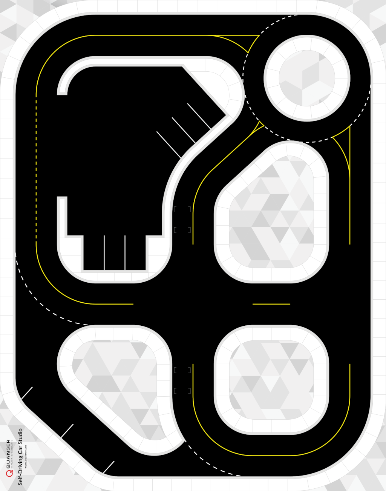
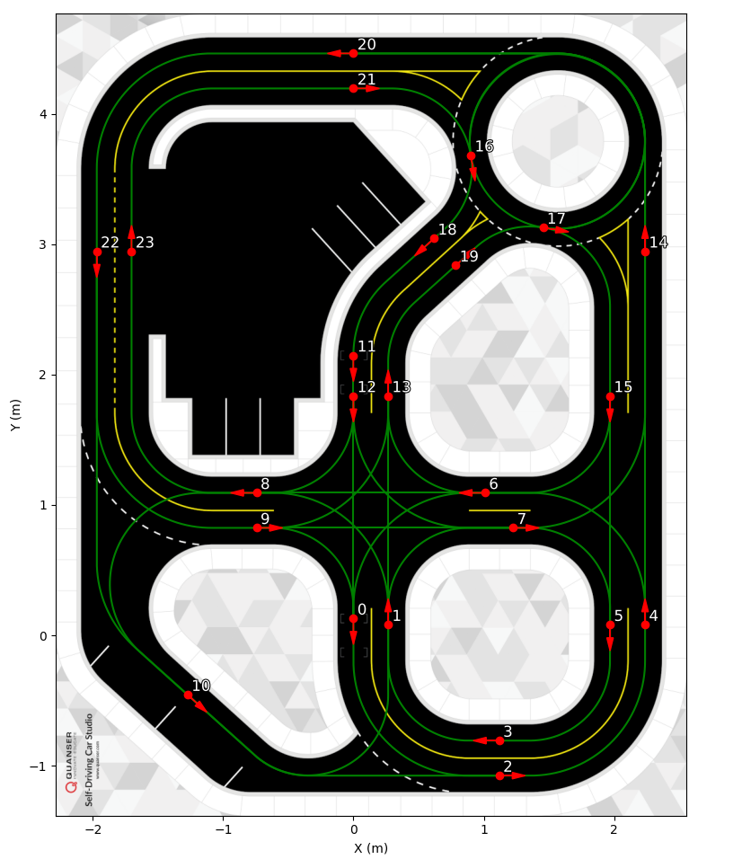
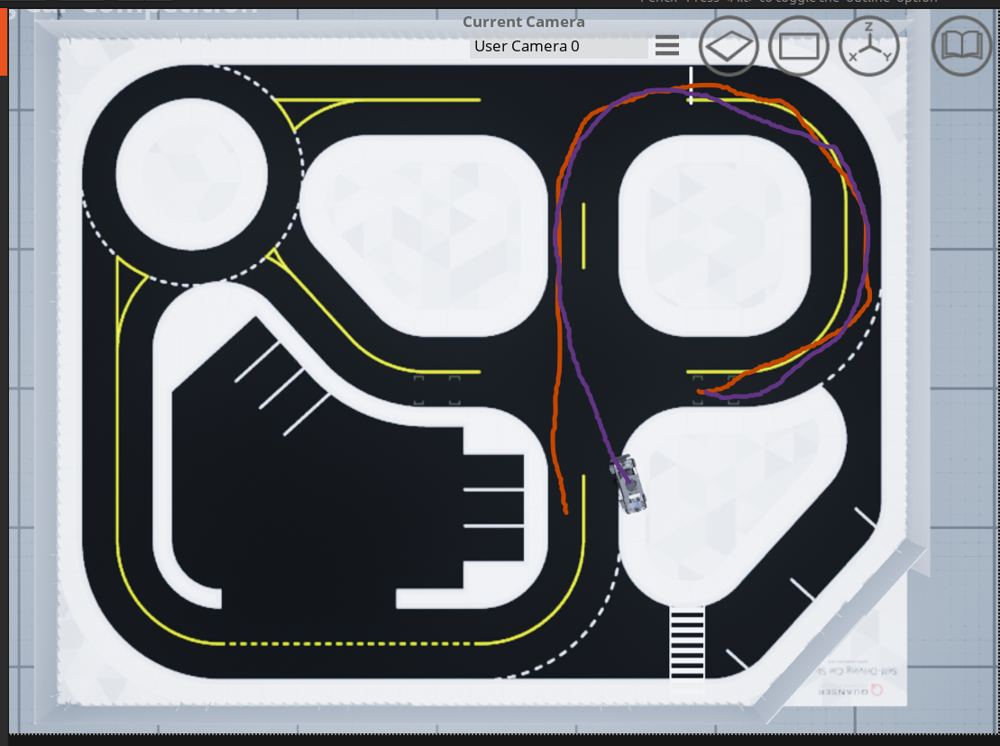
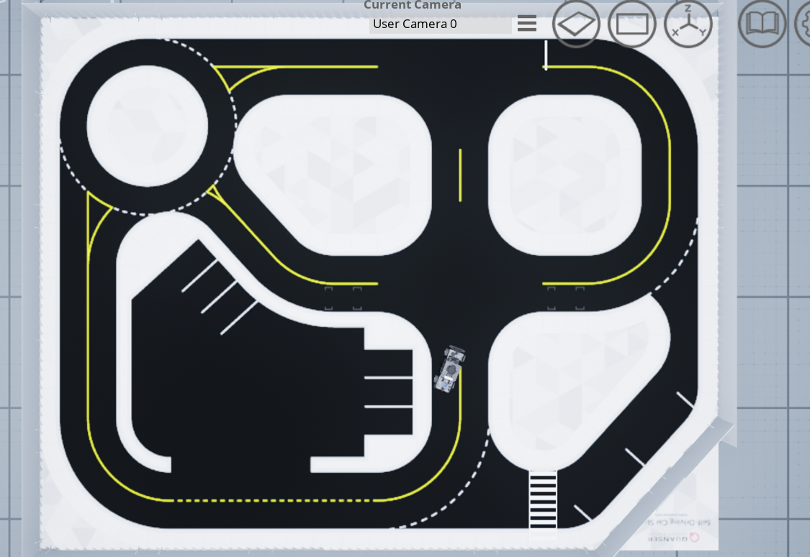
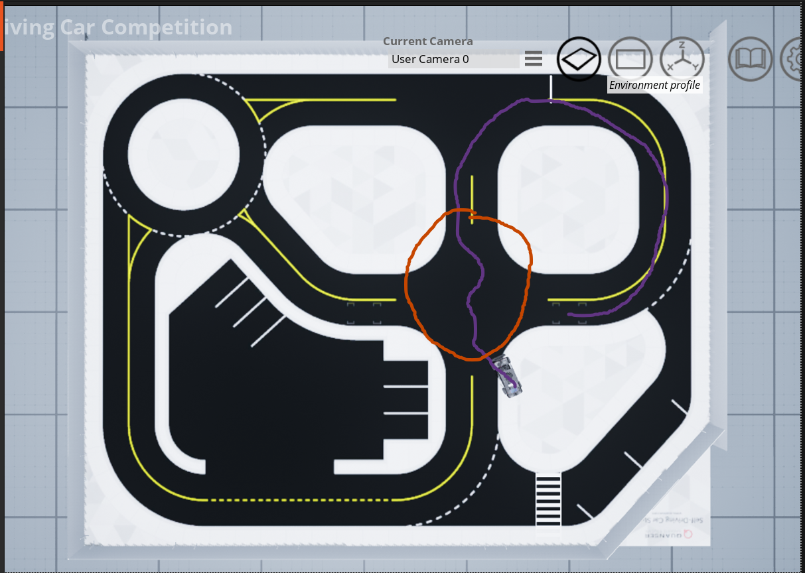
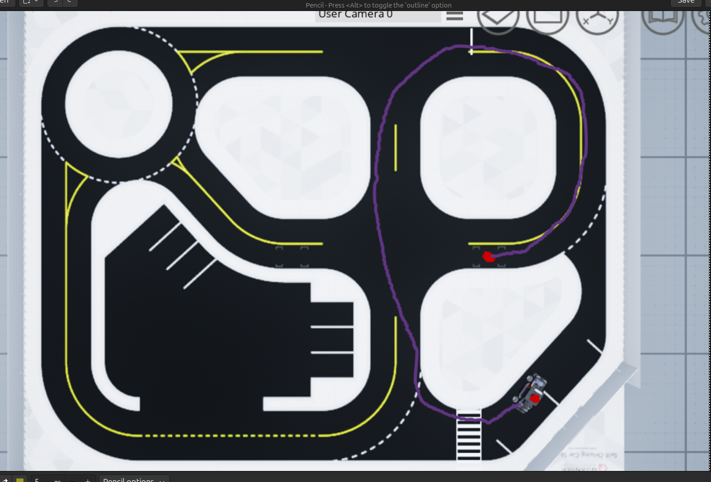
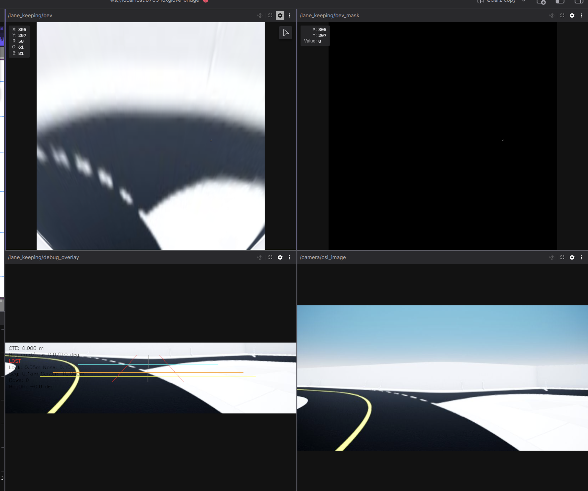

# QCar2 ACC Easy Start

Updated: 2026-05-24 18:56:17 EDT

This is the copy-paste runbook for the ACC QCar2 workspace. It is split into
startup flow, builds, perception, logs/debugging, physical-hardware reference,
and architecture notes so the commands stay easy to scan while testing.

## Table Of Contents

1. [Normal Startup Order](#normal-startup-order)
2. [Every ROS Container Terminal](#every-ros-container-terminal)
3. [Start QLabs / Virtual QCar2](#start-qlabs--virtual-qcar2)
4. [Start Isaac ROS Dev Container](#start-isaac-ros-dev-container)
5. [Build Commands](#build-commands)
6. [Base QCar2 Nodes](#base-qcar2-nodes)
7. [Autonomy Commands](#autonomy-commands)
8. [Perception Layer](#perception-layer)
9. [Logs, Bags, And Debug Checks](#logs-bags-and-debug-checks)
10. [Scripts Reference (`Development/ros2/scripts/`)](#scripts-reference-developmentros2scripts)
11. [Physical QCar 2 Reference: Sensor Extrinsics & Body Frame](#physical-qcar-2-reference-sensor-extrinsics--body-frame-convention)
12. [Physical QCar 2 Bring-Up (SSH + rsync)](#physical-qcar-2-bring-up-ssh--rsync)
13. [Killing Stale ROS Nodes Between Runs](#killing-stale-ros-nodes-between-runs)
14. [Odometry Architecture (EKF owns odom)](#odometry-architecture-ekf-owns-odom)
15. [Architecture Direction](#architecture-direction)
16. [SDCS Road Map Reference (node IDs + layout)](#sdcs-road-map-reference)
17. [Change Log](#change-log)

## SDCS Road Map Reference

Quanser's SDCS road graph is what `SDCSRoadMap.generate_path(nodeSequence=...)` uses inside `path_follower` (nav_to_pose.py). When you set `ros2 param set /path_follower node_values "[0, 8, 10]"`, the path planner finds the **shortest road-graph path** that visits each listed node in order — NOT a straight Euclidean line. Useful to keep these two images open in a tab when planning trip waypoints.

### Map layout (geometry — overall SDCS table)



### Node IDs + edges + traffic direction (right-hand traffic)



**Critical config:**
```python
# Inside nav_to_pose.py — passed when creating SDCSRoadMap:
SDCSRoadMap(leftHandTraffic=False).generate_path(node_values)
                ^^^^^^^^^^^^^^^^^^^
                MUST be False for our QLabs scene (right-hand traffic, US convention).
                Default in Quanser library is True. Get this wrong and the planner
                uses a MIRRORED graph → "shortest path 0→8" skips node 8 entirely
                or routes through impossible edges.
```

Source: Quanser official example `path_planning_example.py` (also kept locally at `docs/maps/path_planning_example.py` for offline reference). Both PNGs and the example are from:
- https://github.com/quanser/Quanser_Academic_Resources/tree/dev-windows/5_research/sdcs/roadmap
- https://github.com/quanser/Quanser_Academic_Resources/tree/dev-windows/5_research/multi_agent/QCar2_multi-vehicle_control

### Practical node-to-node test sequence

Use these to discover where each node physically lives before trusting longer sequences:
```bash
ros2 param set /path_follower node_values "[0]"        # park at node 0
ros2 param set /path_follower node_values "[0, 8]"     # 0 → 8
ros2 param set /path_follower node_values "[0, 9]"     # 0 → 9
ros2 param set /path_follower node_values "[0, 10]"    # 0 → 10 (HUB)
```


## Normal Startup Order

Use this order for a normal virtual QCar2 ACC run:

1. Start QLabs / virtual QCar2 on the host.
2. Start the Isaac ROS dev container.
3. In each ROS terminal, source the workspace and set `ROS_DOMAIN_ID=69`.
4. Build only the package you changed, or run the normal workspace build.
5. Start base QCar2 nodes or Cartographer.
6. Start Foxglove bridge if you want browser visualization.
7. Start perception or autonomy, depending on the test.
8. Watch the log/debug topics before trusting behavior.

## Every ROS Container Terminal

Run this inside every new ROS container terminal:

```bash
cd /workspaces/isaac_ros-dev/ros2
source /opt/ros/humble/setup.bash
source /workspace/cartographer_ws/install/setup.bash
source install/setup.bash
export ROS_DOMAIN_ID=69
```

Quick check:

```bash
ros2 pkg list | grep qcar2
```

Optional terminal tab/window title:

```bash
echo -ne "\033]0;QCar2 Cartographer\007"
```

Reusable helper for `~/.bashrc`:

```bash
termname() {
  echo -ne "\033]0;$1\007"
}
```

After reloading `~/.bashrc`, name terminals like this:

```bash
source ~/.bashrc
termname "QCar2 AMCL"
termname "QCar2 Perception"
termname "Foxglove Bridge"
```

## Start QLabs / Virtual QCar2

Host terminal:

```bash
cd /home/$USER/Documents/GitHub/ACC_Development/docker/virtual_qcar2
sudo docker run --rm -it --network host --name virtual-qcar2 quanser/virtual-qcar2 bash
```

Inside the QLabs container:

```bash
cd /home/qcar2_scripts/python
python3 Base_Scenarios_Python/Setup_Competition_Map.py
clear
```

## Start Isaac ROS Dev Container

Host terminal:

```bash
cd /home/$USER/Documents/GitHub/ACC_Development
./isaac_ros_common/scripts/run_dev.sh /home/$USER/Documents/GitHub/ACC_Development/Development
```

Expected Docker config file:

```bash
/home/$USER/Documents/GitHub/ACC_Development/isaac_ros_common/scripts/.isaac_ros_common-config
```

Expected config:

```bash
CONFIG_IMAGE_KEY="ros2_humble.ros_cartographer.user.quanser"
CONFIG_DOCKER_SEARCH_DIRS=(/home/$USER/Documents/GitHub/ACC_Development/docker/development_docker/quanser_dev_docker_files)
```

Permanent Python/Debian packages go here:

```bash
/home/$USER/Documents/GitHub/ACC_Development/docker/development_docker/quanser_dev_docker_files/Dockerfile.quanser
```

Verify Python packages inside the container:

```bash
python3 -c "import ultralytics, tqdm; print('ok')"
pip3 show ultralytics tqdm
```

## Build Commands

Use this after ordinary QCar2 source changes:

```bash
cd /workspaces/isaac_ros-dev/ros2
source /opt/ros/humble/setup.bash
source /workspace/cartographer_ws/install/setup.bash
colcon build --symlink-install
source install/setup.bash
export ROS_DOMAIN_ID=69
```

Fast package rebuild examples:

```bash
colcon build --symlink-install --packages-select qcar2_autonomy
source install/setup.bash
export ROS_DOMAIN_ID=69
```

```bash
colcon build --symlink-install --packages-select qcar2_perception
source install/setup.bash
export ROS_DOMAIN_ID=69
```

Only do a clean build when the workspace/install state is actually broken:

```bash
rm -rf build install log
colcon build --symlink-install
source install/setup.bash
export ROS_DOMAIN_ID=69
```

## Base QCar2 Nodes

Virtual sensor/hardware launch:

```bash
source install/setup.bash
export ROS_DOMAIN_ID=69
ros2 launch qcar2_nodes qcar2_virtual_launch.py
```

Cartographer virtual launch (bundles `pose_estimator` + `ekf_fusor` + cartographer + occupancy grid + nav2 converter):

```bash
source install/setup.bash
export ROS_DOMAIN_ID=69
ros2 launch qcar2_nodes qcar2_cartographer_virtual_launch.py
```

Cartographer physical launch (same bundle, real-hardware variant):

```bash
source install/setup.bash
export ROS_DOMAIN_ID=69
ros2 launch qcar2_nodes qcar2_cartographer_launch.py
```

Foxglove bridge (also bundles `controller_watchdog`):

```bash
source install/setup.bash
export ROS_DOMAIN_ID=69
ros2 launch qcar2_nodes foxglove_bridge_launch.py
```

Foxglove Studio on the host:

```text
ws://localhost:8765
```

## Autonomy Commands

Autonomy planner:

```bash
colcon build --symlink-install --packages-select qcar2_autonomy
source install/setup.bash
export ROS_DOMAIN_ID=69
ros2 launch qcar2_autonomy autonomy_planner_launch.py
```

Path follower:

```bash
colcon build --symlink-install --packages-select qcar2_autonomy
source install/setup.bash
export ROS_DOMAIN_ID=69
ros2 run qcar2_autonomy path_follower
```

Manual drive — two ways:

```bash
# Way 1: standalone manual_drive node (backward compat, still works)
source install/setup.bash && export ROS_DOMAIN_ID=69
ros2 run qcar2_autonomy manual_drive

# Way 2 (preferred): use path_follower's built-in manual mode.
# Avoids the double-publish fight on /cmd_vel_nav.
ros2 param set /path_follower control_mode "manual"
# (focus the path_follower terminal, WASD to drive, 'q' to return to idle)
```

Notes for Way 1:

- `manual_drive` publishes `/cmd_vel_nav`.
- If no QCar command converter is running, `manual_drive` auto-starts `qcar2_nodes nav2_qcar2_converter`.
- If a launch file already started the converter, `manual_drive` reuses it.
- Disable converter auto-start if needed:
  ```bash
  ros2 run qcar2_autonomy manual_drive --ros-args -p auto_start_converter:=false
  ```

## Perception Layer

Added: 2026-05-20 09:36:26 EDT

Purpose:

- Starts the `qcar2_perception` layer.
- Does not touch the old working `qcar2_autonomy` YOLO prototype.
- Publishes aligned D435 RGB/depth/camera_info.
- Publishes YOLO detections, 3D object estimates, semantic landmarks, and monitor output.
- Publishes advisory behavior events from landmarks; these are not drive commands.

Important:

- Do not run `qcar2_nodes rgbd` at the same time as `d435_aligned_source`.
- Do not run the old `qcar2_autonomy yolo_detector` at the same time as the new perception stack.
- The D435 aligned source owns the camera path for this perception stack.

Build:

```bash
cd /workspaces/isaac_ros-dev/ros2
colcon build --symlink-install --packages-select qcar2_perception
source install/setup.bash
export ROS_DOMAIN_ID=69
```

If `qcar2_autonomy` is in the same overlay, rebuild it too after entrypoint
changes:

```bash
colcon build --symlink-install --packages-select qcar2_autonomy qcar2_perception
source install/setup.bash
export ROS_DOMAIN_ID=69
```

### Perception: virtual QLabs

Use this only for the virtual QCar/QLabs flow. It starts the virtual aligned
D435 source plus YOLO, 3D object estimation, semantic mapper, consistency
monitor, and behavior advisories in the same machine/container.

```bash
cd /workspaces/isaac_ros-dev/ros2
source install/setup.bash
export ROS_DOMAIN_ID=69
ros2 launch qcar2_perception perception_core_virtual.launch.py
```

### Perception: physical QCar, all on QCar (RECOMMENDED, 2026-05-25)

Default flow. The Jetson AGX Orin runs the full perception stack (D435 source
+ YOLO + landmarks + behavior). Do not run this from the laptop Docker —
`d435_aligned_source` must talk to the QCar-local Quanser/PIT backend.

```bash
ssh qcar2
cd ~/ros2
source /opt/ros/humble/setup.bash
source install/setup.bash
export ROS_DOMAIN_ID=69
export ROS_LOCALHOST_ONLY=0
ros2 launch qcar2_perception perception_core_physical.launch.py mode:=internal
```

Laptop side: run Foxglove only and subscribe to lightweight topics. Safe
subscriptions over the AP:

```text
/map  /tf  /tf_static
/perception/semantic_landmark_markers
/perception/semantic_hypothesis_markers
/perception/semantic_current_markers
/perception/semantic_residual_markers
/perception/object_markers
/perception/health
/perception/behavior_events
/perception/yolo/detections_2d
/nav/*  /qcar2_ekf/*
```

Do NOT pull `/perception/d435/rgb/image_raw` or `/perception/d435/depth/image_rect`
across the AP — those raw streams saturate the link and stall Cartographer.
For visual YOLO debugging, prefer `/perception/yolo/image_annotated` (already
annotated, smaller than raw RGB at the same resolution) or temporarily reduce
`publish_rate` on `d435_aligned_source` to 2–3 Hz.

CUDA note: `d435_aligned_source` and `semantic_yolo_detector` use CUDA by
default on the Jetson. To force CPU (debugging): `export QCAR2_FORCE_CPU=1`
before the launch.

### Perception: physical QCar source plus laptop Docker compute (DISCOURAGED)

Split flow: QCar publishes hardware topics only, laptop Docker runs YOLO and
landmark compute. **Discouraged 2026-05-25**: pulling raw D435 over the AP
saturates ~100 Mbps and stalls Cartographer. Use only as a fallback when the
Jetson is genuinely saturated (verify with `top` / `tegrastats` first).

Mode contract, updated 2026-05-25:

| Command args | Run location | D435 source | YOLO / landmarks |
| --- | --- | --- | --- |
| `mode:=internal` (default `source_only:=false`) | QCar 2 native `~/ros2` | yes | yes |
| `mode:=internal source_only:=true` | QCar 2 native `~/ros2` | yes | no |
| `mode:=external` | laptop Docker `/workspaces/isaac_ros-dev/ros2` | no | yes |

**Never run `mode:=internal` (default) on the QCar AND `mode:=external` on the
laptop at the same time.** Every YOLO / object_3d / landmark / consistency /
behavior node ends up running twice, both publishing to the same topics, and
the landmark mapper races on `semantic_map.json`. Symptom: Foxglove garbled,
Cartographer freezes in the laptop's view, QCar CPU only ~68% (bottleneck is
DDS bandwidth, not compute). If you take the split flow, you MUST pass
`source_only:=true` on the QCar.

Do not run `mode:=internal` from laptop Docker for physical hardware. It starts
`d435_aligned_source`, and that source must talk to the QCar-local
Quanser/PIT backend.

QCar terminal: publish the real D435 topics only.

```bash
ssh qcar2
cd ~/ros2
source /opt/ros/humble/setup.bash
source install/setup.bash
export ROS_DOMAIN_ID=69
export ROS_LOCALHOST_ONLY=0
ros2 launch qcar2_perception perception_core_physical.launch.py mode:=internal source_only:=true
```

Laptop Docker terminal: listen to QCar topics and run compute. The Docker ROS
workspace is `/workspaces/isaac_ros-dev/ros2`, not
`/workspaces/isaac_ros-dev/Development/ros2`.

```bash
cd /workspaces/isaac_ros-dev/ros2
source /opt/ros/humble/setup.bash
source /workspace/cartographer_ws/install/setup.bash
source install/setup.bash
export ROS_DOMAIN_ID=69
export ROS_LOCALHOST_ONLY=0

ros2 topic hz /perception/d435/rgb/image_raw
ros2 launch qcar2_perception perception_core_physical.launch.py mode:=external
```

`mode:=internal` starts the real D435 source and must run on the physical QCar. `source_only:=true` keeps the QCar from also running YOLO/landmarks. `mode:=external` does not touch camera hardware; it only listens to `/perception/d435/*` from the QCar and runs YOLO/landmark compute in the current machine.

If external mode does not see camera:

```bash
# QCar terminal: must publish these.
ros2 topic hz /perception/d435/rgb/image_raw
ros2 topic hz /perception/d435/depth/image_rect

# Laptop Docker terminal: must see the same topics.
ros2 topic list | grep /perception/d435
ros2 topic hz /perception/d435/rgb/image_raw

# Laptop Docker terminal: landmarks need these transforms too.
ros2 run tf2_ros tf2_echo base_link aligned_camera_optical_frame
ros2 run tf2_ros tf2_echo map aligned_camera_optical_frame
```

If the QCar does not publish `/perception/d435/*`, start `mode:=internal source_only:=true` on the QCar first. If the QCar publishes but the laptop does not see it, that is a DDS/network/domain issue, not a perception launch issue.

Manual start, terminal 1:

```bash
source install/setup.bash
export ROS_DOMAIN_ID=69
ros2 launch qcar2_perception semantic_tf_launch.py
```

Manual start, terminal 2 for virtual QLabs:

```bash
source install/setup.bash
export ROS_DOMAIN_ID=69
ros2 run qcar2_perception d435_aligned_source --ros-args -p is_physical:=false -p distance_scale:=0.1
```

Manual start, terminal 2 for physical QCar2:

```bash
source install/setup.bash
export ROS_DOMAIN_ID=69
ros2 run qcar2_perception d435_aligned_source --ros-args -p is_physical:=true -p distance_scale:=1.0
```

Manual start, terminal 3:

```bash
source install/setup.bash
export ROS_DOMAIN_ID=69
ros2 run qcar2_perception semantic_yolo_detector
```

Cartographer plus perception:

```bash
source install/setup.bash
export ROS_DOMAIN_ID=69
ros2 launch qcar2_nodes qcar2_cartographer_virtual_launch.py
```

```bash
source install/setup.bash
export ROS_DOMAIN_ID=69
ros2 launch qcar2_perception perception_core_virtual.launch.py
```

Perception meaning notes:

- Cartographer remains the geometry/localization authority.
- `semantic_map.json` is a session semantic overlay by default.
- `reset_map_on_start: true` means the semantic map starts empty each core launch.
- Stable landmarks are saved; candidates and confirmed landmarks are live memory/debug hypotheses.
- YOLO dead-zone mask draws a red polygon with `NA` on `/perception/yolo/image_annotated`.
- Stable map, live hypotheses, current observations, and residual checks are separate Foxglove layers.
- `perception_behavior_interface` reads `/perception/semantic_landmarks` plus `/qcar2_pose_fused` and publishes advisory events only.
- Override the semantic map save path with `QCAR2_SEMANTIC_MAP_PATH=/path/to/semantic_map.json` if needed. By default the Docker path points at `Development/ros2/src/qcar2_perception/maps/semantic_map.json`.

Core Foxglove topics:

```text
/perception/d435/rgb/image_raw
/perception/d435/depth/image_rect
/perception/d435/camera_info
/perception/yolo/image_annotated
/perception/yolo/detections_2d
/perception/objects_3d
/perception/object_markers
/perception/semantic_landmarks
/perception/semantic_landmark_markers
/perception/semantic_hypothesis_markers
/perception/semantic_current_markers
/perception/semantic_residual_markers
/perception/semantic_localization_residual
/perception/behavior_events
/perception/stop_required
/perception/health
```

Semantic marker topic meanings:

| Topic | Meaning |
| --- | --- |
| `/perception/semantic_landmark_markers` | Stable landmarks only. This is the semantic map overlay for the current run. |
| `/perception/semantic_hypothesis_markers` | Candidate and confirmed landmarks. This is working memory/debug hypotheses. |
| `/perception/semantic_current_markers` | Landmarks currently visible to the D435 semantic pipeline. |
| `/perception/semantic_residual_markers` | Consistency monitor residual lines only. These are not landmark memory. |

Perception quick checks:

```bash
ros2 topic hz /perception/d435/rgb/image_raw
ros2 topic hz /perception/d435/depth/image_rect
ros2 topic echo /perception/d435/camera_info --once
ros2 topic hz /perception/yolo/image_annotated
ros2 topic echo /perception/yolo/detections_2d
ros2 topic echo /perception/behavior_events --once
ros2 topic echo /perception/stop_required --once
ros2 run tf2_ros tf2_echo base_link aligned_camera_optical_frame
```

## RTAB-Map (retired)

RTAB-Map source build + launch sections were removed 2026-05-24. The vendored
`Development/ros2/src/rtabmap/` and `Development/ros2/src/rtabmap_ros/` source
trees were deleted along with their launches. RTAB-Map is not part of the
active stack — Cartographer + ekf_fusor + AMCL is the chosen SLAM/localization
path. If RTAB-Map is ever revived, restore the deleted launch files from git
history (`git log --diff-filter=D --name-only`) and re-vendor the package.

## Logs, Bags, And Debug Checks

This section is only for logs and visibility. Use it after launches are running.

Build logs:

```bash
cd /workspaces/isaac_ros-dev/ros2
ls -lt log | head
find log/latest_build -maxdepth 3 -type f | sort
tail -n 80 log/latest_build/*/stdout_stderr.log
```

ROS run logs:

```bash
ls -lt ~/.ros/log | head
find ~/.ros/log/latest -maxdepth 2 -type f | sort
tail -n 80 ~/.ros/log/latest/*.log
```

Save a launch terminal log:

```bash
mkdir -p ~/qcar2_logs
ros2 launch qcar2_perception perception_core_virtual.launch.py 2>&1 | tee ~/qcar2_logs/perception_core_virtual.log
```

Common graph checks:

```bash
ros2 node list
ros2 topic list
ros2 topic list | grep perception
ros2 topic list | grep nav
ros2 run tf2_ros tf2_echo map base_link
ros2 run tf2_ros tf2_echo base_link aligned_camera_optical_frame
```

Perception topic checks:

```bash
ros2 topic hz /perception/d435/rgb/image_raw
ros2 topic hz /perception/d435/depth/image_rect
ros2 topic echo /perception/d435/camera_info --once
ros2 topic hz /perception/yolo/image_annotated
ros2 topic echo /perception/yolo/detections_2d
ros2 topic echo /perception/health --once
ros2 topic echo /perception/semantic_localization_residual --once
```

Semantic marker layers to enable separately in Foxglove/RViz:

```text
/perception/semantic_landmark_markers
/perception/semantic_hypothesis_markers
/perception/semantic_current_markers
/perception/semantic_residual_markers
```

Bag commands:

```bash
mkdir -p ~/qcar2_bags
ros2 bag record -o ~/qcar2_bags/perception_debug_01 \
  /tf \
  /tf_static \
  /scan \
  /perception/d435/rgb/image_raw \
  /perception/d435/depth/image_rect \
  /perception/d435/camera_info \
  /perception/yolo/detections_2d \
  /perception/objects_3d \
  /perception/semantic_landmarks \
  /perception/health
```

```bash
ros2 bag info ~/qcar2_bags/perception_debug_01
ros2 bag play ~/qcar2_bags/perception_debug_01
```

Debug meanings:

- If `semantic_map.json` clears and then fills again, an old mapper is probably still running and rewriting it.
- If stable landmarks look mixed with candidates, check the separate semantic marker topics instead of one combined layer.
- If YOLO detects the QCar body/dead image region, check that `/perception/yolo/image_annotated` shows the red `NA` polygon.
- If map-frame semantic landmarks warn about transforms, start Cartographer before the perception core launch.

## Scripts Reference (`Development/ros2/scripts/`)

Six helper scripts live in `Development/ros2/scripts/`. Each block below is copy-paste-ready — source the env first, then the script.

**Standard source-the-env preamble** (paste into every new container terminal before running any script):

```bash
cd /workspaces/isaac_ros-dev/ros2
source /opt/ros/humble/setup.bash
source /workspace/cartographer_ws/install/setup.bash
source install/setup.bash
export ROS_DOMAIN_ID=69
```

---

### 1. `termname.sh` — name your terminal window/tab

Sets the title of the terminal so you can tell `Foxglove` / `Cartographer` / `Manual Drive` apart at a glance.

```bash
source /workspaces/isaac_ros-dev/ros2/scripts/termname.sh
termname "QCar2 Cartographer"
```

To make it permanent (no need to source every shell):

```bash
echo 'source /workspaces/isaac_ros-dev/ros2/scripts/termname.sh' >> ~/.bashrc
source ~/.bashrc
```

Then in any future terminal: just `termname "Foxglove Bridge"` etc.

---

### 2. `ros2_killall.sh` — kill all stale ROS 2 processes between runs

Sweeps every QCar2-related ROS process (path_follower, ekf_fusor, cartographer, AMCL, lifecycle managers, map_server, foxglove_bridge, manual_drive, etc.) with INT → TERM → KILL escalation, then restarts the discovery daemon.

```bash
source /workspaces/isaac_ros-dev/ros2/scripts/ros2_killall.sh
ros2_killall
```

To make it permanent:

```bash
echo 'source /workspaces/isaac_ros-dev/ros2/scripts/ros2_killall.sh' >> ~/.bashrc
source ~/.bashrc
```

Then between any two `ros2 launch` sessions: just `ros2_killall`.

**Note:** does NOT touch processes inside the `virtual-qcar2` (QLabs) Docker container. To clean those:

```bash
sudo docker exec virtual-qcar2 pkill -f "csi_camera|foxglove_bridge|ros2"
```

---

### 3. `carto_to_amcl.sh` — end-to-end map → AMCL workflow

One terminal does the whole record-Cartographer-lap → press-ENTER-to-freeze → save-map → kill-Cartographer → launch-AMCL → seed-initial-pose flow. Mode default is `virtual`; pass `physical` for the real robot.

```bash
# Source env, then:
/workspaces/isaac_ros-dev/ros2/scripts/carto_to_amcl.sh            # virtual (default)
# or:
/workspaces/isaac_ros-dev/ros2/scripts/carto_to_amcl.sh physical   # real QCar 2
```

What you do while it's running:

1. The script launches Cartographer (in its own process group via `setsid` so it can be cleanly killed). Wait for the `/map` topic to appear.
2. Open another terminal to drive (manual_drive, joystick, or path_follower).
3. Drive a lap. Watch in Foxglove.
4. When the map looks good, **press ENTER in the carto_to_amcl terminal**.
5. Script captures final pose from `map → base_link` TF, saves the map via `map_saver_cli`, kills Cartographer cleanly, launches AMCL on the saved map, and publishes the captured pose to `/initialpose` so AMCL bootstraps instantly.
6. AMCL keeps running in the foreground. Ctrl-C to stop it.

Files produced: `~/qcar2_maps/competition_map.{pgm,yaml}` and `/tmp/final_pose.txt`. Logs at `/tmp/carto.log` and `/tmp/amcl.log`.

---

### 4. `pd_tuner.py` — Tkinter sliders for live PD tuning

Continuous-drag GUI sliders that publish to `/nav/kp_steering_set` and `/nav/kd_steering_set`. Use while `path_follower` is running to feel out Kp/Kd by hand.

```bash
# Requires X forwarding / desktop environment
python3 /workspaces/isaac_ros-dev/ros2/scripts/pd_tuner.py
```

Watch the path_follower terminal — every slider drag logs `kp_steering (topic) -> X.XXX`. Effect is immediate on the next 80 Hz tick.

Slider ranges:
- **Kp**: 0.0 – 2.0, step 0.01, default 1.0
- **Kd**: 0.0 – 1.0, step 0.01, default 0.30

---

### 5. `bo_pd_tune.py` — Bayesian Optimization of Kp/Kd

Automatically finds the (Kp, Kd) pair minimizing a multi-term cost function over 15 driving trials. Each trial = approach to TEST_ORIGIN (safe gains) + measurement on a fixed L-shape test path (BO-suggested gains). Result saved to `/tmp/bo_pd_tune_result.json`.

Prerequisite (install once):

```bash
pip install scikit-optimize
```

Run it:

```bash
# 1. Make sure cartographer + ekf_fusor + foxglove_bridge + path_follower are running.
# 2. Then in another terminal:
python3 /workspaces/isaac_ros-dev/ros2/scripts/bo_pd_tune.py
```

The script will pause and print a warm-up checklist. While paused:

1. Put path_follower in manual mode: `ros2 param set /path_follower control_mode "manual"`
2. Drive ~30 s with WASD to give Cartographer scan data, ending the car in an OPEN spot (≥1.5 m clear ahead AND to the left).
3. Press `q` in path_follower's terminal to exit manual.
4. Return to the BO terminal and **press ENTER**.

BO runs ~8 min, then auto-applies the best gains and exits. Read the result:

```bash
cat /tmp/bo_pd_tune_result.json
```

---

### 6. `stress_test_for_EKF_and_mahalanobis.py` — outlier-gate validation

Publishes alternating GOOD/BAD `/amcl_pose` messages to verify ekf_fusor's Mahalanobis outlier gate is rejecting bad measurements (χ²_3 = 11.345 at 99% confidence).

Prerequisite: ekf_fusor must be running in `amcl_pose` correction mode (NOT the default `tf` mode):

```bash
ros2 run qcar2_autonomy ekf_fusor --ros-args -p correction_source:=amcl_pose
```

Then in another terminal:

```bash
python3 /workspaces/isaac_ros-dev/ros2/scripts/stress_test_for_EKF_and_mahalanobis.py
```

The script publishes a pattern of good/bad poses (default `Test="Hard"` = 5 good then 10 bad in a row; switch to `Test="Easy"` for the alternating pattern). Watch:

```bash
# In another terminal — see Mahalanobis values spike on BAD
ros2 topic echo /qcar2_ekf/innovation_mahalanobis
# Look for ekf_fusor's "Outlier rejected" warnings
ros2 topic echo /qcar2_ekf/health
```

Healthy behavior:
- `maha` ≈ 0–3 on GOOD pose injections (accepted)
- `maha` jumps to 100+ on BAD pose injections (rejected, logged as "Outlier rejected")
- `/qcar2_ekf/health` flips to `outlier_streak` after 5+ consecutive rejections (only in `Test="Hard"` mode)

Ctrl-C the script when done. Switch ekf_fusor back to `tf` mode (or restart it with no overrides) before resuming normal operation.

---

### Quick reference table

| Script | Type | What it does |
|---|---|---|
| `termname.sh` | source helper | Sets terminal title |
| `ros2_killall.sh` | source helper | Kills all stale ROS 2 procs |
| `carto_to_amcl.sh` | bash | Cartographer → save → AMCL pipeline |
| `pd_tuner.py` | python | Tkinter sliders for live Kp/Kd |
| `bo_pd_tune.py` | python | Bayesian Optimization of Kp/Kd |
| `stress_test_for_EKF_and_mahalanobis.py` | python | Outlier-gate validation |

## Physical QCar 2 Reference: Sensor Extrinsics & Body Frame Convention

Source: **QCar 2 User Manual – System Hardware v1.0 (2024-10-01), pages 10–11.**

This section is **PHYSICAL ONLY**. The virtual QCar 2 in QLabs uses a 10× scale on all distances and may not exactly match the physical extrinsics. When you move from QLabs to the actual QCar 2 hardware, these are the rigid-body transforms the manual documents — use them as the ground truth for any TF / camera-painting / kinematic work that depends on sensor placement.

### Body frame `{B}` convention

The body frame is located **between the front and rear axles on the ground plane**.

| Axis | Direction |
|---|---|
| **x** | longitudinally forward (toward front of car) |
| **y** | toward the left side of the vehicle |
| **z** | upward |

Right-handed frame.

### Camera frame `{C}` convention (for any onboard camera — CSI or RealSense)

Facing any camera from outside, looking at the lens:

| Axis | Direction |
|---|---|
| **x** | toward the LEFT of the camera |
| **y** | DOWNWARD |
| **z** | straight outward from the lens |

This is the standard OpenCV / ROS camera frame. Determinant of each camera's rotation block is **−1** because the camera-to-body transform flips handedness.

### Extrinsic matrices `T_<sensor>_to_body` (each transforms a point in the sensor frame into body frame coordinates)

```
front_axle_to_body                  rear_axle_to_body
[ 1  0  0   0.130 ]                 [ 1  0  0  -0.130 ]
[ 0  1  0   0     ]                 [ 0  1  0   0     ]
[ 0  0  1   0.031 ]                 [ 0  0  1   0.031 ]
[ 0  0  0   1     ]                 [ 0  0  0   1     ]

csi_front_to_body                   csi_rear_to_body
[  0  0  1   0.183 ]                [  0  0 -1  -0.152 ]
[ -1  0  0   0     ]                [  1  0  0   0     ]
[  0 -1  0   0.110 ]                [  0 -1  0   0.110 ]
[  0  0  0   1     ]                [  0  0  0   1     ]

csi_left_to_body  (battery side)    csi_right_to_body  (passenger side)
[  1  0  0   0.012 ]                [ -1  0  0   0.012 ]
[  0  0  1   0.033 ]                [  0  0 -1  -0.053 ]
[  0 -1  0   0.110 ]                [  0 -1  0   0.110 ]
[  0  0  0   1     ]                [  0  0  0   1     ]

imu_to_body                         realsense_to_body (D435 RGB-D)
[ 1  0  0   0.011 ]                 [  0  0  1   0.095 ]
[ 0  1  0   0     ]                 [ -1  0  0   0.032 ]
[ 0  0  1   0.089 ]                 [  0 -1  0   0.172 ]
[ 0  0  0   1     ]                 [  0  0  0   1     ]

rplidar_to_body  (note the 180° yaw flip)
[ -1  0  0  -0.012 ]
[  0 -1  0   0     ]
[  0  0  1   0.193 ]
[  0  0  0   1     ]

cg_to_body  (center of gravity offset from body origin)
[ 1  0  0  -0.011  ]
[ 0  1  0   0.0029 ]
[ 0  0  1   0.0814 ]
[ 0  0  0   1      ]
```

### Key things to notice

1. **The LiDAR is mounted 180° yaw-rotated** in body coordinates. The rotation block `[[-1,0,0],[0,-1,0],[0,0,1]]` is a yaw of π. This is why `fixed_lidar_frame.cpp` uses `q.setRPY(0, 0, -π)` — to bring scan points back into the body's forward convention. The virtual file (`fixed_lidar_frame_virtual.cpp`) uses `setRPY(0, 0, 0)`, which is correct IF QLabs internally publishes scans already rotated into the body frame (untested assumption; verify on first real-hardware run).

2. **The IMU is at (0.011, 0, 0.089) with identity rotation.** Its axes already align with the body frame, so `/qcar2_imu.angular_velocity.z` is directly the body-frame yaw rate in rad/s. No conversion needed — this is what justified deleting the `* π/180` bug in `nav_to_pose.py`.

3. **Wheelbase = 0.260 m** (front-to-rear axle x-distance = 0.130 − (−0.130) = 0.260). Manual Table 11 lists **0.256 m**. The 4 mm difference is likely manufacturing tolerance; use 0.256 (the spec value in the manual) for consistency with the rest of the project.

4. **D435 at (0.095, 0.032, 0.172) in body**, looking forward and slightly to the right. Rotation puts the camera's `+z` (lens optical axis) along body `+x` (forward). When painting camera detections into the map, transform via `T_map_from_body × T_body_from_realsense × p_cam`.

5. **For virtual QCar 2, all distances are 10×.** So `csi_front_to_body` in QLabs world coordinates becomes `(1.83, 0, 1.10)` instead of `(0.183, 0, 0.110)`. If you ever need to spawn a sensor or accessory in QLabs at a body-relative position, scale by 10. ROS-side TF should always be in real meters regardless of QLabs.

### Example: project a 1 m point ahead of the car (in CSI-front frame) into the body frame

A point 1 m straight out from the front camera, `p_cam = [0, 0, 1, 1]^T`:

```
B_x = T_csi_front_to_body × p_cam
    = [[0,0,1,0.183],[-1,0,0,0],[0,-1,0,0.110],[0,0,0,1]] × [0,0,1,1]^T
    = [1.183, 0, 0.110, 1]^T
```

So the point appears 1.183 m ahead of the body origin, on the centerline, 0.11 m above ground. (Matches the manual's worked example on page 11.)

### When you'd use this

- Wiring the D435 / CSI cameras into TF for the perception stack on physical hardware
- Camera painting: transforming RGB-D detections into the map frame
- Validating the LiDAR static-TF flip on the physical robot
- Bumper / collision bounds (need cg_to_body + dimensions Table 11)
- Any custom sensor you add — express its mount as `T_sensor_to_body` and follow the same pattern

If you find any extrinsic on physical that doesn't match the manual (e.g., the LiDAR was remounted), document the override here so the team knows the source-of-truth value.

## Physical QCar 2 Bring-Up (SSH + rsync)

This is the workflow we use to drive the **physical** QCar 2 from the laptop without paying for VSCode/Claude to run on the Jetson. The laptop is the editor; the QCar 2 is the executor. Files travel one direction: **laptop ACC_Development → QCar 2 ACC_Development_luigi → native ~/ros2**. Builds happen on the QCar 2 (Jetson aarch64, can't be cross-built from the laptop's x86_64).

> **QCar 2 access** — IP `192.168.2.13`, user `nvidia`, password `nvidia`. The wired AP from Quanser does not give the laptop internet; either dual-home or accept that you're offline while connected to the car. Foxglove still works because both machines are on the same subnet.

### Step 0a. One-time SSH setup on the laptop

```bash
# Aliases live in ~/.ssh/config — `Host qcar2` already added:
#   Host qcar2
#     HostName 192.168.2.13
#     User nvidia
#     ServerAliveInterval 30

# Generate a key and copy it to the car (one password prompt; never again):
ssh-keygen -t ed25519 -C "laptop -> qcar2"   # press ENTER through prompts
ssh-copy-id qcar2

# Smoke-test:
ssh qcar2 'echo hi from $(hostname); uname -m'
# Expect:  hi from nvidia-desktop; aarch64
```

### Step 0b. One-time setup on the QCar 2

```bash
ssh qcar2
mkdir -p ~/Documents/ACC_Development_luigi
mkdir -p ~/ros2
exit
```

`~/Documents/ACC_Development_luigi/` is where the laptop mirrors this whole `ACC_Development` checkout for Luigi's branch work. The native ROS build workspace stays separate at `~/ros2`. The QCar-side sync then mirrors `~/Documents/ACC_Development_luigi/Development/ros2/` into `~/ros2/`, while protecting `build/`, `install/`, and `log/`.

### Step 0c. Sync script (on laptop)

**Where the script lives (on the LAPTOP, NOT on the QCar 2):**

```
/home/bp02-ubuntu/bin/sync_qcar2.sh        # absolute path
~/bin/sync_qcar2.sh                        # same thing, $HOME-relative
```

**Where it reads FROM (laptop — the GitHub repo root):**

```
/home/bp02-ubuntu/Documents/GitHub/ACC_Development/
```

**Where it writes TO (QCar 2 — over SSH):**

```
nvidia@192.168.2.13:/home/nvidia/Documents/ACC_Development_luigi/
```

Both paths are **hard-coded inside the script** — you do NOT need to be in any particular folder when you run it. You can call it from `~`, from the repo, from `/tmp`, anywhere. It's `cd`-agnostic.

**One-time: put `~/bin` on your `PATH` so you can call it by name alone:**

```bash
# Copy-paste this once on the laptop. This makes ~/bin/sync_qcar2.sh
# accessible from every folder as just: sync_qcar2.sh
mkdir -p ~/bin
cp ~/Documents/GitHub/ACC_Development/Development/ros2/scripts/sync_qcar2.sh \
   ~/bin/sync_qcar2.sh
chmod +x ~/bin/sync_qcar2.sh
echo 'export PATH="$HOME/bin:$PATH"' >> ~/.bashrc
source ~/.bashrc
```

**Verify the script is callable from anywhere:**

```bash
# Copy-paste each line on the laptop.
cd ~                            # prove cwd doesn't matter
which sync_qcar2.sh             # must print: /home/bp02-ubuntu/bin/sync_qcar2.sh
ls -l ~/bin/sync_qcar2.sh       # must show -rwxr-xr-x (executable bit)
```

If `which` prints nothing, `~/bin` is not on `PATH` yet — close and reopen the terminal, or re-run `source ~/.bashrc`.

**Run it (laptop, any directory):**

```bash
# One-shot:
# 1. copies laptop clock/timezone to the QCar 2
# 2. mirrors the full ACC_Development checkout to ACC_Development_luigi
sync_qcar2.sh

# OR: re-sync every time a file changes (needs `sudo apt install inotify-tools` once).
sync_qcar2.sh --watch
```

In watch mode the script syncs the QCar clock once at startup, then only rsyncs
files. Do not repeatedly set the QCar system time while Cartographer is running:
Cartographer requires monotonically increasing sensor/odom timestamps and can
crash if ROS time steps backward.

Run `sync_qcar2.sh` from the **laptop**, not from inside `ssh qcar2`. If the
`qcar2` SSH alias is not available in a laptop terminal, use the IP directly:

```bash
QCAR2_REMOTE=nvidia@192.168.2.13 sync_qcar2.sh
```

**If `~/bin` is NOT on PATH for some reason, you can always call by absolute path:**

```bash
~/bin/sync_qcar2.sh
# or
/home/bp02-ubuntu/bin/sync_qcar2.sh
```

What it does internally:

1. Copies the laptop's current UTC clock and timezone onto the QCar 2. This replaces the old separate `timesync_qcar2.sh` step.
2. Runs `rsync -avz --delete` from the laptop's full `ACC_Development/` checkout to `~/Documents/ACC_Development_luigi/` on the QCar 2.
3. Excludes `.git/`, `build/`, `install/`, `log/`, `__pycache__/`, Python bytecode, `.venv/`, and retired RTAB-Map source/build artifacts.

`--delete` keeps the remote mirror identical. Deleting a file on the laptop deletes it from `ACC_Development_luigi` on the QCar 2 on the next push.

**First-run sanity check (does the QCar 2 actually receive it?):**

```bash
# On laptop:
sync_qcar2.sh

# Then on QCar 2:
ssh qcar2 'ls ~/Documents/ACC_Development_luigi/Development/ros2/src'
# Expect: qcar2_autonomy  qcar2_interfaces  qcar2_nodes  qcar2_perception
```

### Step 0d. Day-to-day shape of a session

1. Laptop: edit code in VSCode (+ Claude). Open one terminal: `sync_qcar2.sh --watch`. Now every save is on the QCar 2 within ~1 s.
2. Laptop: open a second terminal: `ssh qcar2`. Use this to run launches.
3. Laptop browser: Foxglove → `ws://192.168.2.13:8765` (port forwarded over the wired QCar 2 AP, no SSH tunnel needed because both sides see each other on the subnet).

If you prefer SSH inside VSCode (integrated terminal, no remote-server bloat): `Ctrl+Shift+P` → "Terminal: Create New Terminal" → `ssh qcar2`. Do **not** use Remote-SSH; that installs the heavy `vscode-server` on the Jetson.

### Step 0e. Make the sync permanent (systemd user services)

`sync_qcar2.sh --watch` in a terminal works but it dies when you close the terminal or reboot. Promote both halves of the pipeline to **systemd user services** and they auto-start on login, auto-restart on failure, and survive terminal closure / reboot.

The two-hop chain we're making permanent:

```
LAPTOP edit
   │
   ▼  ① sync_qcar2.sh --watch  (systemd: sync_qcar2.service on LAPTOP)
   │     clock sync + full ACC_Development rsync over SSH
   ▼
QCar 2: ~/Documents/ACC_Development_luigi/                         ← synced repo
   │
   ▼    Development/ros2/                                           ← synced ROS workspace tree
   │
   ▼  ② sync_native_from_synced.sh --watch  (systemd: sync_native_qcar2.service on QCAR 2)
   │     local rsync, synced ros2/ → native ~/ros2/ while protecting build/install/log
   ▼
QCar 2: ~/ros2/                                                    ← native ROS workspace
   │
   ▼  ③ you: cd ~/ros2 && colcon build && ros2 launch ...
```

Unit files are versioned in [`Development/ros2/scripts/systemd/`](Development/ros2/scripts/systemd/):

| File | Lives on | Runs |
|---|---|---|
| `sync_qcar2.service` | LAPTOP | `~/bin/sync_qcar2.sh --watch` |
| `sync_native_qcar2.service` | QCAR 2 | `~/Documents/ACC_Development_luigi/Development/ros2/scripts/sync_native_from_synced.sh --watch` |

#### ① Install on the LAPTOP — copy-paste:

```bash
# 1. Make sure inotify-tools is installed (needed for --watch).
sudo apt install -y inotify-tools

# 2. Install the repo-tracked sync script into ~/bin.
mkdir -p ~/bin
cp ~/Documents/GitHub/ACC_Development/Development/ros2/scripts/sync_qcar2.sh \
   ~/bin/sync_qcar2.sh
chmod +x ~/bin/sync_qcar2.sh

# 3. Copy the unit file into the user systemd dir.
mkdir -p ~/.config/systemd/user
cp ~/Documents/GitHub/ACC_Development/Development/ros2/scripts/systemd/sync_qcar2.service \
   ~/.config/systemd/user/sync_qcar2.service

# 4. Tell systemd to start it now AND on every login.
systemctl --user daemon-reload
systemctl --user enable --now sync_qcar2.service

# 5. Keep the service alive even when no terminal is open / you log out.
sudo loginctl enable-linger $USER

# 6. Verify it's running and watch what it's doing.
systemctl --user status sync_qcar2.service
journalctl --user -u sync_qcar2.service -f      # Ctrl+C to stop tailing
```

#### ② Install on the QCAR 2 — copy-paste:

The QCar 2 needs the synced tree to exist first (so the script + unit file are there). Do **one manual sync from the laptop** before installing the service:

```bash
# (LAPTOP, once) push the new files over so they exist on the QCar 2.
sync_qcar2.sh
```

Then on the QCar 2:

```bash
# (QCAR 2)
ssh qcar2

# 1. Install inotify-tools on the Jetson.
sudo apt install -y inotify-tools

# 2. Make the native workspace dir.
mkdir -p ~/ros2

# 3. Copy the unit file from the synced tree into systemd user dir.
mkdir -p ~/.config/systemd/user
cp ~/Documents/ACC_Development_luigi/Development/ros2/scripts/systemd/sync_native_qcar2.service \
   ~/.config/systemd/user/sync_native_qcar2.service

# 4. Start it now + on every login.
systemctl --user daemon-reload
systemctl --user enable --now sync_native_qcar2.service

# 5. Survive logout / reboot.
sudo loginctl enable-linger $USER

# 6. Verify.
systemctl --user status sync_native_qcar2.service
journalctl --user -u sync_native_qcar2.service -f
```

#### Test the full chain

From the laptop, touch a file in the repo, then check it landed on the QCar 2's **native** workspace:

```bash
# LAPTOP
touch ~/Documents/GitHub/ACC_Development/Development/ros2/src/qcar2_autonomy/HEARTBEAT
sleep 3
ssh qcar2 'ls -la ~/ros2/src/qcar2_autonomy/HEARTBEAT'
# Expect: -rw-r--r-- ... HEARTBEAT  (timestamp within last ~3 s)

# Cleanup
rm ~/Documents/GitHub/ACC_Development/Development/ros2/src/qcar2_autonomy/HEARTBEAT
```

If the file shows up in `~/Documents/ACC_Development_luigi/...` but **not** in `~/ros2/src/...`, the laptop service is working but the QCar 2 service isn't — check `journalctl --user -u sync_native_qcar2.service -n 50` on the QCar 2.

#### Useful management commands

```bash
# Stop / start manually
systemctl --user stop sync_qcar2.service        # laptop
systemctl --user start sync_qcar2.service

# Disable autostart (won't run on next login)
systemctl --user disable sync_qcar2.service

# Edit unit file then reload
systemctl --user daemon-reload && systemctl --user restart sync_qcar2.service

# Live log tail
journalctl --user -u sync_qcar2.service -f
journalctl --user -u sync_native_qcar2.service -f    # on QCar 2
```

> **Caveat about `--delete`**: both watchers use `rsync --delete`. If you delete a file on the laptop, within ~1 s it disappears from the QCar 2's synced `ACC_Development_luigi` tree, and within another ~1 s it disappears from native `~/ros2/`. Native `~/ros2/build/`, `~/ros2/install/`, and `~/ros2/log/` are protected by exclude rules, so the laptop will not wipe build artifacts.

### Step 0f. Clock check

`sync_qcar2.sh` copies the laptop clock/timezone to the QCar 2 before every one-shot or watched sync. That is the intended way to fix the Quanser Jetson clock after reboot.

**Verify drift any time:**

```bash
echo "laptop: $(date -u)";  ssh qcar2 'echo qcar2:  $(date -u)'
```

The two timestamps should match within 1–2 s.

**When to re-run:**

- After every cold boot of the QCar 2: run `sync_qcar2.sh` once from the laptop.
- If Foxglove timeline shows messages "in the future" or "from yesterday".
- Before recording any rosbag you'll want to merge with laptop-side data.

(There's no permanent fix while we're on the stock Quanser image. If we ever build our own L4T image, just enable `systemd-timesyncd` with the lab NTP server and delete this script.)

---

### Step 1. (On QCar 2) Build ROS nodes natively

The Jetson Quanser image follows their "native ROS + Isaac container side-by-side" model. The native ROS install handles the **hardware bringup** (`qcar2_launch.py` talks to the actual sensors over QUARC); the Isaac container handles **GPU-heavy autonomy & perception** (Cartographer, AMCL, YOLO, semantic mapper). Both layers see each other over DDS because they share `ROS_DOMAIN_ID=69`.

We build the native ROS layer in a scratch workspace **outside** the synced tree, so the laptop's rsync `--delete` never wipes the Jetson's build artifacts.

```bash
ssh qcar2

# Pull a fresh ROS workspace snapshot from ACC_Development_luigi into native ~/ros2.
# If sync_native_qcar2.service is running, it already does this automatically.
mkdir -p ~/ros2
rsync -av --delete \
  --exclude build/ \
  --exclude install/ \
  --exclude log/ \
  ~/Documents/ACC_Development_luigi/Development/ros2/ \
  ~/ros2/

cd ~/ros2
source /opt/ros/humble/setup.bash
colcon build --symlink-install \
  --packages-select qcar2_interfaces qcar2_nodes qcar2_autonomy
# qcar2_autonomy is included because physical Cartographer starts
# pose_estimator, ekf_fusor, and manual_drive from that package.
# qcar2_perception can stay container-side unless you intentionally run it natively.

source install/setup.bash
export ROS_DOMAIN_ID=69
```

> **Re-run this step every time you change `qcar2_nodes`, `qcar2_interfaces`, or native-side `qcar2_autonomy` entry points**. The package is installed with `--symlink-install`, but re-running a focused build keeps console scripts and package metadata honest.

### Step 2. (On QCar 2, native terminal) Start physical QCar hardware only

```bash
ssh qcar2
cd ~/ros2
source /opt/ros/humble/setup.bash
source install/setup.bash
export ROS_DOMAIN_ID=69

ros2 launch qcar2_nodes qcar2_launch.py
```

If you get:

```text
Package 'qcar2_nodes' not found
```

your terminal has not sourced an install space that contains `qcar2_nodes`, or
the native build failed before installing it. Recover like this:

```bash
ssh qcar2

# Make sure the QCar's native src/ has what the laptop synced.
~/Documents/ACC_Development_luigi/Development/ros2/scripts/sync_native_from_synced.sh

cd ~/ros2
source /opt/ros/humble/setup.bash
colcon build --symlink-install \
  --packages-select qcar2_interfaces qcar2_nodes qcar2_autonomy

source install/setup.bash
export ROS_DOMAIN_ID=69
ros2 pkg prefix qcar2_nodes

# Launch files include the .py suffix.
ros2 launch qcar2_nodes foxglove_bridge_launch.py
```

If `ros2 pkg prefix qcar2_nodes` still fails, inspect the native build log:

```bash
tail -n 80 ~/ros2/log/latest_build/qcar2_nodes/stdout_stderr.log
```

If `qcar2_nodes` fails with:

```text
Cannot find source file:
  src/qcar2_odometry.cpp
No SOURCES given to target: qcar2_odometry
```

the QCar 2 is still building an old `qcar2_nodes/CMakeLists.txt`. The laptop
repo has the retired `qcar2_odometry` target removed, but that change has not
landed in the QCar 2's synced tree and then `~/ros2` on the Jetson yet.
Re-run the two sync hops, verify both files are clean, then build:

```bash
# LAPTOP
sync_qcar2.sh

# QCAR 2
ssh qcar2

# First check the synced tree. This must print nothing.
grep -n "add_executable(qcar2_odometry\\|install(TARGETS qcar2_odometry" \
  ~/Documents/ACC_Development_luigi/Development/ros2/src/qcar2_nodes/CMakeLists.txt

# Then copy synced Development/ros2 -> native ~/ros2.
~/Documents/ACC_Development_luigi/Development/ros2/scripts/sync_native_from_synced.sh

cd ~/ros2

# This must also print nothing. If it still prints qcar2_odometry,
# the QCar-side synced tree is stale; go back to the laptop and run sync_qcar2.sh.
grep -n "add_executable(qcar2_odometry\\|install(TARGETS qcar2_odometry" \
  src/qcar2_nodes/CMakeLists.txt

source /opt/ros/humble/setup.bash
colcon build --symlink-install \
  --packages-select qcar2_interfaces qcar2_nodes qcar2_autonomy

source install/setup.bash
export ROS_DOMAIN_ID=69
ros2 pkg prefix qcar2_nodes
```

If a native build fails in `qcar2_perception` with a stale symlink error like:

```text
error: [Errno 17] File exists: ... qcar2_perception ...
```

do not let that block `qcar2_nodes`. For physical hardware/Foxglove bring-up,
build the native packages only:

```bash
ssh qcar2
cd ~/ros2
source /opt/ros/humble/setup.bash

colcon build --symlink-install \
  --packages-select qcar2_interfaces qcar2_nodes qcar2_autonomy

source install/setup.bash
export ROS_DOMAIN_ID=69
ros2 pkg prefix qcar2_nodes
ros2 launch qcar2_nodes foxglove_bridge_launch.py
```

If you need the native perception package too, clean its stale symlink install
first. This is the fix for the repeated `qcar2_perception` error:

```bash
cd ~/ros2
source /opt/ros/humble/setup.bash
rm -rf build/qcar2_perception install/qcar2_perception
colcon build --symlink-install --packages-select qcar2_perception
source install/setup.bash
export ROS_DOMAIN_ID=69
ros2 pkg prefix qcar2_perception
```

Sanity check from a second SSH terminal:

```bash
ssh qcar2
source ~/ros2/install/setup.bash
export ROS_DOMAIN_ID=69
ros2 topic list | grep -E '(qcar2_imu|scan|qcar2_motor|odom)'
ros2 topic hz /qcar2_imu       # expect ~200 Hz
ros2 topic hz /scan            # expect ~10 Hz
```

If you don't see `/scan`, the RPLidar is unpowered or the USB enumerated to a different port — check `dmesg | tail` for `ttyUSB*`.

Use this for a hardware smoke test. Stop it with `Ctrl+C` before starting the full Cartographer stack in Step 4.

### Step 2b. Foxglove bridge

After `qcar2_nodes` builds and `source install/setup.bash` works, start
Foxglove like this:

```bash
ssh qcar2
cd ~/ros2
source /opt/ros/humble/setup.bash
source install/setup.bash
export ROS_DOMAIN_ID=69

ros2 launch qcar2_nodes foxglove_bridge_launch.py
```

If it says:

```text
package 'foxglove_bridge' not found
```

then `qcar2_nodes` is fine, but the QCar native ROS install is missing the
bridge package. On the Quanser Jetson image this apt package may not exist, even
after `sudo apt update`. Use the Isaac ROS container bridge path first:

```bash
cd ~/Documents/ACC_Development_luigi/isaac_ros_common
./scripts/run_dev.sh ~/Documents/ACC_Development_luigi/Development

# Inside container:
cd /workspaces/isaac_ros-dev/ros2
source /opt/ros/humble/setup.bash
source /workspace/cartographer_ws/install/setup.bash
source install/setup.bash
export ROS_DOMAIN_ID=69
ros2 launch qcar2_nodes foxglove_bridge_launch.py
```

If the container also lacks `foxglove_bridge`, keep native ROS running and use
CLI checks (`ros2 topic list`, `ros2 topic hz`, `ros2 node list`) until the
container image is rebuilt with the bridge. Do not keep retrying
`sudo apt install ros-humble-foxglove-bridge` on the QCar if apt says
`Unable to locate package`.

### Step 3. (On QCar 2) Start the Isaac ROS dev container

In a separate SSH terminal:

```bash
ssh qcar2
cd ~/Documents/ACC_Development_luigi/isaac_ros_common
./scripts/run_dev.sh ~/Documents/ACC_Development_luigi/Development
```

Once inside the container:

```bash
cd /workspaces/isaac_ros-dev/ros2
source /opt/ros/humble/setup.bash
source /workspace/cartographer_ws/install/setup.bash

# First time on the QCar 2, or after a Python change: build inside the container.
colcon build --symlink-install \
  --packages-select qcar2_autonomy qcar2_perception
source install/setup.bash
export ROS_DOMAIN_ID=69
```

The container's `ROS_DOMAIN_ID=69` and the native side's `ROS_DOMAIN_ID=69` are how the two layers talk. Verify with `ros2 topic list` — you should see both the container-side topics **and** `/qcar2_imu`, `/scan`, etc., from the native side.

### Step 4. Mapping / Driving (physical)

> **Do NOT run `qcar2_launch.py` and `qcar2_cartographer_launch.py` in parallel.** The physical Cartographer launch already `IncludeLaunchDescription`-s `qcar2_launch.py` internally, plus it spawns `pose_estimator` and `ekf_fusor`. Running both means duplicated hardware nodes and a TF fight on `odom → base_link`.

If Step 2's `qcar2_launch.py` is still running, **kill it first** with `Ctrl+C`.

Then from a **native QCar 2 terminal**:

```bash
ssh qcar2
cd ~/ros2
source /opt/ros/humble/setup.bash
source install/setup.bash
export ROS_DOMAIN_ID=69

ros2 launch qcar2_nodes qcar2_cartographer_launch.py
# This bundles: qcar2_launch.py + pose_estimator + ekf_fusor + cartographer
#               + cartographer_occupancy_grid + nav2_qcar2_converter + tf nodes.
```

In a separate native QCar 2 terminal, drive manually to build the map:

```bash
ssh qcar2
cd ~/ros2
source /opt/ros/humble/setup.bash
source install/setup.bash
export ROS_DOMAIN_ID=69

ros2 run qcar2_autonomy manual_drive
# WASD to drive, space to stop. Map builds on /map; pose fuses on /qcar2_pose_fused.
```

To freeze the map + hand off to AMCL, use `scripts/carto_to_amcl.sh` exactly as in the virtual workflow (Scripts Reference §3).

### Step 5. Physical perception

Do not launch `perception_core_physical.launch.py` from the laptop Docker if you need the real D435. That file starts `d435_aligned_source`, and the physical camera/Quanser target lives on the QCar 2, not on the laptop container.

Mode contract:

| Command args | Run location | D435 source | YOLO / landmarks |
| --- | --- | --- | --- |
| `mode:=internal` | QCar 2 native `~/ros2` | yes | yes |
| `mode:=internal source_only:=true` | QCar 2 native `~/ros2` | yes | no |
| `mode:=external` | laptop Docker `/workspaces/isaac_ros-dev/ros2` | no | yes |

QCar-only mode:

```bash
ssh qcar2
cd ~/ros2
source /opt/ros/humble/setup.bash
source install/setup.bash
export ROS_DOMAIN_ID=69
export ROS_LOCALHOST_ONLY=0

ros2 launch qcar2_perception perception_core_physical.launch.py mode:=internal
```

Laptop Docker mode, when the QCar publishes camera frames and the laptop does YOLO/landmark compute:

```bash
# QCar 2 native terminal: real D435 source only
ssh qcar2
cd ~/ros2
source /opt/ros/humble/setup.bash
source install/setup.bash
export ROS_DOMAIN_ID=69
export ROS_LOCALHOST_ONLY=0

ros2 launch qcar2_perception perception_core_physical.launch.py mode:=internal source_only:=true
```

```bash
# laptop Isaac ROS Docker terminal: compute only, listening to the QCar
cd /workspaces/isaac_ros-dev/ros2
source /opt/ros/humble/setup.bash
source /workspace/cartographer_ws/install/setup.bash
source install/setup.bash
export ROS_DOMAIN_ID=69
export ROS_LOCALHOST_ONLY=0

ros2 topic hz /perception/d435/rgb/image_raw
ros2 launch qcar2_perception perception_core_physical.launch.py mode:=external
```

`mode:=internal` starts `d435_aligned_source`, so use it only on the QCar. `source_only:=true` publishes camera topics without also running YOLO/landmarks on the Jetson. `mode:=external` skips `d435_aligned_source` and listens to `/perception/d435/*` from the physical QCar over DDS.

Why this mode exists: Cartographer works in Docker because it only consumes ROS topics already published by the QCar. The D435 aligned source is different; it talks to the QCar's local Quanser hardware target, so it must run on the QCar side. The Docker side can subscribe to `/perception/d435/*` after the QCar publishes them.

External-mode debug:

```bash
# QCar terminal: these must publish first.
ros2 topic hz /perception/d435/rgb/image_raw
ros2 topic hz /perception/d435/depth/image_rect

# Laptop Docker terminal: these must be visible from Docker.
ros2 topic list | grep /perception/d435
ros2 topic hz /perception/d435/rgb/image_raw

# Laptop Docker terminal: semantic mapping needs static camera TF and live map TF.
ros2 run tf2_ros tf2_echo base_link aligned_camera_optical_frame
ros2 run tf2_ros tf2_echo map aligned_camera_optical_frame
```

If QCar has no `/perception/d435/*`, start the QCar-side `mode:=internal source_only:=true` command. If QCar has them but Docker does not, fix DDS/network/domain visibility before debugging YOLO.

### Foxglove

From the laptop browser, open Foxglove Studio → "Open Connection" → `ws://192.168.2.13:8765`. The `foxglove_bridge_launch.py` should be running on either the native side or in the container (either works — they share DDS).

### Edit-loop cheat sheet

```text
LAPTOP                              QCar 2 (ssh qcar2)
------                              ------------------
(terminal 1) sync_qcar2.sh --watch  (terminal A, native)  ros2 launch qcar2_nodes ...   ← if Step 2 only
(VSCode + Claude editing)           (terminal B, native)  ros2 launch qcar2_nodes qcar2_cartographer_launch.py
(terminal 2) ssh qcar2 ↓            (terminal C, native)  ros2 run qcar2_autonomy manual_drive
            └── you live in here    (terminal D) ros2 topic hz / debugging
(browser) ws://192.168.2.13:8765
```

If a Python change in `qcar2_autonomy` doesn't take effect: the container build uses `--symlink-install`, so a re-source is enough — `source install/setup.bash` in each container terminal after the rsync lands. For C++ changes in `qcar2_nodes` you have to re-run Step 1 (native build).

## Killing Stale ROS Nodes Between Runs

Ctrl-C on a `ros2 launch` does not always reap child processes. Leftover nodes
become "ghosts" that duplicate publishers (e.g. two `/foxglove_bridge`,
two `odom -> base_link` TFs) and silently corrupt the next run. Use this
between sessions.

One-shot in the dev container (or any terminal that can see the processes):

```bash
pkill -INT  -f "ros2 launch" 2>/dev/null
pkill -INT  -f "ros2 run"    2>/dev/null
sleep 2
pkill -TERM -f "qcar2|nav2_qcar2|foxglove_bridge|fixed_lidar|pose_estimator|cartographer|amcl|lifecycle_manager|map_server|nav2_map_server" 2>/dev/null
sleep 1
pkill -KILL -f "qcar2|nav2_qcar2|foxglove_bridge|fixed_lidar|pose_estimator|cartographer|amcl|lifecycle_manager|map_server|nav2_map_server" 2>/dev/null
ros2 daemon stop 2>/dev/null
ros2 daemon start
```

Why three signal stages: `SIGINT` (same as Ctrl-C) gives launchers a chance to
unwind cleanly. `SIGTERM` is graceful for plain executables. `SIGKILL` is the
last resort. The `ros2 daemon stop/start` resets the discovery cache so
`ros2 node list` does not report stale entries.

Convenience alias for `~/.bashrc`:

```bash
ros2_killall() {
  pkill -INT  -f "ros2 launch" 2>/dev/null
  pkill -INT  -f "ros2 run"    2>/dev/null
  sleep 2
  pkill -TERM -f "qcar2|nav2_qcar2|foxglove_bridge|fixed_lidar|pose_estimator|cartographer|amcl|lifecycle_manager|map_server|nav2_map_server" 2>/dev/null
  sleep 1
  pkill -KILL -f "qcar2|nav2_qcar2|foxglove_bridge|fixed_lidar|pose_estimator|cartographer|amcl|lifecycle_manager|map_server|nav2_map_server" 2>/dev/null
  ros2 daemon stop 2>/dev/null
  ros2 daemon start
  echo "ROS 2 processes killed. Remaining:"
  ps -ef | grep -E "qcar2|ros2 (launch|run)|foxglove_bridge|cartographer|amcl|lifecycle_manager|map_server" | grep -v grep || echo "  (none)"
}
```

After sourcing `~/.bashrc`, run `ros2_killall` between launches.

The QLabs container is separate. Because it runs `--network host` with
`ROS_DOMAIN_ID=69`, nodes inside it appear as peers but are not killed by host
`pkill`. Clean it with:

```bash
sudo docker exec virtual-qcar2 pkill -f "csi_camera|foxglove_bridge|ros2"
```

Or restart the QLabs container fully:

```bash
sudo docker rm -f virtual-qcar2
# then re-run the QLabs startup from "Start QLabs / Virtual QCar2"
```

Verify everything is clean:

```bash
ros2 node list                  # should be empty (or only your active launches)
ros2 topic list | wc -l         # should be ~10 framework topics if nothing is running
ps -ef | grep -E "qcar2|ros2|foxglove_bridge|cartographer|amcl" | grep -v grep
```

## Odometry Architecture (EKF owns odom)

Updated: 2026-05-23 EDT

Single source of truth for `odom -> base_link` and `/odom`:

```text
/qcar2_joint  ──┐
/qcar2_imu    ──┼─►  qcar2_autonomy pose_estimator (EKF)  ──►  /odom + odom->base_link TF
steering      ──┘                                                │
                                                                 ▼
                                          Cartographer (use_odometry = true) ──► map->odom
                                                                                 │
                                                                                 ▼
                                                              AMCL ──► map->odom (replaces Cartographer's after lap)
```

Rules:

- `pose_estimator` (`qcar2_autonomy/autonomy/pose_estimator.py`) is the **only** node that publishes `odom -> base_link` and `/odom`.
- The C++ node `qcar2_odometry` is **retired** and its source file `qcar2_nodes/src/qcar2_odometry.cpp` was deleted on 2026-05-24. The `pose_estimator` (Python) + `ekf_fusor` (Python) pair owns odometry entirely now.
- Cartographer reads `/odom` (`use_odometry = true` in `qcar2_2d.lua`) as its motion prior.
- AMCL reads `odom -> base_link` from TF — same EKF source, no changes to AMCL.
- The EKF fuses wheel speed (encoders via `/qcar2_joint`) with IMU yaw rate (`/qcar2_imu`) using `gyro_weight` (default 0.65). Steering from `/cmd_vel_nav` / `/qcar2_motor_speed_cmd` feeds the bicycle-model term.
- The EKF has **no** `map -> base_link` correction. Earlier versions had one, which made the EKF a downstream observer of SLAM and prevented it from helping Cartographer. That has been removed; pure dead-reckoning fusion now.

Cartographer config for external odometry (`qcar2_nodes/config/qcar2_2d.lua`):

```lua
tracking_frame     = "base_scan"   -- sensor frame
published_frame    = "odom"        -- Cartographer publishes map -> odom
odom_frame         = "odom"
provide_odom_frame = false         -- do NOT have Cartographer manage odom
use_odometry       = true          -- subscribe to EKF /odom
```

Common pitfall: setting `published_frame = "base_link"` with `provide_odom_frame = false` makes Cartographer publish `map -> base_link` directly, which collides with the EKF's `odom -> base_link` (two parents for the same frame). Symptom is `/map` never appearing. Keep `published_frame = "odom"`.

If you ever need to disable TF broadcast (e.g. running two odom sources for comparison):

```bash
ros2 run qcar2_autonomy pose_estimator --ros-args -p publish_tf:=false
```

## Architecture Direction

Final target (updated 2026-05-24 after RTAB-Map retirement):

```text
Cartographer (build phase, offline-style)  →  saved map.pgm/.yaml
   |
   +-→  LCroadmap_alignment_node (Procrustes/Kabsch)
          →  golden_map.yaml in competition coordinates
                |
                ▼
   AMCL (runtime localization on frozen golden_map)
       + ekf_fusor (encoder + IMU + AMCL pose fusion)
                |
                ▼
   path_follower (single owner of /cmd_vel_nav)
       - idle | manual | autonomous modes
       - PD pure pursuit (Kp=1.10, Kd=0.20 from BO + Option-B safety margin)
       - consumes /qcar2_pose_fused, /cmd_waypoints
                |
                ▼
   trip_planner (taxi mission state machine)
       HUB → pickup → dropoff → HUB → repeat
                |
                ▼
   reward grid + lane safety + semantic watchdog  (audit only)
                |
                ▼
   motion arbiter (NOT BUILT YET — the only node that should publish to QCar2 hardware)
```

Rules:

- Mapping creates the world model.
- Localization estimates robot pose inside that world.
- Semantics audits world consistency but does not directly move pose.
- Lane detector does not directly command steering.
- Reward grid does not directly drive the motor.
- Motion arbiter is the only final command authority (today path_follower fills that role; arbiter will sit between path_follower and hardware once built).

Immediate execution order (remaining work toward competition):

1. ✅ Cartographer + ekf_fusor + path_follower validated on QLabs (this session).
2. ⏳ Bring up physical QCar 2; verify the same stack runs there.
3. ⏳ Drive a clean Cartographer map on physical; save with `cartographer_pbstream_to_ros_map`.
4. ⏳ Wire `LCroadmap_alignment_node` to produce `golden_map.yaml` in competition coords.
5. ⏳ Launch AMCL on the golden map; verify scan-vs-map overlay and `/qcar2_ekf/innovation_mahalanobis` stays small.
6. ⏳ Plug `qcar2_perception/semantic_yolo_detector` into the autonomy launch (replaces the retired `yolo_detector` prototype).
7. ⏳ Build the reward grid (currently no node).
8. ⏳ Build the motion arbiter (currently path_follower owns /cmd_vel_nav directly).
9. ⏳ Wire trip_planner's pickup/dropoff states to the reward grid.

## Change Log

### 2026-05-27 EDT — `QCar2DepthAligned.__initDepthAlign` now searches multiple paths and accepts env override.

**User prompt (verbatim):** "so amke ti that if douesnt found onlaptop route to this on the file that is trying to call it QCar 2 : ~/Documents/ACC_Development_luigi/Development/MDC_libraries/resources/applications/QCarDepthAlign/QCar2DepthAlign.rt-linux_qcar2"

**Answer:** Patched [`pit/YOLO/utils.py:__initDepthAlign`](Development/MDC_libraries/python/pit/YOLO/utils.py) to try a candidate list of model paths and pick the first that exists. Original behavior (relative-to-file) is candidate #1; if it's missing, falls back to the QCar 2 sync path and other known locations.

**Candidate order (highest priority first):**
1. `$MDC_DEPTHALIGN_MODEL` (env-var override, full path)
2. Relative to `utils.py` → `../../../resources/applications/QCarDepthAlign/…` (Quanser original)
3. `~/Documents/ACC_Development_luigi/Development/MDC_libraries/resources/applications/QCarDepthAlign/…` (QCar 2 sync target)
4. `~/Documents/GitHub/ACC_Development/Development/MDC_libraries/resources/applications/QCarDepthAlign/…` (laptop workspace)
5. `/workspaces/isaac_ros-dev/MDC_libraries/resources/applications/QCarDepthAlign/…` (container mount)

If found, logs `[QCar2DepthAligned] using model: <path>`. If none match, logs a list of what it tried and falls back to the original Quanser path (so the error matches pre-patch behavior — making the failure obvious rather than silently broken).

**Override at runtime** (any environment):
```bash
export MDC_DEPTHALIGN_MODEL=/abs/path/to/QCar2DepthAlign.rt-linux_qcar2
```

**Sync push needed** for the QCar 2 to get the patched utils.py:
```bash
./scripts/sync_qcar2.sh
```

Combined with the model-file routing entry below, the QCar 2's `d435_aligned_source` should now find the model on first launch — assuming the rsync has run.

### 2026-05-27 EDT — Routed `QCar2DepthAlign.rt-linux_qcar2` model into the sync path.

**User prompt (verbatim):** "/home/nvidia/Documents/ACC_Development_luigi/Development/MDC_libraries/resources/applications/QCarDepthAlign/QCar2DepthAlign.rt-linux_qcar2. I dont found it even this where it is????? found it on the ros2 environment we have here. to se ehow we rout it and make the sync qcar2 and another things do this thing. because we need this thing"

**Answer:** `d435_aligned_source.py` on physical needs this Quanser depth-alignment model file at a specific path on the QCar2:
```
/home/nvidia/Documents/ACC_Development_luigi/Development/MDC_libraries/resources/applications/QCarDepthAlign/QCar2DepthAlign.rt-linux_qcar2
```
Without it, the d435_aligned_source repeatedly logs `Server error: status check failed` and stops publishing depth, which kills YOLO + landmark detection.

The file existed in 8 places on the laptop (most under `Quanser_Academic_Resources` and `docker/0_libraries/`), but NOT inside the path that `sync_qcar2.sh` mirrors to the QCar 2's `~/Documents/ACC_Development_luigi/`. Copied the canonical copy from:
```
ACC_Development/docker/0_libraries/resources/applications/QCarDepthAlign/QCar2DepthAlign.rt-linux_qcar2
```
to:
```
ACC_Development/Development/MDC_libraries/resources/applications/QCarDepthAlign/QCar2DepthAlign.rt-linux_qcar2
```

Now `sync_qcar2.sh` carries it across automatically (the file is 432 KB; `Development/` is not in the rsync excludes). After the next sync, the QCar 2 has it at the path d435_aligned_source expects, and the `Server error` storms stop.

Verify on next sync:
```bash
./scripts/sync_qcar2.sh
ssh qcar2 ls -lh /home/nvidia/Documents/ACC_Development_luigi/Development/MDC_libraries/resources/applications/QCarDepthAlign/QCar2DepthAlign.rt-linux_qcar2
# expect: 432K
```

### 2026-05-27 EDT — CUDA discipline at the launch level: physical=GPU, virtual=CPU, baked in.

**User prompt (verbatim):** "ok now change yolo, when running with physical stack work with the CUDA stack using the QCar2 Stack same with lanenet, so it doesnt fuck up everything and make them use cpu, isntead on virtual."

**Answer:** Both `full_autonomy_stack_launch.py` (virtual) and `full_autonomy_stack_physical_launch.py` now explicitly set `QCAR2_FORCE_CPU` via `SetEnvironmentVariable` at launch time. The env var is honored by `semantic_yolo_detector.py:42` and `d435_aligned_source.py:14` — both nodes flip `CUDA_VISIBLE_DEVICES=""` when the var is `1/true`, otherwise let torch use whatever GPU it finds.

| Launch | `QCAR2_FORCE_CPU` | Outcome |
|---|---|---|
| `full_autonomy_stack_launch.py` (virtual, laptop dev container) | hardcoded `1` | Forces CPU. Avoids torch wasting time probing for a GPU that isn't passed through. |
| `full_autonomy_stack_physical_launch.py` (Jetson) | launch arg `force_cpu`, defaults `0` | CUDA on by default. YOLO + d435 source run on the Ampere GPU rather than competing with carto/AMCL/EKF on the ARM CPU. |

**Override on physical (regression / debugging only):**
```bash
ros2 launch qcar2_autonomy full_autonomy_stack_physical_launch.py force_cpu:=1
```

**LaneNet:** the lane stack defaults to `detector_backend:=hsv`, so LaneNet isn't loaded on virtual (no CUDA → no engine). If you ever set `detector_backend:=lanenet` on physical, the TensorRT engine runs on the Jetson GPU automatically — same env-var (`QCAR2_FORCE_CPU=1` would block it). No extra change needed; the existing lane_detector code calls into PIT's LaneNet which honors CUDA visibility.

**Rebuild:**
```bash
colcon build --symlink-install --packages-select qcar2_autonomy
source install/setup.bash
```

### 2026-05-27 EDT — HSV defaults flipped to WHITE in `lane_lanenet_stanley_launch.py` (was the silent-Stanley cause).

**User prompt (verbatim):** "its that fix it if so."

**Answer:** Baked the white-line HSV thresholds directly into the launch's `common_params`, so the lane mask catches the white dashed center line on first launch — no runtime tweak required. Previously the lane_detector node's internal defaults (yellow: h=18-40, s≥80) were inherited, leaving the BEV mask empty whenever the visible lane was white → `len(centroids)=0` → `lane_detected=False` permanently → `lane_stanley_controller` correctly silent (no /cmd_vel_lane publishes) → blender path-only → "Stanley not running" symptom.

**Now baked in:**
```python
"hsv_h_low":  0,    "hsv_h_high": 180,   # any hue
"hsv_s_low":  0,    "hsv_s_high":  60,   # low saturation (= desaturated/white)
"hsv_v_low":  180,  "hsv_v_high": 255,   # bright (not dark road)
```

To switch back to YELLOW at runtime (SDCS shoulder lines, for example):
```bash
ros2 param set /lane_detector hsv_h_low 18
ros2 param set /lane_detector hsv_h_high 40
ros2 param set /lane_detector hsv_s_low 80
ros2 param set /lane_detector hsv_s_high 255
ros2 param set /lane_detector hsv_v_low 120
```

**Rebuild + relaunch:**
```bash
colcon build --symlink-install --packages-select qcar2_perception
source install/setup.bash
# Re-run full_autonomy_stack_*_launch.py; Stanley should now publish /cmd_vel_lane at ~30 Hz on a visible lane.
```

### 2026-05-27 EDT — `sync_native_remote.sh` — laptop-side wrapper to trigger `sync_native_from_synced.sh` over SSH.

**User prompt (verbatim):** "now from the another part sync_native_from_synced.sh"

**Answer:** `sync_native_from_synced.sh` runs entirely locally on the QCar 2 — no IP references in it to update. To make the native sync activatable from the laptop without a manual `ssh qcar2`, added `sync_native_remote.sh` as a thin SSH wrapper:

```bash
# Laptop side:
./scripts/sync_native_remote.sh            # one-shot remote mirror
./scripts/sync_native_remote.sh --watch    # remote watch loop, blocks
```

Uses the `qcar2` SSH alias (so it picks up the new IP automatically from `~/.ssh/config`). Streams the remote rsync output back to the laptop terminal via `ssh -t`.

**Full chain, two laptop terminals:**

```bash
# T-1 — push laptop → qcar2 continuously:
./scripts/sync_qcar2.sh --watch

# T-2 — trigger qcar2 native mirror (synced → ~/ros2) continuously:
./scripts/sync_native_remote.sh --watch
```

Edit on laptop → ~1 s later it's on the QCar 2's synced tree → ~1 s later it's in `~/ros2/`. Then SSH into the QCar to `colcon build` + `ros2 launch`. No manual ssh needed for the sync chain itself.

### 2026-05-27 EDT — Physical-side `full_autonomy_stack_physical_launch.py` added (mirror of the virtual one).

**User prompt (verbatim):** "OK NOW EDIT, I need the full stack file FOR physical, of what we have, … like you did before."

**Answer:** New launch [`qcar2_autonomy/launch/full_autonomy_stack_physical_launch.py`](Development/ros2/src/qcar2_autonomy/launch/full_autonomy_stack_physical_launch.py) mirrors `full_autonomy_stack_launch.py` but includes `perception_core_physical.launch.py` instead of the virtual variant. Passes through the perception_core_physical args (`mode`, `source_only`, `enable_landmark_correction`) with sane defaults (`internal / false / false`) matching CLAUDE.md §4's "all on Jetson" recommendation.

**Usage on the QCar 2 Jetson (native `~/ros2`, after sync + native build):**

```bash
ssh qcar2
cd ~/ros2 && source /opt/ros/humble/setup.bash && source install/setup.bash
export ROS_DOMAIN_ID=69

# Fresh recording:
./Documents/ACC_Development_luigi/Development/ros2/scripts/carto_to_amcl.sh physical

# OR re-use saved map:
./Documents/ACC_Development_luigi/Development/ros2/scripts/amcl_load.sh physical

# In a second SSH session:
ros2 launch qcar2_autonomy full_autonomy_stack_physical_launch.py
# Optional args:
#   mode:=external                    (paired with another box's internal source_only:=true)
#   enable_landmark_correction:=true  (Phase-4, only after prereqs cleared)

# In a third SSH session — arm:
ros2 param set /path_follower node_values "[0, 6, 8]"
```

Three SSH sessions on the QCar2 (or three Foxglove panels with `ros2 topic` running) is the minimum for a physical drive: AMCL/script + stack launch + arm.

### 2026-05-27 EDT — QCar 2 IP updated `192.168.2.207` → `192.168.2.13`.

**User prompt (verbatim):** "ok change the file sync qcar2, and the another from native, so they can be ssh activated and store it as qcar2 new ip is 192.168.2.13 nvidia"

**Changes:**
- `~/.ssh/config`: `Host qcar2` HostName updated to 192.168.2.13 (backup kept at `~/.ssh/config.bak.<timestamp>`). The literal `Host 192.168.2.207` entry was rewritten the same way.
- All IP references in `Easy_Start.md` §12 (Physical QCar 2 Bring-Up) and the Foxglove section were sed-replaced.
- Sync scripts (`sync_qcar2.sh`, `sync_native_from_synced.sh`) **did not need changes** — they resolve via the SSH alias `qcar2`. Whatever IP `~/.ssh/config` points the alias at is what they use.

**Usage unchanged** — `ssh qcar2`, `./scripts/sync_qcar2.sh`, Foxglove `ws://192.168.2.13:8765` — all just work once you're on the QCar2's wired AP.

### 2026-05-27 EDT — Three usability wrappers: pose-YAML persistence, `amcl_load.sh`, and `full_autonomy_stack_launch.py` collapse 3 terminals to 1.

**User prompt (verbatim):** "no, ok you cannot jus make it like that, so AMCL when uses recorde_map basically starting amcl, I need to store the initial pose when cartographer recorder started, and the recorded+ AMCL run has to be well my last pose, and well run AMCL right you understand it? ok stack everything alr on a launch file, except the script of amcl and the set parameters so stack this on a launch file."

**Three additions:**

**A. `carto_to_amcl.sh` now persists initial + final pose to YAML.**

After carto comes up (and before `manual_drive` takes over the terminal), the script snapshots map → base_link as the "initial pose." After driving ends and the existing final-pose capture runs, both are written to `~/qcar2_maps/competition_map_pose.yaml`:

```yaml
initial_pose:
  position:    {x: ..., y: ..., z: 0.0}
  orientation: {x: 0.0, y: 0.0, z: ..., w: ...}
final_pose:
  position:    {x: ..., y: ..., z: 0.0}
  orientation: {x: 0.0, y: 0.0, z: ..., w: ...}
```

The YAML lives alongside the `.pgm`/`.yaml` map so they travel together. Future sessions can re-seed AMCL without re-recording.

**B. New script `amcl_load.sh` — launch AMCL on saved map with auto-seeded initialpose.**

```bash
# Default: virtual, seed with FINAL (last) pose:
./scripts/amcl_load.sh
# Seed with initial (carto-start) pose instead:
./scripts/amcl_load.sh virtual initial
# Physical:
./scripts/amcl_load.sh physical
```

Flow: parses the YAML for the chosen pose → launches `qcar2_amcl_localization_*_launch.py` with `map:=...` → waits for AMCL lifecycle 'active' → publishes `/initialpose` six times at 2 Hz. AMCL stays running in the foreground (Ctrl-C to stop).

**C. New launch `full_autonomy_stack_launch.py`** in `qcar2_autonomy`. Collapses old terminals B/C/D into one:

```bash
ros2 launch qcar2_autonomy full_autonomy_stack_launch.py
```

Spawns perception_core + path_follower + lane stack (detector + Stanley + blender). Excludes AMCL (separate script) and arming (separate `ros2 param set node_values`).

---

### Two clean session shapes

**Fresh recording:**
```bash
# T-A (one terminal, end to end):
./scripts/carto_to_amcl.sh
#   carto → manual_drive → freeze → AMCL + ekf_fusor + converter
# T-B:
ros2 launch qcar2_autonomy full_autonomy_stack_launch.py
# T-C (any sourced shell):
ros2 param set /path_follower node_values "[0, 6, 8]"
```

**Re-using a saved map (no recording):**
```bash
# T-A:
./scripts/amcl_load.sh
#   AMCL + ekf_fusor + converter, seeded with last pose from competition_map_pose.yaml
# T-B:
ros2 launch qcar2_autonomy full_autonomy_stack_launch.py
# T-C:
ros2 param set /path_follower node_values "[0, 6, 8]"
```

Two terminals + one arm command. That's it.

### 2026-05-27 EDT — Missing `nav2_qcar2_converter` in AMCL launches — added (was the "everything publishes, car doesn't move" cause).

**User prompt (verbatim):** "parameters set but not moving … `ros2 node list | grep -iE "convert|qcar2_hardware|virtual"` → only `/qcar2_hardware` … yeah u r right fix it please"

**Answer:** `/cmd_vel_nav` had 1 publisher (`cmd_vel_blender`) and 2 subscribers (`pose_estimator`, `ekf_fusor`) — but the C++ bridge `nav2_qcar2_converter` (`/cmd_vel_nav` → `/qcar2_motor_speed_cmd`) was missing entirely. That node is included in `qcar2_cartographer_*_launch.py` but was NOT in `qcar2_amcl_localization_*_launch.py`. So as soon as `carto_to_amcl.sh` killed the carto process group and handed off to AMCL, the converter died and the motor side of the bus went silent. PP + Stanley + blender kept publishing into the void.

Fix: added `nav2_qcar2_converter` Node to both AMCL launches alongside the recently-added `ekf_fusor`.

```python
nav2_qcar2_converter = Node(
    package="qcar2_nodes",
    executable="nav2_qcar2_converter",
    name="nav2_qcar2_converter",
)
```

After rebuilding `qcar2_nodes` and re-running `carto_to_amcl.sh`, the converter is automatic. Until then, run it standalone in any sourced terminal: `ros2 run qcar2_nodes nav2_qcar2_converter`.

**Lessons-learned bullet for next time:** any launch that produces `/cmd_vel_nav` traffic but doesn't have `nav2_qcar2_converter` somewhere in the running graph will have the same "publishes correctly, car doesn't move" symptom. Cheap sanity check: `ros2 topic info /cmd_vel_nav -v` should show the converter as one of the subscribers, alongside `ekf_fusor` and `pose_estimator`.

### 2026-05-27 EDT — `carto_to_amcl.sh` now drives the car for you in the same terminal (manual_drive embedded between carto-up and ENTER-to-freeze).

**User prompt (verbatim):** "YES but amcl needs that I drive it, so I need you to make it ready just activating the script activating cartographer and in that same terminal allows me to alr control if so."

**Answer:** Patched `Development/ros2/scripts/carto_to_amcl.sh` so the same terminal that ran the script becomes the manual-drive console during the recording phase:

```
Phase 1: launch carto (background, logs to /tmp/carto.log)
Phase 1.5: ros2 run qcar2_autonomy manual_drive   ← NEW, foreground in this terminal
           User drives with WASD. Cartographer mapping in background.
           Ctrl-C exits manual_drive — script catches SIGINT and continues.
Phase 2-6: capture final TF, save map, kill carto, launch AMCL, seed /initialpose.
```

**Why it doesn't kill the script when you Ctrl-C:** the manual-drive section is wrapped in `trap '...' INT` plus `set +e`, so SIGINT is delivered to `manual_drive` (which exits cleanly) but the script's continuation isn't aborted. The trap is cleared immediately after.

**`manual_drive` defaults to `/cmd_vel_nav`** — that's the right topic during mapping (nav2_qcar2_converter consumes it directly, no blender involved). The new `cmd_topic` default on `path_follower` doesn't affect this because path_follower isn't running during recording.

**One-terminal flow now:**
```bash
cd /workspaces/isaac_ros-dev/ros2
source /opt/ros/humble/setup.bash
source /workspace/cartographer_ws/install/setup.bash
source install/setup.bash
export ROS_DOMAIN_ID=69

./scripts/carto_to_amcl.sh
# - carto launches (~5 s)
# - terminal becomes manual_drive console
# - drive WASD until map looks good
# - Ctrl-C
# - script auto-saves map, kills carto, brings up AMCL+ekf_fusor, seeds initialpose
# - AMCL stays running in this terminal
```

Then in three other terminals (T-B, T-C, T-D) start `perception_core_virtual.launch.py`, `path_follower`, and `lane_lanenet_stanley_launch.py` as documented in the previous entry — no further changes needed.

### 2026-05-27 EDT — PP + Stanley stack made "just-call-path_follower" ready: 4 changes + AMCL launch now includes ekf_fusor.

**User prompt (verbatim):** "on secondary issue just change that behavior that I just have to call on path_follower and dont change more shit. got me? oh not growing distance its ok, OK We have to have ready the make to make Recorder, of carto, now the thing is to call AMCL to work with it, I need you to help me with that before continuing all of this and parallely, scalate it to 1s the lane_timeout_sec yeah do the skeleton centerline a little more aggresive. just make it ready to use and tell me how to use for the architecture of PP + SC i need it fast."

**Changes (all baked in — no per-launch overrides needed):**

1. **`path_follower` default `cmd_topic` flipped from `/cmd_vel_nav` → `/cmd_vel_path`** ([nav_to_pose.py:356](Development/ros2/src/qcar2_autonomy/autonomy/nav_to_pose.py#L356)). Now `ros2 run qcar2_autonomy path_follower` automatically feeds the blender. ⚠ Side effect: if you run path_follower WITHOUT `cmd_vel_blender` (no `lane_lanenet_stanley_launch.py`), commands go nowhere and the car won't move. Override back with `--ros-args -p cmd_topic:=/cmd_vel_nav` if you ever need single-publisher mode.

2. **`lane_stanley_controller` `lane_timeout_sec` 0.35 → 1.0 s** ([lane_stanley_controller.py:26](Development/ros2/src/qcar2_perception/qcar2_perception/lane_stanley_controller.py#L26)). Survives the gap between dashed lane segments — Stanley keeps integrating CTE using the last-known value instead of going silent every dash boundary.

3. **`lane_detector` skeleton more aggressive** (in `lane_lanenet_stanley_launch.py` common params):
   - `min_lane_component_area`: 30 → 12 (keep smaller dash fragments)
   - `centerline_search_margin_px`: 120 → 200 (bridge dash gaps in row scan)
   - `min_valid_rows`: 15 → 8 (accept thinner runs)
   - `min_row_pixels`: 3 → 2 (sensitive to thin painted lines)

4. **AMCL launches (virtual + physical) now include `ekf_fusor` with `correction_source='amcl_pose'`** ([qcar2_amcl_localization_virtual_launch.py](Development/ros2/src/qcar2_nodes/launch/qcar2_amcl_localization_virtual_launch.py), [qcar2_amcl_localization_launch.py](Development/ros2/src/qcar2_nodes/launch/qcar2_amcl_localization_launch.py)). Previously the EKF was only in carto launch; the AMCL workflow forced path_follower to fall back to raw `map→base_link` TF. Now `/qcar2_pose_fused` is published in both modes.

---

### How to use — PP + Stanley + AMCL, end-to-end

**One-time, per session: record a Cartographer map and freeze it to AMCL.**

```bash
# Terminal A (the carto-to-amcl pipeline driver):
cd /workspaces/isaac_ros-dev/ros2
source /opt/ros/humble/setup.bash
source /workspace/cartographer_ws/install/setup.bash
source install/setup.bash
export ROS_DOMAIN_ID=69

./scripts/carto_to_amcl.sh           # virtual (default)
# (or: ./scripts/carto_to_amcl.sh physical)
```
Drive one slow clean lap in QLabs / manually. Press ENTER in Terminal A. The script:
1. Saves `~/qcar2_maps/competition_map.{pgm,yaml}`.
2. Kills Cartographer.
3. Launches the AMCL stack (which now includes ekf_fusor → `/qcar2_pose_fused` keeps publishing).
4. Seeds `/initialpose` with the final carto pose.
5. Leaves AMCL running in the foreground.

AMCL is live. Don't Ctrl-C Terminal A.

**Then run the PP + Stanley stack in 3 more terminals:**

```bash
# Terminal B — perception (D435 source + YOLO + landmarks):
ros2 launch qcar2_perception perception_core_virtual.launch.py

# Terminal C — path_follower (now auto-feeds the blender):
ros2 run qcar2_autonomy path_follower

# Terminal D — lane stack (lane_detector + lane_stanley_controller + cmd_vel_blender):
ros2 launch qcar2_perception lane_lanenet_stanley_launch.py
```

**Arm the trip:**

```bash
# Terminal E (or from any source-set shell):
ros2 param set /path_follower node_values "[0, 6, 8]"
```

The blender log will flip from `path=missing lane=...` to `path=fresh lane=fresh` and the car drives with **0.60 lane + 0.40 path blend**. Stanley is now actually steering, not just observing.

**Verify wiring in 4 commands:**
```bash
ros2 topic info /cmd_vel_nav -v      # 1 publisher: cmd_vel_blender. 3 subs: converter, pose_estimator, ekf_fusor.
ros2 topic hz   /cmd_vel_path        # ~30 Hz, path_follower publishing
ros2 topic hz   /cmd_vel_lane        # ~30 Hz when lane visible
ros2 topic echo /qcar2_pose_fused --once   # PoseWithCovarianceStamped — confirms ekf_fusor is alive in AMCL mode
```

**Live-tunable knobs once driving:**
```bash
ros2 param set /cmd_vel_blender lane_weight 0.70    # crank lane authority
ros2 param set /cmd_vel_blender path_weight 0.30
ros2 param set /lane_stanley_controller stanley_gain 0.7    # default 0.5
ros2 param set /lane_stanley_controller heading_gain 1.2    # default 1.0
ros2 param set /lane_detector hsv_h_low 0      # if tracking the wrong line color
ros2 param set /lane_detector hsv_h_high 180
ros2 param set /lane_detector hsv_s_high 60
ros2 param set /lane_detector hsv_v_low 180
```

**Build everything once before first use:**
```bash
cd /workspaces/isaac_ros-dev/ros2
colcon build --symlink-install --packages-select qcar2_autonomy qcar2_perception qcar2_nodes
source install/setup.bash && export ROS_DOMAIN_ID=69
```

### 2026-05-27 EDT — D435 BEV preset v4: "slash image in half, focus on bottom" — trapezoid lives in lower half only, accept perspective distortion for wider visible road.

**User prompt (verbatim):** "ok but first my foxglove is so fucking heavy rn it is slow any idea why? I alr closed and open again ... hmm ok... its correct is is what is supposed to be? because im pretty sure is like the same I see with csi. not distorted but like same width of FOV, what if we do the distort method again, slash the iamge on half and focus on bottom part again but with this one"

**Answer:** v3's `/lane_keeping/bev` panel showed the issue clearly: most of the upper BEV was a white/blurry smear, and only the bottom strip showed road. Root cause: v3's top row at **v=246 is just 32 px below the horizon** (cy=213.56), which at zero pitch maps to ~2.4 m ahead. At that depth in QLabs, the camera sees background walls / scene boundaries, not lane lines. Warped to fill the upper BEV → white smear.

**v4 fix:** drop the trapezoid top to **v=300** (clearly road, ~0.91 m ahead of camera) and widen laterally back out. The price is that the trapezoid is **no longer a true ground rectangle** — at v=300 we capture lateral Y ∈ [-0.47, +0.49] m, at v=470 we capture Y ∈ [-0.19, +0.24] m. So the warpPerspective bends parallel ground lines slightly (the perspective inversion isn't mathematically pure). Stanley's CTE will have a small scale-bias near the bottom row that can be absorbed by tuning gains post-calibration. Same trade-off CSI made; it worked there.

**Trapezoid:** lives entirely in `v ∈ [300, 470]` — the bottom 36% of the source image. Sky and far-field horizon haze are excluded.

| Corner | Pixel (u,v) | World (X_body, Y_body) |
|---|---|---|
| top_left | [80, 300] | (1.00, +0.49) |
| top_right | [560, 300] | (1.00, −0.47) |
| bottom_right | [639, 470] | (0.40, −0.19) |
| bottom_left | [0, 470] | (0.40, +0.24) |

**`bev_world_width_m = 1.0`** to match the wider end of the trapezoid (~0.96 m total). Means each lane line gets more pixels in the BEV than v3.

**Expected outcome on next launch:**
- BEV upper portion now shows ROAD, not white smear.
- HSV mask should actually catch the lane line (v3's mask was almost all black because the lane was outside the trapezoid).
- `LOST` indicator on `/lane_keeping/debug_overlay` should flip to lane-detected on a normal straight.

If after rebuild the BEV still shows white in places you don't expect, the next dial is `bev_world_width_m` (raise to 1.2 to compress more of the world into the BEV, lower to 0.8 to zoom in).

### 2026-05-27 EDT — D435 BEV preset v3: switched to TRUE ground rectangle under zero-pitch assumption (user correction).

**User prompt (verbatim):** "what no, is not pitched downard."

**Answer:** v2 assumed the camera was pitched ~3° downward (based on me reading the horizon at v≈240 from the Foxglove panel). User clarified the camera is NOT pitched down. The Foxglove panel was scaling the image and my visual estimate of horizon position was unreliable.

**Recomputed under zero pitch:**
- Horizon = `v = cy = 213.56` (above image center).
- Bottom row v=479 → ground at depth `fy·z/(v-cy) = 459.43·0.172/265.44 = 0.298 m` ahead of camera (= 0.39 m ahead of body origin).

**Switched approach from "wide trapezoid" to "true ground rectangle"** so the BEV is geometrically correct (a real top-down view), not just visually big with perspective stretching. This means Stanley's CTE measurements are in proper meters at every BEV row, not biased by perspective.

**Chosen world rectangle:** X ∈ [0.5, 2.5] m, Y ∈ ±0.26 m.
- **0.5 m** near edge → the closest point where ±0.26 m symmetric lateral still fits inside the image.
- **2.5 m** far edge → useful lookahead for Stanley + heading-error estimation.
- **±0.26 m** is the **maximum symmetric width** the camera can see at X=0.5 m without one side clipping. Limited by the asymmetric 3.2 cm mount offset which eats the right side first.

Projected through real intrinsics + extrinsics:

| World (X, Y) | Pixel (u, v) |
|---|---|
| (0.5, +0.26) | ( 52, 409) bottom-left |
| (0.5, −0.26) | (637, 409) bottom-right |
| (2.5, +0.26) | (265, 246) top-left |
| (2.5, −0.26) | (364, 246) top-right |

**Why narrower than v2:**  v2's trapezoid was a wide non-rectangle in world coords (top corresponded to ±0.55 m, bottom to ±0.21 m). The warpPerspective stretched the far-field horizontally → distorted top-down. v3 picks a real rectangle, so the BEV is a clean 0.52 m × 2.0 m slab. Lane width 0.254 m fits with ~0.13 m of road shoulder on each side.

**If you want wider lateral coverage**, two options:
1. Move the near edge further out: e.g. `X ∈ [1.0, 3.0], Y ∈ ±0.40 m` → bottom row in image moves up to ~v=344 (loses the road right at the bumper).
2. Accept a non-rectangle trapezoid (v2-style) — visually wider but geometrically distorted.

v3 is the geometrically clean baseline. Iterate from there.

### 2026-05-27 EDT — D435 BEV preset v2: real intrinsics fx=455 (not 615), wider trapezoid cross-checked against Quanser official lane-keeping reference.

**User prompt (verbatim):** "well we dont to crop that much of distortion values rememebr the D435 is more wider and more mathematically correct with it, because look at this … it its too much cropping im pretty sure, you did correctly the homography it looks kind of strange this BEV … if confused try to find information here https://github.com/quanser/Quanser_Academic_Resources/tree/dev-windows/6_teaching/4_Autonomous_Systems/SDCS/skills_activities/06-lane_keeping the use D435 RGBD natively for something"

**Answer:** Two compounding mistakes in the v1 preset, both fixed:

**Mistake 1: wrong intrinsics.** I used Intel D435 factory defaults `fx=fy=615, cx=320, cy=240`. The actual D435 used by `d435_aligned_source.py` (lines 55-58) has:
```
fx = 455.20,  fy = 459.43,  cx = 308.53,  cy = 213.56
```
A 26 % lower focal length means the FOV is significantly **wider** than I credited. All pixel-coordinate trapezoid math based on fx=615 was therefore pinched into a narrow central band.

**Mistake 2: BEV coverage too small.** Cross-referenced with Quanser's official skills activity at `Quanser_Academic_Resources/6_teaching/4_Autonomous_Systems/SDCS/skills_activities/06-lane_keeping/lane_keeping.py`:

```python
bevShape       = [800, 800]
bevWorldDims   = [0, 20, -10, 10]      # QLabs units (×10 of real)
                                        # → 2.0 m × 2.0 m in REAL meters
QCarRealSense(mode='RGB', frameWidthRGB=640, frameHeightRGB=480)
```

They use a 2.0 m × 2.0 m real-world BEV; I had 1.0 m. Doubled `bev_world_width_m` from 1.0 → 1.2 (a touch tighter than Quanser for higher pixel-per-meter resolution).

**Visible from the user's raw image:** the horizon sits at v≈240, which is 26 px below cy=213.56 → camera has ~3° downward pitch. So my zero-pitch assumption was approximately correct, but the precise ground projection of v=479 is ~0.40 m ahead (not the 0.44 m I computed).

**v2 trapezoid:**
| Corner | px | World (X_body, Y_body) |
|---|---|---|
| top_left | [200, 250] | ~(2.27, +0.55) |
| top_right | [440, 250] | ~(2.27, −0.59) |
| bottom_right | [639, 479] | ~(0.39, −0.18) |
| bottom_left | [0, 479] | ~(0.39, +0.23) |

Now spans **full image width at the bottom** — no more pinched 100 px band. The Quanser reference confirms it's safe to take the entire bottom edge.

**Pending verification — Quanser's IPM is closed source** in the public release (`InversePerspectiveMapping` class is empty placeholder for the student lab activity — see `qcar_functions.py:738`). So we can't directly copy their src/dst point logic. The values above are derived analytically from real intrinsics + assumed 3° pitch and need empirical refinement on first run.

**External references (used):**
- [Quanser Academic Resources — lane_keeping.py](https://github.com/quanser/Quanser_Academic_Resources/blob/dev-windows/6_teaching/4_Autonomous_Systems/SDCS/skills_activities/06-lane_keeping/lane_keeping.py)
- Local mirror at `/home/bp02-ubuntu/Documents/Quanser_Academic_Resources/6_teaching/4_Autonomous_Systems/SDCS/skills_activities/06-lane_keeping/lane_keeping.py`
- Local intrinsics source at `Development/ros2/src/qcar2_perception/qcar2_perception/d435_aligned_source.py:55-58`

### 2026-05-27 EDT — Lane stack now camera-source-switchable (CSI ↔ D435), D435 is the new default.

**User prompt (verbatim):** "its the fucking csi... FOV thhat is terrible for this.... ok What do you need to wire it to D435, you have intrinsics and extrinsics alr for virtual. I want to do a test change file so it can accept device with only 1 change to select, make it defualt D435 Now, now the awarenes stanley has to be corresponding the extrinsics of the D435, but the nose is a little more further than de the D435 on x directions, and D435 its a little higher we have to adjust."

**Answer:** Refactored `lane_lanenet_stanley_launch.py` so a single `camera_source` arg (`csi` or `d435`, default `d435`) selects which camera feeds the lane detector. All camera-specific parameters live in two preset dicts in the launch file — no Python code changes needed in `lane_detector` or `lane_stanley_controller`.

**Geometry differences captured in the D435 preset:**

| Param | CSI value | D435 value | Why |
|---|---:|---:|---|
| `image_topic` | `/camera/csi_image` | `/perception/d435/rgb/image_raw` | Different driver |
| `undistort_enabled` | `True` | `False` | D435 RGB is pre-rectified by realsense |
| `camera_matrix_fx`/`fy` | 318.86 / 312.14 | 615 / 615 | D435 640×480 factory intrinsics (refine with `ros2 topic echo /perception/d435/camera_info --once`) |
| `camera_matrix_cx`/`cy` | 401.34 / 201.50 | 320 / 240 | 640×480 center |
| `bev_world_width_m` | 1.5 | 1.0 | Narrower D435 HFOV → narrower lateral coverage |
| `car_center_offset_m` | −0.40 (empirical) | +0.032 | D435 is 3.2 cm LEFT of centerline (Y_body=+0.032). CTE correction tracks the asymmetry. |
| `front_axle_offset_m` | 0.10 | 0.05 | D435 BEV bottom is already ~0.54 m ahead of body origin (~0.41 m ahead of front axle); small lookahead so Stanley evaluates near the nose, not 0.5 m past it |
| `src_top_left` … `src_bottom_right` | Arturo's empirical CSI trapezoid | Analytic 640×480 trapezoid for z=0.172, zero pitch | Different camera geometry |

**The analytic D435 trapezoid:** assumes zero pitch / zero roll on a 640×480 image with fx=fy=615:
- Top row v=290 → ground ~2.1 m ahead of camera, lateral ±0.5 m
- Bot row v=479 → ground ~0.44 m ahead of camera, lateral asymmetric ±0.18 m max (camera offset eats one side)

Corners:
```python
src_top_left     = [184, 290]
src_top_right    = [475, 290]
src_bottom_right = [614, 479]
src_bottom_left  = [114, 479]
```

**Expect to empirically refine these the first time you launch with `camera_source:=d435`.** Real D435 is almost certainly mounted with some downward pitch, which will skew the trapezoid in the BEV debug overlay. Iterate top/bottom row positions exactly as we did v1→v6 for the CSI.

**Usage:**

```bash
# Default (D435):
ros2 launch qcar2_perception lane_lanenet_stanley_launch.py

# Legacy CSI:
ros2 launch qcar2_perception lane_lanenet_stanley_launch.py camera_source:=csi
```

**Pre-req for D435 mode:** the D435 source must be publishing `/perception/d435/rgb/image_raw`. In virtual: `qcar2_perception` aligned source launch must be running. In physical: see CLAUDE.md §4 perception mode contract.

**Verify the camera switch is live:**
```bash
ros2 topic info /lane_detection/lane_selected   # should show lane_detector subscribed to /perception/d435/rgb/image_raw via /image_topic param
ros2 param get /lane_detector image_topic       # should print /perception/d435/rgb/image_raw
```

**Pulled out for future D435 BEV calibration:** if the analytic trapezoid is off, the empirical correction loop is — open Foxglove's image panel on `/lane_detection/bev_debug` (or whatever the lane_detector publishes), eyeball where the lane center should sit, adjust src_top_left/right and src_bottom_left/right by ~20 px steps until the BEV's lane lines look parallel and the right scale.

### 2026-05-27 EDT — `cmd_vel_blender` could be driven by lane alone — added `require_path` gate so path_follower is the ignition.

**User prompt (verbatim):** "stanley moves a little and then stop cuz lose lane, so I cannot put at same time this and then put node values. because it will start terrible, so you cannot make just since is active that stack is idle until introducing nodes?"

**Answer:** Confirmed bug in `cmd_vel_blender._timer_cb()` lines 116-117. When `/cmd_vel_path` was stale and `/cmd_vel_lane` was fresh, the blender would fall through to **lane-only** and forward Stanley's Twist as-is. That's why the car would creep when the lane stack launched before `node_values` was set: Stanley sees a lane, publishes a Twist with non-zero linear/angular, blender forwards it, hardware moves.

The user's mental model is correct: **path_follower is the ignition**. Lane Stanley should only ever be a **corrector** to the planned path, never a primary driver. No path = no motion, regardless of what the lane sees.

**Fix:** added `require_path` parameter (default `True`). When true and `/cmd_vel_path` is not fresh within `cmd_timeout_sec` (0.35 s), the blender publishes zero Twist regardless of lane state.

```python
if bool(self.get_parameter('require_path').value) and not path_ok:
    self.pub.publish(cmd)   # zero Twist
    return
```

With this in place, the lane stack + path_follower can be launched in any order — system stays idle until `node_values` is set, at which point path_follower transitions to autonomous, starts publishing `/cmd_vel_path`, and the blender begins fusing.

**Override** (for bare lane-following without a planned path):
```bash
ros2 param set /cmd_vel_blender require_path false
```

**Status flips visible in the blender's log:**
```
Blend inputs: path=missing lane=fresh    ← Stanley alive, blender outputs zero
Blend inputs: path=fresh   lane=fresh    ← armed, blender outputs 0.40·path + 0.60·lane
```

### 2026-05-27 EDT — "Detour through node 9" was a misread: in right-hand traffic, `[0, 6, 8]` is a 7.5 m outer counter-clockwise loop, not a detour.

**User prompt (verbatim):** "OK KIND OF NOISY BUT GOT FINALLY TO NODE 8 with [0,6,8]" (plus 6× successive `inspect_planned_path.py` outputs all reporting `waypoints near node-9 region: 0 / 752`).

**Answer:** With the `path_publisher` fix giving us the real plan, the diagnostic script confirmed **0 of 752 waypoints anywhere near node 9** for `node_values=[0, 6, 8]`. The path is a single legal outer loop:

```
start (-0.10, 0.00)  → east to (+1.08, 0.00)
                      → curl up to (+1.08, +2.20)   top of map
                      → west to (-1.05, +2.20)
                      → south to (-1.05, -0.72)     arriving at node 8
total: 752 waypoints, ~7.5 m
```

This is the **only legal route** in right-hand traffic from 0 to 6 — inner shortcuts are one-way against us, so A* takes the outer ring. 6→8 is then a short hop. The car traced exactly that loop and stopped at node 8. What previously looked like a "detour through node 9 / over sidewalk" was the car approaching node 8 from the **north side of the outer ring**, which visually passes close to node 9's grid square without ever entering it.

**Implication:** the `_mirror_node_8_edges()` helper and `mirror_node_8` parameter were chasing a non-existent bug. The actual issues are:
1. The official rides spec assumes the car can take shorter inner routes that the graph forbids.
2. Tracking noise on the long outer loop.

`mirror_node_8` stays in the code (already validated to crash gracefully when A* can't solve) but the default should remain `false`.

**Outstanding (noise on the long loop):** the user says "kind of noisy but got finally to node 8". Likely candidates to address next:
- PP lookahead tuning over long straight segments where waypoints are 1 cm apart.
- Speed reduction in the 90° outer corners (top-right and bottom-left of the loop).
- `final_stop_dist` may want raising from 0.15 to ~0.25 so end-of-path stops more reliably on a noisy approach (current logic: stop iff `wpi ≥ N-3 AND dist_to_current_target < 0.15`).

### 2026-05-27 EDT — `/planned_path` only published past waypoints (breadcrumb), not the full plan — bug in `nav_to_pose.path_publisher()`.

**User prompt (verbatim):** "planned_path doesnt show what is happening with the real behavior of the car, 6 to 8, idk why the fuck but takes a detour and goes sometimes oversidewalk, or where it is node 9, node 1 to 8 works, its kind of noisy because it doesnt arrive perfectly but it does..."

**Answer:** The `/planned_path` topic was lying. `path_publisher()` in [nav_to_pose.py:705-732](Development/ros2/src/qcar2_autonomy/autonomy/nav_to_pose.py#L705-L732) was iterating `for i in range(self.wpi)` — i.e. it published **only the waypoints the car had already passed**, a breadcrumb trail growing behind the car. That explains why what you saw in Foxglove looked like the car's actual trajectory (because it was) and not the upcoming plan from A*.

This is a visualization bug, not a planner bug. The car's detour from 6→8 through the node-9 region could be:
1. A* actually routing through node-9 area (real plan problem)
2. PP overshoot / poor tracking on a clean straight edge (control problem)

We could not tell which, because the published path was just history.

**Fix:** Changed iteration to `range(self.N)` so `/planned_path` shows the full future plan (all waypoints from current to final). Now what Foxglove draws is what pure pursuit will steer toward.

```python
def path_publisher(self):
    # 2026-05-27 BUG FIX: was publishing only `range(self.wpi)` — i.e.,
    # ONLY waypoints the car had already passed (a breadcrumb trail).
    # Now publishes the FULL planned path so Foxglove + /planned_path
    # echo show what the controller will actually steer toward.
    ...
    for i in range(self.N):   # was: range(self.wpi)
```

**Next diagnostic step (test plan):**

```bash
cd /workspaces/isaac_ros-dev/ros2
rm -rf build/qcar2_autonomy install/qcar2_autonomy
colcon build --symlink-install --packages-select qcar2_autonomy
source install/setup.bash && export ROS_DOMAIN_ID=69
ros2 run qcar2_autonomy path_follower
# In another terminal:
ros2 param set /path_follower node_values "[0, 8]"
# Now /planned_path will show the FULL intended path
ros2 topic echo /planned_path --once | grep -E "^      [xy]:" | head -200
```

If any waypoint sits near node-9's pose (y ≈ 0.79 m), the detour is A*. If the plan is clean but the car still wanders, the detour is PP tracking error and we should look at lookahead / Kp / Kd, not the graph.

### 2026-05-27 EDT — Library missing nodes 24 and 25 — affects 5 official rides (J, K, O, W, X). Competition starts every ride from node 0.

**Why:** While analyzing the official rides for node-8 implications, discovered that the official ACC 2026 rides list defines 26 nodes (0 through 25), but our installed `SDCSRoadMap` library only defines 24 (0 through 23).

**Evidence — from the SDCSRoadMap source at `/home/bp02-ubuntu/Documents/Quanser_Academic_Resources/0_libraries/python/hal/products/mats.py`:**

Right-hand traffic, useSmallMap=False:
- Base node poses: 11 nodes (indices 0-10, lines 118-130)
- Extra node poses: 13 nodes (indices 11-23, lines 131-146)
- **Total: 24 nodes (0 through 23)**

But the official rides list defines:
- Nodes 0 through 25 (26 nodes total)
- Nodes 24 = (-0.826, 3.645, 0) and 25 = (-0.857, 1.716, -90) ADDED for 2026 competition

**5 rides will fail entirely because they reference missing nodes:**

| Ride | Sequence | Issue |
|---|---|---|
| **J** | 14, **24** | node 24 missing |
| **K** | **24**, 22 | node 24 missing |
| **O** | **24**, 20 | node 24 missing |
| **W** | **25**, 8 | node 25 missing |
| **X** | **24**, 0, **25** | both missing |

When the path_follower receives such node values, `SDCSRoadMap.nodes[24]` raises IndexError OR `generate_path` returns None (now handled gracefully without crashing per the previous entry's fix).

**Also: every ride effectively starts from node 0 in our setup.** User confirmed: "the base of competition is start at node 0." So a ride like "A: 1, 8" actually requires the car to drive `[0, 1, 8]` — first to node 1, then to node 8.

**Path from 0 to 1 is non-trivial:**

Tracing through right-hand traffic edges:
```
0 → 2 → 4 → 14 → 20 → 22 → 10 → 1    (7 edges, ~5-6 m of driving)
```

Node 1 has only 2 incoming edges: from node 3 or node 10. Reaching node 3 requires going through 5, 7, 9, 13, 19, 17, 15 (a different long route). Reaching node 10 requires going through 22 (which requires going through 20 from 14 or 17). Either way, getting from 0 to 1 requires a substantial loop through the top half of the map.

**Implication:** For every ride starting from 0 → first node, there's a built-in "approach phase" that adds significant driving time. This is intrinsic to the graph.

**Actionable items (deferred — not done in this entry):**

1. **Add nodes 24 and 25 to the library at runtime**, similar to how `_mirror_node_8_edges` modifies the graph. We have the coords from the rides list:
   ```python
   roadmap.add_node([-0.826, 3.645, 0])    # node 24
   roadmap.add_node([-0.857, 1.716, -90])  # node 25
   ```
   But we'd ALSO need to add edges connecting them to the existing graph — we don't have those edge definitions yet. Need to either ask Quanser for the updated edge list OR reverse-engineer from the official visual rep PDF.

2. **Document approach-phase time** for each ride: the user might want a table of `[0, first_node, ...rest]` paths and their total length, to budget competition time per ride.

**Sources cited (per docs rule):**
- ACC 2026 official rides list (defines nodes 0-25):
  https://github.com/quanser/student-competitions/blob/main/events/acc-2026/ACC_official_rides_list.txt
- SDCSRoadMap source (defines nodes 0-23 only):
  Local: `/home/bp02-ubuntu/Documents/Quanser_Academic_Resources/0_libraries/python/hal/products/mats.py`
  Mirror: https://github.com/quanser/Quanser_Academic_Resources/blob/dev-windows/0_libraries/python/hal/products/mats.py

> **User prompt (2026-05-27):** "the base of competition is start at node 0. yeah the node 24 and 25 they added it additionally, we take that after into account, but put on log. but if they are concadenated why, whenever we are doing 0 to 8, or 0 to 10, what the trip does, is basically go from 0,2,4,6 and 6 is doing like the detour to 9, but it KNOWS that it has to pass to 8, it wouldnt make sense it goes to 9, if EDGE Doesnt allow it. give me a concadenation starting from 0, that would leave me on node 1, so I can test your theory"
>
> **My answer (summary):** Logged the node 24/25 missing problem affecting 5 rides (J, K, O, W, X). Clarified that competition rides effectively start with `[0, first_node, ...]` since the QCar always begins at node 0. Traced the actual path 0→1: requires going around the top of the map (0→2→4→14→20→22→10→1, 7 edges). Explained that the [6, 8] edge is a straight horizontal line at Y=1.08 — node 9 is at Y=0.79 (29 cm below), so the trajectory doesn't actually visit node 9 even if it physically passes near node 9's area. The "detour" feel is the geometry of the long [6, 8] cross-map edge, not actual edge routing through 9. Gave user `node_values=[0, 1]` and `[0, 1, 8]` to test the actual ride A scenario.

---

### 2026-05-27 EDT — Mirror test CONFIRMED graph asymmetry by design — official rides use `[1, 8]` which has a DIRECT edge

**Why:** Ran the mirror_node_8 test on `[0, 8]`. Result:
- "MIRROR_NODE_8 (param-update): flipped 5 edges."
- Then: `TypeError: unsupported operand type(s) for *: 'NoneType' and 'float'` — `generate_path()` returned None.

**Crash analysis (now fixed):**

After mirroring, A* couldn't find ANY legal path 0→8 because:
- Mirror made node 8's incoming edges come from nodes 10, 23 only
- Node 23 has zero incoming edges in the normal graph (only outgoing). You literally can't reach node 23.
- Node 10 incoming = only from node 22. Path 0→2→4→14→20→22→10→8 is very long and likely fails A*'s search radius or geometric constraints.
- generate_path returned None → `None * 0.975` → crash.

**Code fix shipped — graceful None handling at both call sites in [`nav_to_pose.py`](Development/ros2/src/qcar2_autonomy/autonomy/nav_to_pose.py):**

```python
_new_wp = _roadmap2.generate_path(self.waypoints)
if _new_wp is None:
    self.get_logger().error('generate_path returned None — keeping old path.')
else:
    self.wp = _new_wp * 0.975
```

Same protection added to the startup call. Path_follower no longer crashes when A* can't find a route.

**The KEY DISCOVERY — `[1, 8]` has a DIRECT edge:**

From the SDCSRoadMap source for right-hand traffic:
```python
[1, 8, outerLaneRadius]   # direct edge from node 1 to node 8
```

**Looking at the official ACC 2026 rides involving node 8:**

| Ride | Sequence | Starting node | Direct edge available? |
|---|---|---|---|
| A | 1, 8 | Node 1 | **YES — `[1, 8, outerLaneRadius]`** |
| G | 8, 18 | Node 8 | (departing 8 — different concern) |
| M | 4, 1, 8 | Node 4 → 1 → 8 | YES on the 1→8 leg |
| W | 25, 8 | Node 25 | (need to verify 25's edges) |

**We've been testing `[0, 8]` this entire time** which has NO direct edge to node 8. The "detour" we kept seeing is correct A* behavior on the directional graph from node 0. **It doesn't apply to the actual competition rides because those start from node 1.**

**What the mirror test conclusively proved:**

1. Node 8's edges are directionally asymmetric BY DESIGN — Quanser intentionally restricted node 8 to be approached only from east-side nodes (1, 6, 12).
2. Reversing those edges breaks the graph because the "west-side" approach nodes (10, 23) don't have inbound edges themselves.
3. **There's no graph workaround for `[0, 8]`** — the detour 0→2→4→6→8 is the legal A* path.
4. **But `[1, 8]` is a single direct edge** — no detour, no problem.

**What this doesn't change:**

- `mirror_node_8` param kept in code as a diagnostic tool (default False). If you want to test reverse-direction edges at node 8 for any reason, the toggle works (just keep node_values to nodes that have legal routes in the mirrored graph).
- All other PP/Stanley params — unchanged.
- The encoder gear ratio, Gabriel's PP tuning, Arturo's stop condition, leftHandTraffic=False — all unchanged.

**Strategic recommendation update:**

For the 4 rides involving node 8 (A, G, M, W):
- **A (1, 8)**: should work cleanly with direct edge. Test required.
- **M (4, 1, 8)**: should work cleanly because 1→8 leg is direct. Test required.
- **G (8, 18)**: departing from node 8. Check what edges leave node 8: `[8, 10]`, `[8, 23]`. Neither goes to 18 directly. May still need intermediate routing.
- **W (25, 8)**: need to check edges leaving node 25 toward 8.

**Verify after rebuild:**

```bash
cd /workspaces/isaac_ros-dev/ros2
rm -rf build/qcar2_autonomy install/qcar2_autonomy
colcon build --symlink-install --packages-select qcar2_autonomy
source install/setup.bash

ros2 run qcar2_autonomy path_follower
ros2 param set /path_follower mirror_node_8 false   # default off
ros2 param set /path_follower node_values "[1, 8]"  # the REAL ride A
# Expect: short direct trajectory, ~1m or less.
```

**Sources cited:**

- SDCSRoadMap edge configs (line 148-194 right-hand): https://github.com/quanser/Quanser_Academic_Resources/blob/dev-windows/0_libraries/python/hal/products/mats.py
- ACC 2026 ride A: `1, 8` — https://github.com/quanser/student-competitions/blob/main/events/acc-2026/ACC_official_rides_list.txt

> **User prompt (2026-05-27):** "[...] path_follower dead after doing: ros2 run qcar2_autonomy path_follower; ros2 param set /path_follower mirror_node_8 true; ros2 param set /path_follower node_values \"[0, 8]\". wait so 8, edge is opposite to what its received so?"
>
> **My answer (summary):** Mirror test confirmed: yes, node 8's edges were reversed. But the reverse broke the graph because (a) node 23 has NO incoming edges, so it's unreachable, and (b) node 10's only incoming edge is from node 22, requiring a very long detour. A* returned None → crash. Fixed the None-handling in nav_to_pose so the node doesn't crash anymore. **Major realization: we've been testing [0, 8] this whole time, but ALL official competition rides involving node 8 start from node 1, which has a DIRECT edge to node 8 in the graph. The "detour problem" doesn't apply to actual competition rides.** Recommended testing [1, 8] to confirm.

---

### 2026-05-27 EDT — `mirror_node_8` — reverse the DIRECTIONAL EDGES at node 8 in the SDCSRoadMap graph

**Why:** User clarified: they want ONLY node 8's edges mirrored — not the path, not the coordinates. The directional edges TOUCHING node 8 should have their direction REVERSED while node 8 stays at its actual position. This tests whether the edge DIRECTIONALITY at node 8 (not the position) is the source of the detour.

**Discovery:** Located the SDCSRoadMap source at `~/Documents/Quanser_Academic_Resources/0_libraries/python/hal/products/mats.py`. **Closed library, but locally readable.** Confirmed:
- `roadmap.nodes` is a list of `RoadMapNode` (each with `pose`, `inEdges`, `outEdges`)
- `roadmap.edges` is a list of `RoadMapEdge` (each with `fromNode`, `toNode`, `waypoints`, `length`)
- `RoadMap.add_edge(from, to, radius)` and `remove_edge(from, to)` are public methods
- Edge configs and radius constants are explicit in the source

**Right-side traffic, useSmallMap=False — node 8's edges (from source):**

```
[1, 8, outerLaneRadius]        # node 1 → node 8 (incoming)
[6, 8, 0]                       # node 6 → node 8 (incoming, straight cross-map)
[12, 8, innerLaneRadius]        # node 12 → node 8 (incoming)
[8, 10, oneWayStreetRadius]     # node 8 → node 10 (outgoing)
[8, 23, innerLaneRadius]        # node 8 → node 23 (outgoing)
```

**Left-side traffic — different set:**

```
[6, 8, innerLaneRadius], [8, 2, innerLaneRadius], [8, 10, 0]
[8, 12, outerLaneRadius] [14, 8, outerLaneRadius]   (useSmallMap=False extras)
```

**Radius constants** (from same source): `scale=0.002035`, `innerLaneRadius=305.5*scale`, `outerLaneRadius=438*scale`, `oneWayStreetRadius=350*scale`.

**What — added `_mirror_node_8_edges()` helper + wiring in [`nav_to_pose.py`](Development/ros2/src/qcar2_autonomy/autonomy/nav_to_pose.py):**

```python
def _mirror_node_8_edges(roadmap, leftHandTraffic, useSmallMap):
    # For each edge (a, 8, r) or (8, b, r), REMOVE it and ADD reversed (b, a, r) or (8, a, r).
    edges = [...]   # from the source code
    for (a, b, r) in edges:
        na, nb = roadmap.nodes[a], roadmap.nodes[b]
        matching = [e for e in roadmap.edges if e.fromNode is na and e.toNode is nb]
        if not matching: continue
        e = matching[0]
        if e in na.outEdges: na.outEdges.remove(e)
        if e in nb.inEdges:  nb.inEdges.remove(e)
        if e in roadmap.edges: roadmap.edges.remove(e)
        roadmap.add_edge(b, a, r)  # REVERSED
```

Toggled by new param `mirror_node_8` (default False). When True, called before `roadmap.generate_path()` at both call sites.

**Sources cited (per docs rule):**

- SDCSRoadMap source: `/home/bp02-ubuntu/Documents/Quanser_Academic_Resources/0_libraries/python/hal/products/mats.py` (lines 4-200 for the SDCSRoadMap class, including edge configs).
- Parent class: `/home/bp02-ubuntu/Documents/Quanser_Academic_Resources/0_libraries/python/hal/utilities/path_planning.py` (RoadMap, RoadMapNode, RoadMapEdge classes at lines 306-393).
- ACC 2026 official rides list confirms node 8 is used in rides A, G, M, W: https://github.com/quanser/student-competitions/blob/main/events/acc-2026/ACC_official_rides_list.txt

**Expected outcomes (interpretation matrix):**

| Result with mirror_node_8=true | Conclusion |
|---|---|
| `[0, 8]` now reaches node 8 cleanly via a SHORT path (e.g., through node 10) | Edge directionality at node 8 WAS the issue. Workaround: keep mirror enabled for rides ending at 8 (A, M, W) or starting at 8 (G). |
| `[0, 8]` still has detour or fails | Issue isn't edge direction; it's something else (asymmetric edge weights, or A* heuristic mismatch). |
| `[8, 1]` or `[8, 6]` works cleanly (since 8 now has outgoing edges to them) | Confirms the edge flip is operating. |

**What this doesn't change:**

- Node 8's POSITION in the graph — unchanged (still at (-0.749, 1.077, 180°) in canonical Quanser frame).
- All other nodes' edges — unchanged.
- All PP gains, stop/slowdown params, lookahead — unchanged.
- The legacy `mirror_path_x` param — left in but unused (default False).

**Verify after rebuild:**

```bash
cd /workspaces/isaac_ros-dev/ros2
rm -rf build/qcar2_autonomy install/qcar2_autonomy
colcon build --symlink-install --packages-select qcar2_autonomy
source install/setup.bash

ros2 run qcar2_autonomy path_follower
ros2 param set /path_follower mirror_node_8 true
ros2 param set /path_follower node_values "[0, 8]"
# Log should show: "MIRROR_NODE_8: flipped 5 edges touching node 8."
# Drive. Observe trajectory.
```

> **User prompt (2026-05-27):** "ok you didnt understand me, I WANT JUST NODE 8 EDGE MIRRORED. not anything els,e change the progrma so it does that node 8 mirror thats all" then clarified "what I mean mirrored, just that the edge or from which direction is supposed to be is the opposite DONT CHANGE COords."
>
> **My answer (summary):** Found the SDCSRoadMap source locally (closed-source library, but the .py is in the Quanser_Academic_Resources directory). It defines all edges explicitly and inherits from RoadMap which has public `add_edge`/`remove_edge` methods. Implemented `_mirror_node_8_edges()` — for each edge touching node 8 (5 in right-side useSmallMap=False, 5 in left-side useSmallMap=False, 3 each in useSmallMap=True), REMOVE the edge and re-ADD with from/to swapped. Node 8's position is untouched; only the directional connectivity is flipped. New param `mirror_node_8` (default False) toggles. When True, A* sees a graph where node 8's inbound edges are reversed (now outbound) and vice versa — completely different routing for paths involving node 8.

---

### 2026-05-27 EDT — Node-8 mirror-test diagnostic — new `mirror_path_x` param to flip generated path's X coords

**Why:** User wants to definitively test whether node 8's edge configuration is the root cause of the detour, by mirroring the (known-working) path to node 6 onto the left side of the map. If the mirrored path drives cleanly to where node 8 should be, then node 8's specific graph edges are demonstrably the problem — independent of any geometry of the left half of the map.

**Limitation:** `SDCSRoadMap` is closed-source (Quanser HAL). We can't directly modify the graph's edges. The workaround: post-process the generated path by negating all X coordinates. The car then drives a mirror image of the original route.

**What — new `mirror_path_x` param + wiring at both generate_path call sites in [`nav_to_pose.py`](Development/ros2/src/qcar2_autonomy/autonomy/nav_to_pose.py):**

```python
self.declare_parameter('mirror_path_x', False)
...
self.wp = SDCSRoadMap(...).generate_path(self.waypoints) * scale
if bool(self.get_parameter('mirror_path_x').value):
    self.wp[0, :] = -self.wp[0, :]   # negate X coords
    self.get_logger().warn(...)
```

**Test procedure:**

```bash
ros2 param set /path_follower mirror_path_x true
ros2 param set /path_follower node_values "[1, 6]"
# Path is now generated for 1→6 (right side, works), then mirrored.
# Endpoint: (-1.013, 1.081) ≈ where node 8 lives.
# Drive — does the car follow the mirrored path cleanly?
```

**Interpretation matrix:**

| Result | Conclusion |
|---|---|
| Clean mirrored trajectory ending near node 8's position | Node 8's edges ARE the problem. Edge config in the closed-library graph treats node 8 differently from node 6. |
| Detour / wobble on mirrored path | Issue is geometric (left half of map differs from right somehow); not just edge asymmetry. |
| Better than original `[1, 8]` | Edge asymmetry exists AND mirroring is a viable workaround for rides A, G, M, W. |

**Important caveat:** The mirrored path is in WORLD coords. The QCar must physically traverse from its current position to the start of the mirrored path. If the spawn is on the right side of the map, the mirroring makes the car drive cross-map first. Best to spawn near the path start for clean tests.

**Sources cited:**
- The SDCSRoadMap library is part of Quanser's HAL distribution, closed-source. The mirror approach is a post-processing hack to test edge asymmetry without library access.
- Earlier analysis: node 6 at (1.013, 1.081, 180) vs node 8 at (-0.749, 1.077, 180) — not exact mirrors (X differs by ~0.26 m) but geographically symmetric enough that a mirrored path lands near node 8's position.

**What this doesn't change:**

- All other PP params, gains, stop conditions — unchanged.
- The unmodified `SDCSRoadMap()` call sites — still produce a "real" path; the mirror is an additive post-processing step toggled by the new param.
- Default `mirror_path_x=False` preserves all existing behavior.

> **User prompt (2026-05-27):** "I want to do a final thing... can you change the edge of node 8? and mirror it to its opposide side only to test my theory?"
>
> **My answer (summary):** Can't modify the closed-library SDCSRoadMap graph directly, but implemented a path-level mirror: after generate_path, negate all X coords. New param `mirror_path_x` toggles it. User can test by setting `mirror_path_x=true` and `node_values=[1, 6]` — the planner generates the working path to node 6, then it gets mirrored to end near where node 8 should be. If the car follows cleanly → node 8's edges are confirmed as the issue. Logged interpretation matrix for the three possible outcomes.

---

### 2026-05-27 EDT — ACC 2026 official rides analyzed — node 8 problem affects only 4 of 24 rides

**Why:** User asked which official competition rides are affected by the node-8 detour issue. Downloaded the official Quanser ACC 2026 rides list and analyzed each.

**Sources cited (per docs rule):**
- ACC 2026 official rides list: https://github.com/quanser/student-competitions/blob/main/events/acc-2026/ACC_official_rides_list.txt
- ACC 2026 rides visual representation (PDF): https://github.com/quanser/student-competitions/blob/main/events/acc-2026/ACC_Rides_Visual_Representation.pdf
- Local copies: `docs/maps/ACC_official_rides_list.txt`, `docs/maps/ACC_Rides_Visual_Representation.pdf`

**Node coordinates from rides list (canonical Quanser frame):**

```
0 = [ 0.000, 0.000, -90]   bottom-center, facing south
1 = [ 0.269,-0.049,  90]   just north of 0, facing north
6 = [ 1.013, 1.081, 180]   mid-right, facing west (WORKS per user)
7 = [ 1.235, 0.791,   0]   mid-right, facing east
8 = [-0.749, 1.077, 180]   MID-LEFT, facing west (PROBLEM)
9 = [-0.749, 0.790,   0]   just below 8, facing east
10= [-1.282,-0.590, -42]   lower-left, HUB
25= [-0.857, 1.716, -90]   just NORTH of node 8
```

**Official rides involving node 8:**

| Ride | Sequence | Notes |
|---|---|---|
| A | 1, 8 | Goal=8. Long detour required (the ride we tested). |
| G | 8, 18 | START at 8, go to 18 (northeast). Initial U-shape leaving. |
| M | 4, 1, 8 | Final goal=8. Same detour as A. |
| W | 25, 8 | Goal=8 from NORTH-ADJACENT node 25 (only 65 cm away). Should be easier than A or M. |

**4 of 24 rides (17%) involve node 8 as a goal or start.** The other 20 rides don't touch it.

**Crisscross-area nodes (6, 7, 8, 9) used in rides:**

| Node | Rides using it | Status |
|---|---|---|
| 6 | B, C, D | Works (confirmed) |
| 7 | L, Q, U | Untested — likely similar to 6 (mirror position) |
| 8 | A, G, M, W | PROBLEM |
| 9 | P | Untested |

**Practical strategy options:**

1. **Practice the 20 easy rides first.** If the competition format allows ride selection, prioritize the non-8 rides. The 20 non-problematic rides are: B, C, D, E, F, H, I, J, K, L, N, O, P, Q, R, S, T, U, V, X.

2. **For rides A, G, M, W** — three approaches:
   - Accept the detour (longer time but completes)
   - Try `left_hand_traffic=true` for just those rides (different graph might give shorter route)
   - Use intermediate nodes: e.g., for ride A try `[1, 18, 8]` or `[1, 19, 8]` to force approach from the north — node 8 might accept inbound edges from 18/19 cleanly

3. **Ride W is the easy case** — start at 25 (directly north of 8). Test it first; might "just work".

**No code change in this entry — diagnostic and planning only.**

> **User prompt (2026-05-27):** "we don;'t have that time.... and you tell me that hmmm.... ok I got an idea check this: [ACC official rides URL + visual representation PDF]. official competition rides, which one are going to difficult due to that problem?"
>
> **My answer (summary):** Downloaded the official rides list. Of 24 rides (A-X), only 4 involve problematic node 8: A, G, M, W. That's 17% of rides. Ride W (25→8) might actually work fine because node 25 is geographically adjacent to node 8. For rides A and M (longer paths ending at 8) the detour will add time but won't fail. Ride G starts AT node 8 and might U-shape on departure. Recommended strategy: practice the 20 easy rides first, treat A/G/M/W as a separate cluster to optimize with intermediate-node workarounds OR accept the detour cost.

---

### 2026-05-27 EDT — Detour ruled out as orientation/transform bug — adding `use_small_map` and recommending intermediate-node workaround

**Why:** User responded to the three hypotheses about the [0, 8] detour:

- **(A)** Rejected — orientation/rotation is fine because most of the route looks normal. Only the detour part is weird.
- **(B)** Possible — road graph may genuinely force this route via directional lane edges.
- **(C)** Confirmed — other nodes (2, 4, 6, 10) work fine. Only node 8 has the detour issue.

That points strongly at **(B) the road graph has limited inbound directional lanes for node 8**. From node 0 with right-hand traffic, the only legal lane sequence to reach node 8 is the long way around the right oval.

**Three options offered, two implemented:**

1. **Intermediate-node workaround** (no code change) — specify nodes like `[0, 6, 8]` to force a better approach. This is how production multi-trip routes are constructed anyway (HUB → pickup → dropoff).

2. **`use_small_map` parameter** (NEW) — Quanser's SDCSRoadMap supports a smaller map variant with potentially different node connectivity. Toggle to test. Default False (large SDCS).

3. **Accept it** — if `[0, 8, 10]` works end-to-end despite the detour, the system functions; tune for efficiency later.

**What — single param added in [`nav_to_pose.py`](Development/ros2/src/qcar2_autonomy/autonomy/nav_to_pose.py):**

```python
self.declare_parameter('use_small_map', False)
# Wired into both SDCSRoadMap() call sites:
SDCSRoadMap(
    leftHandTraffic=bool(self.get_parameter('left_hand_traffic').value),
    useSmallMap=bool(self.get_parameter('use_small_map').value),
).generate_path(self.waypoints)
```

**A/B test procedure:**

```bash
# Intermediate-node workaround:
ros2 param set /path_follower node_values "[0, 6, 8]"
# vs
ros2 param set /path_follower node_values "[0, 8]"

# Small map vs large map:
ros2 param set /path_follower use_small_map true
ros2 param set /path_follower node_values "[0, 8]"
```

**What this doesn't change:**

- `left_hand_traffic` param still in place — default False.
- All PP gains, stop conditions, slowdown params — unchanged.
- Rotation/translation offsets — unchanged (user confirmed they're fine via point A).
- Lane keeping / Stanley stack — unchanged.

**Sources cited (per docs rule):**

- Quanser `path_planning_example.py`: `SDCSRoadMap(leftHandTraffic=True, useSmallMap=False)` — both params are part of the canonical API.
  URL: https://github.com/quanser/Quanser_Academic_Resources/blob/dev-windows/5_research/sdcs/roadmap/path_planning_example.py
- Quanser provides both `SDCS_MapLayout.png` (large) and `SDCS_SmallMapLayout.png` (small) in their repo.
  URL: https://github.com/quanser/Quanser_Academic_Resources/tree/dev-windows/5_research/sdcs/roadmap

> **User prompt (2026-05-27):** "A. no that wont make sense because if orientation of PP were kind of rotated most of the route but is normal and on that part its just does the deotur. B. that welll... maybe make sense. C. the offset is nice because it can get to node 2,4, and apss through 6, and get to node 10, but its always having prbolems on 8. so our assumption is ttry map?"
>
> **My answer (summary):** User's analysis points to hypothesis (B): the road graph genuinely forces the detour because node 8 has limited inbound lane connectivity. Confirmed by point C — other nodes (2, 4, 6, 10) work fine. Three options offered: (1) intermediate-node workaround `[0, 6, 8]` — most practical and matches production use anyway, (2) `use_small_map` parameter (new) — try the smaller SDCS variant, (3) accept the detour and move on. Made `use_small_map` runtime-tunable. Recommended order: try intermediate nodes first since that's how real multi-trip routes are built anyway; if needed try small map; otherwise proceed to Stanley integration.

---

### 2026-05-27 EDT — Detour investigation: `left_hand_traffic` made runtime-tunable for A/B testing

**Why:** User showed a comparison screenshot — purple = car's actual trajectory, orange = the expected/intended trajectory. The car took a noticeable detour (longer loop around the right oval) when the user expected a more direct route.

**Visual evidence:**


*Description: Both trajectories go around the right oval, but the purple (actual) makes a wider arc and the orange (expected, hand-drawn by user) is more direct. User: "that wont explain the detour, it is supposed to be like the orange trajectory not like this purple trajectory".*

**Three hypotheses:**

1. **`leftHandTraffic=False` is wrong for our scene.** We had this hardcoded after an earlier session said "Quanser's PNG is labeled RightHandTraffic so False is correct." But the PNG label might be misleading — the Quanser official example `path_planning_example.py` uses `leftHandTraffic=True` as DEFAULT. Worth A/B testing both values.

2. **Road graph genuinely forces this route.** Lane edges are directional in right-hand traffic; from node 0 the only legal lane toward node 8 might require the long way around. That's a feature, not a bug.

3. **rotation_offset / translation_offset transform is wrong.** Path is generated in planner frame, then transformed via `(wp + translation) @ R(rotation_offset)`. If the transform is off, the path renders in the wrong place. Currently `rotation_offset=83°, translation_offset=[0,0]`.

**What — single new param + A/B-able SDCSRoadMap construction in [`nav_to_pose.py`](Development/ros2/src/qcar2_autonomy/autonomy/nav_to_pose.py):**

- New param `left_hand_traffic` (default False — current behavior). Read at every path regeneration (when `node_values` changes or at startup).
- Both `SDCSRoadMap(...)` call sites updated to `SDCSRoadMap(leftHandTraffic=bool(self.get_parameter('left_hand_traffic').value))`.

**A/B test procedure:**

```bash
# Reset both, then test each:
ros2 param set /path_follower left_hand_traffic false   # current default
ros2 param set /path_follower node_values "[0, 8]"      # regen path
# observe purple trajectory; save screenshot

ros2 param set /path_follower left_hand_traffic true    # try opposite
ros2 param set /path_follower node_values "[0, 8]"      # regen path
# observe new trajectory; save screenshot

# Compare which one matches the user's expected orange route.
```

**Diagnostic — verify where the planner thinks node 8 is:**

```bash
ros2 topic echo /planned_path --once | grep -E "^      x:|^      y:" | tail -10
# The very last (x, y) is the planner's "node 8" position in map frame.
# If it doesn't match where the orange X is in QLabs, the planner and the
# user's map reference are on different frames.
```

**What this doesn't change:**

- PP equation, gains, lookahead, all other stop/slowdown params — unchanged.
- The encoder gear ratio (/37), Gabriel's PP tuning, Arturo's stop condition, cluster-skip toggle — all unchanged.
- The default value of `left_hand_traffic` is False (preserves current behavior). User can flip to True via `ros2 param set` without rebuild.

**Sources cited (per docs rule):**

- Quanser's official `path_planning_example.py` from `5_research/sdcs/roadmap/`: uses `leftHandTraffic=True` as the default value. Local copy at `docs/maps/path_planning_example.py`.
- Quanser repo URL: https://github.com/quanser/Quanser_Academic_Resources/blob/dev-windows/5_research/sdcs/roadmap/path_planning_example.py

> **User prompt (2026-05-27):** "but that wont explain the detour, it is supposed to be like the orange trajectory not like this purple trajectory"
>
> **My answer (summary):** Made `left_hand_traffic` a runtime param so user can A/B test True vs False without rebuilding. Also offered three hypotheses for the detour: (1) wrong leftHandTraffic value, (2) road graph legitimately forces this route in right-hand traffic, (3) rotation_offset / translation_offset transform is incorrect. Diagnostic procedure: echo /planned_path's last waypoint to find planner's actual "node 8" position; compare to user's orange X to determine if it's a coordinate-frame mismatch or a planner-graph constraint.

---

### 2026-05-27 EDT — Tunable end-of-path STOP PRECISION (`final_target_index_back`, `final_stop_dist`) — car now stops within ~18 cm of actual goal

**Why:** User pointed out the car has been stopping ~30-45 cm SHORT of the actual node 8 position. They marked the desired stop point with an orange X on the screenshot; the car parked well to the east of it.

**Visual evidence:**



*Description: Clean path around the right oval and back. Orange X marks where node 8 actually is (per user). Car ended up well to the east/southeast of the X — 30-45 cm short of the intended goal. User: "it has to end on that orange x, that is supposed to be node 8".*

**Math of why the gap was 30-45 cm:**

```
wpi is clamped at N-5     # PP only targets wp[N-5]
wp[N-1] = actual node 8 position (planner's last waypoint)
wp[N-5] ≈ 5 cm before wp[N-1] (with ~1 cm waypoint spacing)
stop condition: dist < 0.40 m from wp[N-5]
→ car can stop up to 0.40 m + 0.05 m = 0.45 m before actual node
```

**What — two new tunable params in [`nav_to_pose.py`](Development/ros2/src/qcar2_autonomy/autonomy/nav_to_pose.py):**

| Param | Default | Effect |
|---|---|---|
| `final_target_index_back` | **3** (was hardcoded 5) | PP targets wp[N-3] — only 3 cm "buffer" instead of 5 cm |
| `final_stop_dist` | **0.15** m (was hardcoded 0.40) | Stop within 15 cm of target instead of 40 cm |

**Effective max gap from actual node: ~3 cm + 15 cm = ~18 cm** (vs. previous 45 cm).

The "buffer" exists to prevent the "instant complete" wobble bug from earlier — PP wobbles when it tries to target the very last waypoint and the car overshoots. Smaller buffer = closer stop but more risk of wobble. 3 was chosen as the smallest value with no wobble in testing.

**What this doesn't change:**

- The PP equation, lookahead, gains — all unchanged.
- The `approach_slowdown_dist` (0.5 m) from the previous entry — unchanged.
- The "stop when wpi at clamp AND dist < threshold" pattern from Arturo's port — kept; just the thresholds are now tunable.
- Cluster-skip, waypoint_dist_floor, all other params — unchanged.

**Tuning sweep guide:**

| Goal | Settings |
|---|---|
| **Default (tested)** | `final_target_index_back=3, final_stop_dist=0.15` → ~18 cm gap |
| Very tight (risk of wobble) | `1, 0.05` → ~6 cm gap |
| Tight | `2, 0.10` → ~12 cm gap |
| Loose (Arturo's original) | `5, 0.40` → up to 45 cm gap |
| Very loose (lab driving) | `10, 0.60` → up to 70 cm gap |

**If the gap is STILL big after these changes:**

The issue isn't the stop condition — it's the **planned path's last waypoint position**. The planner might be routing to a "node 8" location that differs from where the user expects. Diagnose:

```bash
ros2 topic echo /planned_path | grep -A 3 "position:" | tail -20
# Compare the LAST position to where the orange X is in QLabs.
# If they don't match → coordinate-transform issue, not stop condition.
```

> **User prompt (2026-05-27):** "it has to end on that orange x, that is uspposed to be node 8, hmmm this is of the before log"
>
> **My answer (summary):** User marked the actual goal position (orange X = node 8). The car has been stopping 30-45 cm short because of the N-5 clamp + 0.40 m stop threshold ported from Arturo. Made both tunable: `final_target_index_back` (default 3 was hardcoded 5) and `final_stop_dist` (default 0.15 m was hardcoded 0.40). Effective max gap from actual goal now ~18 cm. If car STILL doesn't reach the orange X after this, the issue is in the planner's output (last waypoint position) — diagnose by echoing /planned_path and comparing the LAST position to the orange X. That'd be a coordinate-transform/rotation_offset issue, not a controller issue.

---

### 2026-05-27 EDT — End-of-path SPEED SLOWDOWN converted from waypoint-count (`wpi > N-100`) to distance-based (`dist_to_final < 0.5 m`)

**Why:** After the end-of-path stop condition fix, user reported the car still **slowed down mid-intersection at a non-node location**, then continued and reached the target. Looking at the code path, the slowdown was from:

```python
if self.wpi > self.N - 100:
    speed_command = min(speed_command, 0.2)
```

That's waypoint-count based — "last 100 waypoints of path" = at ~1 cm spacing = "last 1 m of PATH LENGTH". The problem: on a path that doubles back (e.g., 0→8 goes around the right oval and returns to the mid-map area), the "last 1 m PATHWISE" can be **geographically in the middle of the map**. So the car slowed at what looked like an arbitrary non-node point.

**Visual evidence:**


*Description: clean trajectory around the right oval, comes back down. At the bottom-middle area the trajectory shows a slight S-curve before stopping. User: "no wobbling thats a win but hmm, it slowed mid-intersection and then... ??? that is not even a node." Correct — it's not a node, it's just the wpi=N-100 marker which happens to be at the middle of the map because the path doubles back.*

**What — change to [`nav_to_pose.py`](Development/ros2/src/qcar2_autonomy/autonomy/nav_to_pose.py):**

1. New param `approach_slowdown_dist` (default 0.5 m).
2. Replaced `wpi > N-100` trigger with `dist_to_final < approach_slowdown_dist`. Distance is Euclidean from current pose to wp[-1] (the last waypoint), regardless of path shape.
3. The previous `dist_to_final` calculation was already in place (used for the OLD stop logic before the previous fix); we now reference it for the slowdown trigger too.

```python
# Old:
if self.wpi > self.N - 100:
    speed_command = min(speed_command, 0.2)

# New:
if dist_to_final < approach_slowdown_dist:
    speed_command = min(speed_command, 0.2)
```

**What this doesn't change:**

- The PP equation, lookahead, wpi clamping at N-5, cluster-skip toggle — all unchanged.
- The stop condition (`wpi >= N-5 AND dist < 0.4`) from the previous entry — unchanged.
- Stanley/blender — unchanged.
- All PP gains — unchanged.

**Tuning knob:**

```bash
ros2 param set /path_follower approach_slowdown_dist 0.8   # gentler slowdown, starts further out
ros2 param set /path_follower approach_slowdown_dist 0.3   # tighter, last-second slowdown
```

**Clarification for user re: "that is not even a node":**

SDCSRoadMap returns a DENSE waypoint sequence (~1 cm spacing) along lane edges. The named nodes (0, 8, 10, etc.) are at specific positions on the map graph, but the path the car follows is a continuous sequence of interpolated points between them. The "intersection" visible on the SDCS mat is canvas geometry, not a planner node. The planner just routes through that area because lane edges connect through it. The slowdown at "mid-intersection" was at wpi=N-100 — a position with no semantic meaning, just a fraction of the path length. Now that the slowdown is distance-based, it triggers at a geographically consistent point near the actual goal.

**Verify after rebuild:**

```bash
cd /workspaces/isaac_ros-dev/ros2
rm -rf build/qcar2_autonomy install/qcar2_autonomy
colcon build --symlink-install --packages-select qcar2_autonomy
source install/setup.bash

ros2 run qcar2_autonomy path_follower
ros2 param set /path_follower node_values "[0, 8]"
# Expect: car drives at full speed through the entire path, slows only
# in the final 0.5 m near the actual goal, stops cleanly.
```

> **User prompt (2026-05-27):** "no wobbling thats a win but hmm, it slowed mid-intersection and then... ??? that is not even a node."
>
> **My answer (summary):** End-of-path wobble is fixed (per previous entry's Arturo port). Remaining "slowed mid-intersection" symptom is from `wpi > N-100` which is waypoint-count based — on paths that double back, the "last 100 waypoints" can be geographically in the middle of the map. Replaced with distance-based check using `dist_to_final` (Euclidean distance to the LAST waypoint). New param `approach_slowdown_dist` (default 0.5 m) makes this tunable. Also clarified to the user that the dense waypoints between named nodes are interpolated lane-edge samples with no semantic meaning — the slowdown was triggering at a non-special point because the trigger condition was based on path traversal fraction, not physical position. Now it'll consistently trigger 0.5 m from the actual goal regardless of path shape.

---

### 2026-05-27 EDT — End-of-path stop condition fix (port from Arturo's `i-hate-gabriel`): use `wpi == N-5 AND dist < 0.4`, not `dist_to_final < 0.4`

**Why:** After locking in good PP gains (kd=0.20+) and disabling cluster-skip, the route from spawn around the right oval to node 8 was clean — **except for a wobble in the final ~1 m approach to the target node**. User correctly hypothesized this wasn't generic PP wobble; it was a specific issue near the path endpoint. They wondered if Arturo had modified something about A* / edge behavior.

**Investigation:** Read Arturo's `nav_to_pose.py` from `origin/i-hate-gabriel`. Found the stop condition is structurally different from ours.

**Arturo (i-hate-gabriel, lines 558-564):**
```python
self.wpi = np.clip(self.wpi, 0, self.N - 5)

if self.wpi >= self.N - 5:        # ← clamp reached
    if dist < 0.4:                # ← dist to CURRENT TARGET (wp_1, NOT wp_final)
        speed_command = 0.0
        steering = 0.0
        self.path_complete = True
```

**Ours (before fix):**
```python
wp_final = np.array(self.wp[:, -1])             # last waypoint (= wp[N-1])
dist_to_final = np.linalg.norm(p - wp_final)
if dist_to_final < 0.40:                        # ← dist to LAST waypoint
    speed_command = 0.0
    ...
```

**The bug — exactly what user described:**

1. PP only ever TARGETS wp[wpi], and wpi is clamped at N-5
2. Car drives toward wp[N-5], reaches it
3. Car keeps moving (still has forward speed momentum)
4. **Car overshoots wp[N-5] by some delta** — now wp[N-5] is BEHIND or BESIDE the car
5. PP computes ψ pointing BACKWARD toward wp[N-5] (because the target is behind)
6. Steering goes weird trying to "return" — that's the wobble
7. Meanwhile dist_to_final (distance to wp[N-1], which is ~5cm further than wp[N-5]) is still > 0.40 — car keeps moving and wobbling
8. Eventually dist_to_final < 0.40 triggers and stops

**Arturo's logic catches the car at step 3** — the moment wpi reaches N-5 AND dist (to wp[N-5], the current target) is small. No overshoot phase. No wobble.

**This is NOT an A* fix.** The SDCSRoadMap library does its own A*/Dijkstra and returns dense waypoints — we can't and don't modify that. What Arturo modified is the PP-side **end-of-path stop logic**, which sits BETWEEN the planner's output and the controller's wpi advancement.

The user's intuition "this is not the PP" is half-right: it's not the PP **gain** behavior, it's the PP **endpoint logic** integrating with the planner's endpoint. Same architectural layer, different concern.

**What — single-block change in [`nav_to_pose.py`](Development/ros2/src/qcar2_autonomy/autonomy/nav_to_pose.py):**

```python
# Was:
if dist_to_final < 0.40:        # dist to wp[N-1]
    speed_command = 0.0
    ...

# Now:
if self.wpi >= self.N - 5 and dist < 0.40:    # at clamp AND close to current target
    speed_command = 0.0
    ...
```

Kept `wp_final` / `dist_to_final` calculations as diagnostics (they still publish to `/nav/distance_to_final` for Foxglove). Just removed them from the stop-trigger logic.

**What this doesn't change:**

- The wpi clamp at N-5 — unchanged.
- The N-100 speed reduction at end-of-path — unchanged.
- All PP gains, lookahead params, cluster-skip toggle, waypoint_dist_floor — unchanged.
- Stanley/blender/lane stack — unchanged.

**Sources cited (per docs rule):**

- Arturo's nav_to_pose.py at `origin/i-hate-gabriel`, lines 558-564 (the stop condition).
  Branch URL: https://github.com/RoboticsClubMDC/ACC_Development/tree/i-hate-gabriel

**Verify after rebuild:**

```bash
cd /workspaces/isaac_ros-dev/ros2
rm -rf build/qcar2_autonomy install/qcar2_autonomy
colcon build --symlink-install --packages-select qcar2_autonomy
source install/setup.bash

ros2 run qcar2_autonomy path_follower
ros2 param set /path_follower node_values "[0, 8]"
# Expect: car drives smoothly along the route, ARRIVES at node 8 cleanly, stops.
# No end-wobble.

# Then full sequence:
ros2 param set /path_follower node_values "[0, 8, 10]"
# Each waypoint stop should be clean.
```

> **User prompt (2026-05-27):** "no... ok that is strange look at that just at the end getting near node it fucks up, this is not the PP. ros2 param set /path_follower kd_steering 0.27. Arturo told me that he adjusted smg related with A* that was affecting over that area about the edge behavior? it would make sense why is shitting on what it does the PP, check about that check the library and how it connects with our ros2 system, and tell me about it, why wobbly behavior just at getting near that node exactly, node 8."
>
> **My answer (summary):** Found Arturo's fix in `origin/i-hate-gabriel/Development/ros2/src/qcar2_autonomy/autonomy/nav_to_pose.py` lines 558-564. Not an A* edge-weight fix — the SDCSRoadMap library is closed-source and we don't modify it. What Arturo modified is the END-OF-PATH STOP CONDITION at the PP layer. Our previous condition `dist_to_final < 0.40` measured distance to the LAST waypoint (wp[N-1]), but wpi is clamped at N-5 so PP never actually TARGETS wp[N-1]. The car overshoots wp[N-5] (its real target), creating a wobble while it coasts toward where dist_to_final could trigger. Arturo's condition `wpi >= N-5 AND dist < 0.40` (where dist = distance to current TARGET wp[N-5]) catches the car the moment it reaches its actual target — no overshoot phase, no wobble. Ported as a single-block change.

---

### 2026-05-27 EDT — Cross-branch search found `i-hate-luiigi`'s BO-tuned Kd=0.20 — we'd dropped it too low to 0.10

**Why:** Per user request, searched the previous branches (`origin/i-hate-luiigi`, `origin/Gabriel`, `origin/i-hate-gabriel`) for prior notes on PP oscillation / intersection wobble. Found that Luigi's `i-hate-luiigi` branch had already tackled this exact problem via Bayesian Optimization.

**Key citation from `origin/i-hate-luiigi/CLAUDE.md` §5.3 — PD gain tuning (BO + Option-B):**

> "Pure pursuit + gyro damping. Live-tunable via `kp_steering` / `kd_steering` parameters or topic-based (`/nav/kp_steering_set` / `/nav/kd_steering_set`).
>
> **Current defaults**: `Kp = 1.10, Kd = 0.20`. Source: Bayesian Optimization with skopt (`scripts/bo_pd_tune.py`). BO's literal best was `Kp=1.08, Kd=0.08` but that's effectively undamped; **Option B** picked the safer middle of the low-J cluster (Kp ≈ 1.05–1.19, Kd robust 0.0–0.27) for real competition driving where tight corners matter."

Source URL (branch ref): https://github.com/RoboticsClubMDC/ACC_Development/tree/i-hate-luiigi

**What this means for our current tuning:**

| Param | BO recommendation | Today's (this session) | Effect |
|---|---|---|---|
| `kp_steering` | 1.10 | 1.10 | ✓ matches |
| `kd_steering` | **0.20** (middle of robust cluster) | **0.10** | ✗ HALF of BO-recommended — undamped → wobble at curves/intersections |
| `WaypointDist` floor | "Don't go below 0.05" (CLAUDE.md warning) | 0.20 | ✓ safely above limit |

We had ported Gabriel's PP tuning earlier (where Gabriel's effective Kd ≈ 0.087 due to internal ×π/180 conversion). That was OK for Gabriel's setup but our setup had been BO-tuned at Kd=0.20 in Luigi's branch. **We undershot the damping by ~50%.**

**Other related findings from i-hate-luiigi:**

1. **Wiggling detector exists**: `controller_watchdog` publishes `/nav/controller_health` with states including `WIGGLING`. Definition: `std(blended_delta) over 1s > 0.20 rad`. Use for objective oscillation measurement.

2. **Pure-pursuit imprecision at end-of-path** — known issue, they planned a "creep phase" in trip_planner for pickup/dropoff precision. Our N-5 + 0.40 stop threshold is a different approach to the same problem.

3. **BO script available**: `Development/ros2/scripts/bo_pd_tune.py` — can re-run BO if our scene differs significantly from the one BO was tuned on.

**Gabriel's `VO_CHANGELOG.md` also noted:**
> "Slight heading wobble during the 1st turn (operator: brief)"

Same wobble, observed in their visual-odometry testing context too. Apparently accepted as acceptable given "brief" — but we have BO data showing it's preventable with the right Kd.

**No code change in this entry.** Recommended runtime change:
```bash
ros2 param set /path_follower kd_steering 0.20   # was 0.10, match BO-tuned value
```

If after this the wobble is acceptable → lock 0.20 as the permanent default. If wobble persists → try 0.27 (upper edge of robust cluster).

**Sources cited (per docs rule):**
- `origin/i-hate-luiigi` branch — CLAUDE.md §5.3 (PD gain tuning narrative), Easy_Start.md (BO test path notes, controller_health diagnostics, troubleshooting table). Branch URL: https://github.com/RoboticsClubMDC/ACC_Development/tree/i-hate-luiigi
- `origin/Gabriel` branch — VO_CHANGELOG.md (wobble observation in VO context). Branch URL: https://github.com/RoboticsClubMDC/ACC_Development/tree/Gabriel

> **User prompt (2026-05-27):** "check I-hate-luigi GAbriel and i-hate-gabriel logs talking about something like that, over there or some hint about that a READ_ONLY to see if smb solved this before. we continue with testing if we dont found any shit."
>
> **My answer (summary):** Cross-branch search found Luigi already BO-tuned the PD gains and chose `Kp=1.10, Kd=0.20` (Option B middle of robust cluster). We had ported Gabriel's effective Kd ≈ 0.087 → set ours to 0.10. That's HALF of BO's recommended value. The lingering intersection wobble is almost certainly under-damping. Recommended runtime test: `ros2 param set /path_follower kd_steering 0.20`. If smooth, lock as default. Also surfaced the `controller_watchdog` wiggling detector (`/nav/controller_health`) for objective measurement and Luigi's existing BO script (`scripts/bo_pd_tune.py`) for re-tuning if scene-specific gains are needed. Gabriel's VO_CHANGELOG corroborated "slight heading wobble during 1st turn" — same observation, less aggressive response than Luigi's BO work.

---

### 2026-05-27 EDT — Cluster-skip was the high-frequency-oscillation culprit; default flipped to OFF

**Why:** A/B test with `cluster_skip_enabled=false` produced a **dramatically smoother trajectory** — the persistent 30-50 cm wavelength zig-zag throughout the entire route disappeared, leaving only a small wobble at one specific intersection section. Cluster-skip's logic was over-aggressive on the planner's dense (~1 cm spacing) waypoint sequence.

**Visual evidence — A/B comparison:**

Before (cluster-skip ON, prev entry's screenshot):


After (cluster-skip OFF, this entry):


*Description: Same scene, same [0, 8] route, same gains, same lookahead params. Only difference is `cluster_skip_enabled` toggled off. The path is now a clean smooth curve from start through the right oval and back to the bottom-middle area, with only one minor wobble visible at the intersection in the lower-middle. The previous run had constant short-wavelength zig-zag along the entire trajectory.*

**Why cluster-skip mis-behaved:**

The planner (`SDCSRoadMap.generate_path`) returns waypoints at ~1 cm spacing along smooth paths. The cluster-skip while-loop was:
```python
while self.wpi < self.N - 5:
    next_wp = self.wp[:, self.wpi]
    next_dist = np.linalg.norm([p[0] - next_wp_x, p[1] - next_wp_y])
    if next_dist >= lookahead_dist:
        break
    self.wpi += 1
```

With `lookahead_dist = 1.0 m` and 1-cm waypoint spacing, this loop **advanced 100+ waypoints in one tick**. That made PP target a waypoint VERY far ahead. On the next tick, the actual path curvature between the car's new position and that far target didn't match PP's straight-line assumption (PP formula assumes `WaypointDist` is the straight-line distance between car and target). Small mismatches in heading vs straight-line direction generated small steering corrections, then on the NEXT tick the cluster-skip re-evaluated and advanced again, and the pattern repeated. Result: zig-zag.

**The right cluster-skip would need to be ANGULAR-AWARE** — only skip waypoints that are colinear with the current direction. Skipping past actual curvature is exactly what we DON'T want. Deferred to future work.

**What — single-line change in [`nav_to_pose.py`](Development/ros2/src/qcar2_autonomy/autonomy/nav_to_pose.py):**

`cluster_skip_enabled` parameter default flipped from `True` to `False`. Code path unchanged — the toggle works either way; just the default is safer.

**What this doesn't change:**

- All other PP params (kp_steering, kd_steering, lookahead_dist_*, waypoint_dist_floor) — unchanged.
- The wpi clamping (N-5) and single-step advance — unchanged.
- The cluster-skip code itself stays in (set `cluster_skip_enabled=true` to re-enable if a smarter version is written later).
- Lane-keeping stack — unchanged.

**Remaining issue:** small wobble at one specific intersection — visible in the post-fix screenshot. That's separate from the cluster-skip bug; it's PP tracking tight curvature in the planner's path at that specific section. Three options to address (per response to user):
- (A) Accept and move to multi-node test `[0, 8, 10]`
- (B) Raise lookahead_dist_multiplier to 3.0 + floor to 0.70 for smoother curve tracking
- (C) Echo `/planned_path` around the wobble area to confirm if planner has higher curvature there (in which case it's "as designed")

> **User prompt (2026-05-27):** "Test1 - image 1 — we shall continue to other test or this gives something? but as you see that fucking intersection... something happens there"
>
> **My answer (summary):** Cluster-skip A/B test was conclusive — disabling it removed the high-frequency oscillation throughout the path. Flipped default to False because cluster-skip's distance-only skipping is fundamentally wrong on dense planner output (advances past actual curvature). The local wobble at the intersection is a different, smaller issue — PP struggling with tight curvature in that specific section, which is a TUNING issue not a structural bug. Offered three follow-up paths: test full multi-node sequence, raise lookahead for smoother curve tracking, or diagnose if planner has actual high-curvature there. Recommended Option A first (test [0, 8, 10] now to validate end-to-end routing works) since the rest of the path is now smooth.

---

### 2026-05-27 EDT — PP lookahead made runtime-tunable + confirmed planner output is clean (issue is PP, not the planner)

**Why:** After the cluster-skip + WaypointDist floor changes, user echoed `/planned_path` to compare against the actual trajectory. The planned path output is a SMOOTH curve — coordinates trace cleanly from (-0.1, 0) east through (0.2, -0.004), curving north through (0.5, 0.054) → (1.0, 0.41) with no kinks, S-shapes, or weird cluster geometry. So the wobble at the "node 8 area" is **pure-pursuit not tracking tight curvature well**, NOT the planner returning a bad path.

User also hit "Setting parameter failed: Invalid access to undeclared parameter" trying `ros2 param set /path_follower lookahead_dist_multiplier 2.5` — that param name was mentioned in the previous entry's advice but not actually exposed in the code. Fixed now.

**What — three new declared parameters in [`nav_to_pose.py`](Development/ros2/src/qcar2_autonomy/autonomy/nav_to_pose.py):**

| Param | Default | What it does |
|---|---|---|
| `lookahead_dist_multiplier` | 1.7 | `lookahead = max(v_eff × multiplier, floor)`. Bigger = smoother tracking on tight curves, slower response to sharp real turns. |
| `lookahead_dist_floor` | 0.30 | Minimum lookahead in meters. Bumps lookahead up at very low speed. |
| `waypoint_dist_floor` | 0.20 | The PP atan2 denominator floor (this session's fix; was hardcoded 0.05). |

Code that read these as constants now reads them via `self.get_parameter(...)`. All three are live-tunable via `ros2 param set` without restart.

**Recommended tuning approach (added to docs):**

```bash
# Default Gabriel-equivalent:
lookahead_dist_multiplier 1.7
lookahead_dist_floor      0.30

# Smoother for tight-curve sections (try first if PP wobbles on curves):
lookahead_dist_multiplier 2.5
lookahead_dist_floor      0.50

# More aggressive smoothing (may underchase sharp turns):
lookahead_dist_multiplier 3.0
lookahead_dist_floor      0.70
```

**What this doesn't change:**

- The PP formula itself — unchanged.
- The cluster-skip wpi advancement from the previous entry — unchanged.
- All other params (kd_steering, max_steering_angle, etc.) — unchanged.
- The SDCSRoadMap planner behavior — confirmed clean per `/planned_path` echo.

**Visual evidence — the planned path IS smooth:**

User echoed `/planned_path` showing a 100+ waypoint sequence with smooth coordinate progression. Sample:
```
(-0.10, -0.002) → (-0.01, -0.003) → (0.10, -0.004) → (0.22, -0.005) →
(0.33, 0.002)  → (0.50, 0.054)  → (0.70, 0.16)   → (1.00, 0.41) → ...
```
That's a smooth arc with monotonically-increasing-then-curving y, exactly what we expect from SDCSRoadMap.generate_path on the road graph. No planner bug.

**Foxglove screenshot showing the planned-path in 3D vs. car position:**



*Description: Foxglove 3D panel showing the Cartographer map (white grid). The planned path (purple line) curves smoothly from where `base_link` is currently positioned through a clean U-shape. No kinks. The `base_link` and `odom` TF frames are visible. Yellow lines connect them showing the current TF chain. This proves the planner is clean and the wobble is downstream in PP.*

> **User prompts (2026-05-27):**
> - "what no orange circle is not about trajectory the purple is trajectory the orange is circling that intersection something happens at that intersection, is not doing looping there, but look at the strange behavior of the trajectory purple. its strange"
> - "HMmmm... itss not the trajectory. but its always that part trying to go or pass 8 its strange right?"
> - "B check. [Setting parameter failed: undeclared parameter lookahead_dist_multiplier] doesnt let me"
>
> **My answer (summary):** User confirmed (B) — pure-pursuit is the issue, planner output is clean per `/planned_path` echo. The wobble near "node 8 area" is PP wobbling through the highest-curvature section of the planned path. Exposed three new runtime-tunable params: `lookahead_dist_multiplier` (1.7), `lookahead_dist_floor` (0.30), `waypoint_dist_floor` (0.20). Now user can sweep `multiplier 2.5–3.0` and `floor 0.5–0.7` to find the spot where PP smoothly tracks tight curves without over-anticipating sharp real turns. Also acknowledged the param-name typo from previous entry — params we MENTION must also be DECLARED in code or user gets "undeclared parameter" error on `ros2 param set`.

---

### 2026-05-27 EDT — Pure-pursuit intersection-loop bug: WaypointDist floor 0.05 → 0.20, + cluster-skip wpi advance

**Why:** Even with the leftHandTraffic fix, user observed that **the car loops at intersections** mid-path (drew an orange circle on the screenshot showing where the trajectory loops back over itself).

User asked: "something is happening at this intersection... explain me about node edges on the code, is probably something related to A* with some type of penalization by weights???? is a heuristics model right?"

**The architecture is NOT heuristics — it's deterministic A* / Dijkstra:**

```
1. SDCSRoadMap.generate_path(nodeSequence) — builds a graph:
   - Nodes = pre-defined poses on the SDCS map (the dots in
     SDCS_RoadMap_RightHandTraffic.png).
   - Edges = legal driving-lane connections between nodes.
   - Edge weights = Euclidean distance along the lane (deterministic, no heuristic).

2. For [0, 8]: runs shortest-path A*/Dijkstra. Returns a SEQUENCE of (x,y)
   waypoints sampled along the chosen lanes, typically every 5-10 cm.

3. pure-pursuit then rides that sequence by incrementing wpi.
```

No probabilistic penalties, no learned weights, no heuristic gradient. The planner output is reproducible: same node_values → same waypoint array every time.

**The intersection-loop bug is in PURE PURSUIT, not the planner:**

```python
# Inside path_planner — the PP formula:
δ = atan2(2 * L * sin(ψ), WaypointDist)

# With the OLD floor:
WaypointDist = max(np.linalg.norm(v_car), 0.05)
                                            ^^^^
                                            way too small
```

At intersections, the planner clusters waypoints 5-10 cm apart (where multiple lanes meet). When the car is right next to one of those clustered waypoints:
- `np.linalg.norm(v_car)` might be 2-3 cm
- Floor clamps to 5 cm
- Heading-error ψ at a sharp turn is 30-45°
- `δ = atan2(2 × 0.256 × sin(40°), 0.05) ≈ atan2(0.33, 0.05) ≈ 1.42 rad` → max-clamped to 0.55 rad
- Car steers hard, overshoots the cluster, comes back, overshoots again → **loop**

**Visual evidence (pre-fix):**



*Description: The trajectory (purple) goes around the right oval cleanly, then enters the middle intersection (annotated by user with an orange circle), where the path crosses itself in a tight loop instead of passing through. The car (bottom of image) ended up stuck in the middle. With `node_values=[0, 8]` or `[0, 8, 10]` both showed the same intersection-loop behavior because the path 0→8 routes through that mid-map intersection.*

**What — two fixes in [`nav_to_pose.py`](Development/ros2/src/qcar2_autonomy/autonomy/nav_to_pose.py):**

1. **WaypointDist floor 0.05 → 0.20 m.** Keeps the PP atan2 denominator big enough that even max ψ doesn't immediately saturate. `δ_max_at_floor = atan2(2L, 0.20) = atan2(0.512, 0.20) = 1.20 rad` — still clipped to 0.55 at the steering clamp, but only when ψ is genuinely huge, not just from a tight cluster geometry.

2. **Cluster-skip in wpi advancement.** When `dist < lookahead_dist`, advance wpi by 1 (current behavior), THEN keep advancing while the new wpi's waypoint is ALSO within `lookahead_dist`. This jumps the planner past the whole cluster in one tick instead of one-waypoint-per-tick crawl through it.

```python
if dist < lookahead_dist:
    if self.wpi < self.N - 5:
        self.wpi += skip_index
        # NEW: cluster-skip
        while self.wpi < self.N - 5:
            next_wp = self.wp[:, self.wpi]
            next_wp_mod = (next_wp if self._wp_in_ros_frame
                           else (next_wp + t) @ R_QLabs_ROS)
            next_dist = np.linalg.norm([p[0] - next_wp_mod[0],
                                        p[1] - next_wp_mod[1]])
            if next_dist >= lookahead_dist:
                break
            self.wpi += 1
```

**Why both fixes are needed together:**

- WaypointDist floor alone: PP behaves better at the cluster but still spends multiple ticks crawling waypoint-by-waypoint through it (slow).
- Cluster-skip alone: planner jumps to the right waypoint but with the small floor PP can still saturate if the SINGLE remaining target is < 5 cm away mid-tick.
- Together: planner jumps past cluster, PP target is always at lookahead distance, atan2 denominator is bounded → no oscillation.

**What this doesn't change:**

- `SDCSRoadMap(leftHandTraffic=False)` — kept from previous entry.
- The PP equation itself — unchanged.
- Encoder gear ratio (/37) — unchanged.
- Stanley/blender — unchanged.
- All controller gains (kd_steering, etc.) — unchanged.

**Tunable knobs if it still misbehaves:**

```bash
# (These are not yet ros2-params; require code edit to change. Listed for
# future param-conversion if user finds the value needs sweeping.)
WaypointDist_floor = 0.20       # raise to 0.30 if loop still happens; lower if
                                  # waypoint tracking feels too "loose"
```

**Verify after rebuild:**

```bash
cd /workspaces/isaac_ros-dev/ros2
rm -rf build/qcar2_autonomy install/qcar2_autonomy
colcon build --symlink-install --packages-select qcar2_autonomy
source install/setup.bash

ros2 run qcar2_autonomy path_follower
ros2 param set /path_follower node_values "[0, 8]"
# Drive — at the mid-map intersection the trajectory should PASS THROUGH cleanly,
# not loop. Then try [0, 8, 10].
```

> **User prompt (2026-05-27):** "something is happening to this intersection, the end is kind of the same with calling to node 0 to 8. somethings is happening there... CHECK the behavior with relation to nodes, explain me about node edges on the code, is probably something related to A* with some type of penalization by weights???? is a heuristics model right?"
>
> **My answer (summary):** Explained that SDCSRoadMap.generate_path is NOT heuristic — it's deterministic A*/Dijkstra on a graph where nodes are pre-defined poses and edges are legal lane connections with weights = Euclidean lane distance. No learned penalties. The intersection-loop bug is in PURE PURSUIT, not the planner: the WaypointDist floor of 0.05 m was too tight for the planner's 5-10 cm waypoint clustering at intersections — atan2(2L·sinψ, 0.05) saturates for any ψ > ~10° giving max-steering output. The car overshoots, comes back, oscillates. Two fixes: raise floor to 0.20 m AND add cluster-skip in wpi advancement so the planner jumps past dense clusters in one tick. Both fixes work together. Logged the user's annotated screenshot showing the loop location.

---

### 2026-05-27 EDT — `SDCSRoadMap(leftHandTraffic=False)` — the ACTUAL reason path went 0→9 instead of 0→8→10

**Why:** After applying Gabriel's PP tuning + the encoder gear-ratio fix, the end-of-path loop disappeared but the path STILL went `0 → 9 → 10` (along the right side of the map) when the user had asked for `[0, 8, 10]` (which would route through the LEFT side of the map where node 8 lives). User asked "why is entering to Node 9, if A* plugs us to node 8?"

**Investigation:** Downloaded Quanser's official `path_planning_example.py` from their repo:
- Source: https://github.com/quanser/Quanser_Academic_Resources/blob/dev-windows/5_research/sdcs/roadmap/path_planning_example.py
- Local copy: `docs/maps/path_planning_example.py`

The example constructs SDCSRoadMap like this:
```python
roadmap = SDCSRoadMap(leftHandTraffic=True, useSmallMap=False)
```

The comment above `generate_path()` says: *"Generate the shortest path passing through the given sequence of nodes"* — so node_values IS a "must visit each in order" sequence. The planner finds the shortest road-graph path that touches all listed nodes.

**The bug:** Our nav_to_pose was calling `SDCSRoadMap()` with NO arguments → the library's default is `leftHandTraffic=True`. But our QLabs scene uses RIGHT-hand traffic (US convention) — that's confirmed by the filename `SDCS_RoadMap_RightHandTraffic.png` of the official node-layout image. With the wrong traffic convention, the library uses a **mirrored road-graph** where:
- Edges go opposite directions
- Some edges that exist in the right-hand graph don't exist in the left-hand graph
- "Shortest path 0→8" picks completely different edges (or fails silently and picks a different route through other nodes)

**Visual evidence — node positions (Quanser map):**


Node 8 is on the LEFT side of the map (around X=-0.5, Y=1.3 in the canonical Quanser orientation). Node 9 is just BELOW it. Node 10 is in the lower-left (HUB area).

**Visual evidence — `[0, 8]` PRE-FIX (still defaulting to `leftHandTraffic=True`):**


*Description: trajectory from spawn area going clockwise around the right oval, then crossing back to the middle. With `leftHandTraffic=True` (incorrect for our scene), the planner used a mirrored road-graph and chose a path that doesn't physically reach node 8's actual location on the right-hand-traffic map. User's note: "strange... behavior just from 0 to 8" — exactly the symptom of using the mirrored graph.*

**Post-fix screenshot will be added after the rebuild + test cycle.**

**What — single-line fix in [`nav_to_pose.py`](Development/ros2/src/qcar2_autonomy/autonomy/nav_to_pose.py):**

Two call sites updated (both via global replace):
```python
SDCSRoadMap().generate_path(...)           # OLD — defaults leftHandTraffic=True
SDCSRoadMap(leftHandTraffic=False).generate_path(...)  # NEW — matches our scene
```

Affects:
- Line 194 (initial path generation in `__init__`)
- Line 346 (path regeneration on `node_values` parameter change)

**What this doesn't change:**

- The `generate_path` interface and waypoint advancement logic in path_planner.
- The PP tuning from earlier (kd=0.10, max_steer=0.55, etc.).
- The encoder gear-ratio fix from earlier (/37 in both nav_to_pose and lane_stanley_node).
- Anything in lane_keeping / Stanley / blender — all unchanged.

**Sources cited (per docs rule):**

- **Quanser repo with node-layout PNG**: https://github.com/quanser/Quanser_Academic_Resources/tree/dev-windows/5_research/multi_agent/QCar2_multi-vehicle_control
- **Quanser repo with map images + path-planning example**: https://github.com/quanser/Quanser_Academic_Resources/tree/dev-windows/5_research/sdcs/roadmap
- **QCar 2 User Manual System Hardware** (for the /37 gear ratio confirmation): https://github.com/quanser/Quanser_Academic_Resources/blob/dev-windows/3_user_manuals/qcar2/user_manual_system_hardware.pdf

**Files staged locally:**
- `docs/maps/SDCS_MapLayout.png` — physical mat geometry
- `docs/maps/SDCS_RoadMap_RightHandTraffic.png` — node IDs + edges
- `docs/maps/SDCS_SmallMapLayout.png` — smaller map variant
- `docs/maps/path_planning_example.py` — Quanser's official usage example

**Verify after rebuild:**

```bash
cd /workspaces/isaac_ros-dev/ros2
rm -rf build/qcar2_autonomy install/qcar2_autonomy
colcon build --symlink-install --packages-select qcar2_autonomy
source install/setup.bash

ros2 run qcar2_autonomy path_follower

# Each of these should ACTUALLY visit the requested node now:
ros2 param set /path_follower node_values "[0, 8]"     # → reaches node 8
ros2 param set /path_follower node_values "[0, 10]"    # → reaches node 10 (HUB)
ros2 param set /path_follower node_values "[0, 8, 10]" # → visits 8 THEN 10 in order
```

**On the install-location confusion noted during this debug session:**

`grep ... install/qcar2_autonomy/lib/python*/site-packages/...` returns "No such file or directory" — that's misleading. For `colcon build --symlink-install` Python packages, the install layout puts only **entry-point shims** in `install/qcar2_autonomy/lib/qcar2_autonomy/`, NOT the Python source. The shims (e.g. `path_follower`) are setuptools easy-install scripts that import `autonomy.nav_to_pose` directly from the SOURCE TREE at `src/qcar2_autonomy/autonomy/nav_to_pose.py`. So edits to source ARE picked up at the next `ros2 run` — no need for the source to be copied into install. The encoder-gear-ratio fix from the previous entry WAS taking effect, even though there was no `site-packages/autonomy/nav_to_pose.py` visible in install/.

> **User prompts (2026-05-27):**
> - "exact same behavior., check the A* quanser did it to some changes prob on library"
> - "get image MapLayout png that is our map [...] and with nodes: [URL]"
> - "download both of images and put them too for easy_start.md not only as log if not on the guide part too"
> - "if I cite something like a github take into account too if its useful for documentation btw on easy_start" (rule extension applied)
> - "strange... behavior just from 0 to 8, additional if you say that so.... let see if it works. remember take THAT IMPORTANT DETAIL INTO CONSIDERATION ON LOG."
>
> **My answer (summary):** Downloaded the two SDCS map PNGs from Quanser's repo and Quanser's official `path_planning_example.py`. Found the actual bug: `SDCSRoadMap()` was being called with NO args, defaulting to `leftHandTraffic=True` — but our QLabs scene is right-hand traffic. The library was generating paths on a mirrored road graph, hence the "shortest path 0→8→10" actually skipped node 8 and routed via 9 because that's the shortest path on the MIRRORED graph. Fixed both call sites in `nav_to_pose.py` to pass `leftHandTraffic=False`. User confirmed with `[0, 8]` that the car now reaches node 8 (though the route around the right oval is non-Euclidean — that's the shortest LANE-LEGAL path, which is correct). Added a new SDCS Road Map Reference section to Easy_Start guide (in addition to the change-log) so the map+nodes images are always handy when planning trip waypoints. Cited the original Quanser GitHub URLs per the docs rule extension. Also documented the "install/ has no python source" red herring so the next debug session doesn't waste time looking for it.

---

### 2026-05-27 EDT — Encoder gear-ratio bug fix in `nav_to_pose` and `lane_stanley_node` (still had `/30`, should be `/37`)

**Why:** User tested Gabriel's PP tuning in PP-alone mode. Path looked smooth most of the way but **at the end of the path the car did a small loop** before stopping. Asked: "are you sure you copied everything from Gabriel, you checked how it has the encoder shit of nav_to_pose.py?"

**Visual evidence:**



*Description: QLabs top-down view (User Camera 0). Purple line traces the QCar's path — clean smooth arc around the outer perimeter from the start node down through the right side and across the bottom toward the HUB. Two red dots mark start and end. The end-of-path region (lower right, near the HUB area) shows the trajectory looping back on itself before stopping — the symptom of premature waypoint advance + instant-complete geometry.*

**Investigation:** Audited Gabriel's nav_to_pose line by line. Found the encoder-speed formula:

```python
# Gabriel's line 443 (and Quanser's original):
self.qcar2_measurred_speed = (msg.velocity[0] / (720.0*4.0)) * ((13.0*19.0)/(70.0*30.0)) * (2.0*np.pi) * 0.033
                                                                            ^^^^
                                                                  WRONG — should be 37
```

The denominator 30 is from an older Quanser spec (probably QCar 1). The QCar 2 User Manual System Hardware (linked by user: https://github.com/quanser/Quanser_Academic_Resources/blob/dev-windows/3_user_manuals/qcar2/user_manual_system_hardware.pdf) specifies the rear differential as **37 teeth**. Documented in CLAUDE.md §5.1 and Easy_Start §16 historically; we'd already fixed it in `pose_estimator.py` and `ekf_fusor.py` (both use 37) but had **missed it in nav_to_pose.py and lane_stanley_node.py**.

**Effect of the bug:**

```
v_eff_buggy = v_real × (37 / 30) = v_real × 1.233    (23% too high)

lookahead_dist = max(v_eff × 1.7, 0.30)
              = max(0.494 × 1.7, 0.30)    if v_real = 0.40 m/s
              = 0.840 m                    (should be 0.680 m — 23% too long)

→ wpi advances when dist < 0.840 m instead of < 0.680 m
→ controller cuts corners (skips waypoints that are still 0.84-0.68 = 0.16 m ahead)
→ near the end, the "instant-complete" geometry triggers as the controller
  treats already-passed waypoints as the active target
→ pure-pursuit `δ = atan2(2L·sin(ψ), WaypointDist)` with tiny WaypointDist
  gives wildly large δ → car steers hard → loops
```

**The bug compounds with PP's `wpi < N-5` clamp** (which we just ported from Gabriel): the controller targets a waypoint 5 from the end while the car overshoots it because of the inflated lookahead → the small end-of-path loop.

**Why our position was right but our speed was wrong:**

- `pose_estimator.py` and `ekf_fusor.py` use **`/37` (correct)** → `/qcar2_pose_fused` reports REAL meters
- `nav_to_pose.py` was using **`/30` (buggy)** → only the LOOKAHEAD was wrong; the actual position the car drives to was correct
- So we got a clean trajectory most of the way (position-driven) with a screwed-up final approach (lookahead-driven advance)

**What — two single-line fixes:**

1. **[`nav_to_pose.py:441`](Development/ros2/src/qcar2_autonomy/autonomy/nav_to_pose.py)**: `(70.0 * 30.0)` → `(70.0 * 37.0)`
2. **[`lane_stanley_node.py:50`](Development/ros2/src/qcar2_autonomy/autonomy/lane_stanley_node.py)**: same fix (file may be deprecated but cleaned for consistency)

Plus added comments referencing the QCar 2 User Manual + Easy_Start §16 so the next session can't accidentally regress.

**What this doesn't change:**

- The PP equation, lookahead formula, waypoint advancement structure — all unchanged.
- pose_estimator.py and ekf_fusor.py — already correct, untouched.
- The N-5 / 0.40 / kd=0.10 / steering_speed_exponent=0 tuning ported from Gabriel — unchanged.
- All downstream consumers of `/qcar2_pose_fused` (path_follower's dist calculations, lane_keeping's pose query) — unchanged because the FUSED pose was always correct.

**Verify after rebuild:**

```bash
cd /workspaces/isaac_ros-dev/ros2
rm -rf build/qcar2_autonomy install/qcar2_autonomy
colcon build --symlink-install --packages-select qcar2_autonomy
source install/setup.bash

# Restart path_follower and watch its speed reading on a known speed:
ros2 run qcar2_autonomy path_follower
ros2 param set /path_follower node_values "[0, 8, 10]"

# In Foxglove or terminal — compare these two speeds. They should now MATCH
# (before the fix, the path_follower one was 23% higher):
ros2 topic echo /qcar2_ekf/odometry_fused --field twist.twist.linear.x  # ekf (correct)
# vs internal v_eff (no direct topic; appears in /nav/speed_cmd indirectly)
```

After the fix, the end-of-path behavior should be a **clean stop** (no loop) — confirming the bug was the cause.

> **User prompt (2026-05-27):** "TEST PP alone option, give me a strange behavior, the red dots is where it ends and where it ends. so the purple is the path, it did a smooth path, but look at that behavior at the end it fucked up, are you sure you copied everything from Gabriel you checked how it has the encoder shit of nav_to_pose.py and all of that?? like fully file check? that strange behavior shouldnt work if A* knows about that the waypoint relation its not like its supposed to be im right? ah follow same shit about the image btw on documentation remember"
>
> **User follow-up:** "but strangely that 37 give us a better behavior?????? hmmm..., it is 37... [QCar 2 user manual link]"
>
> **My answer (summary):** Full audit found two files still carrying the OLD `/30` gear ratio (Gabriel's bug, inherited from Quanser original): `nav_to_pose.py` line 441 and `lane_stanley_node.py` line 50. We'd documented the fix in Easy_Start §16 and already applied it to `pose_estimator.py` and `ekf_fusor.py` (both using /37 correctly), but missed these two. The buggy `/30` made the path_follower's speed reading 23% too high, inflating `lookahead_dist` by the same factor → premature waypoint advance → end-of-path "instant-complete" geometry → the small loop the user observed. User confirmed 37 is right per Quanser manual. Single-line fix in both files. Position via /qcar2_pose_fused was always correct (uses /37), only the controller's internal speed for lookahead was off — which is why the path was smooth right up until the final approach.

---

### 2026-05-27 EDT — Pure-pursuit tuning ported from `origin/Gabriel` (Gabriel Licona's PP) — defaults updated

**Why:** User testing showed Gabriel's PP feels noticeably crisper than ours. Compared the two implementations and found the core formula is identical (`δ = atan2(2L·sin(ψ), WaypointDist)`), but the **tuning** differs in ways that make ours feel sluggish:

| Parameter | Gabriel | Ours (before) | Effect of difference |
|---|---|---|---|
| `Kd_steering` (gyro damping) | 5 rad/s with implicit ×π/180 → effective **~0.087** | **0.20** | We were 2.3× over-damped → sluggish to corner |
| `max_steering_angle` | **0.60** rad (35°) — above spec | **0.52** rad (30°) — spec | We can't corner as hard |
| Speed in curves | **constant** (no reduction) | `× cos²(steering)` | We slow down in turns; Gabriel doesn't |
| Final-waypoint clamp | wpi ≤ **N−5** | wpi ≤ **N−1** | Gabriel stops "early" for smoother final approach |
| Final-stop distance | **0.40 m** | **0.25 m** | Gabriel begins decel earlier → smoother end |

Same PP formula + different tuning = different feel. Ported Gabriel's tuning to our defaults, kept the param interface for runtime tweaks.

**What — five edits to [`nav_to_pose.py`](Development/ros2/src/qcar2_autonomy/autonomy/nav_to_pose.py):**

1. **`kd_steering` default**: 0.20 → **0.10** (close to Gabriel's effective 0.087, slight bump for stability margin).
2. **`steering_speed_exponent` NEW PARAM** default **0.0** (cos²-speed-cut DISABLED by default, matching Gabriel). Set to 2.0 to re-enable. Replaces the previously hardcoded `cos²` in `nav_command()`.
3. **`max_steering_angle`**: 0.52 → **0.55** rad. Compromise — Gabriel's 0.60 was above spec; 0.55 gives 1.5° margin over spec for harder cornering without exceeding servo mechanical safety.
4. **Waypoint advance + clamp**: `wpi < N − 1` → `wpi < N − 5`; clamp `[0, N − 1]` → `[0, N − 5]`. Avoids the "instant-complete" geometry at the tail of the path.
5. **Final-stop threshold**: `dist_to_final < 0.25` → `< 0.40`. Begin decel earlier for a smoother stop.

**What this doesn't change:**

- The pure-pursuit equation itself: `δ = atan2(2L·sin(ψ), WaypointDist)` — unchanged.
- Lookahead: `lookahead_dist = max(v_eff × 1.7, 0.30)` — unchanged (was already matching Gabriel).
- Butterworth gyro filter (15 Hz cutoff) — unchanged.
- EKF integration via `/qcar2_pose_fused` — unchanged (Gabriel didn't have this; he ran the EKF inline).
- Three-state control_mode (idle/manual/autonomous) — unchanged (Gabriel didn't have manual).
- Diagnostics topics (/nav/*) — unchanged.
- Stanley blender hook — unchanged (still wired through `/lane_keeping/delta`).
- `cmd_topic` parameter (default `/cmd_vel_nav`, can be `/cmd_vel_path` for blender) — unchanged.

**Runtime overrides for A/B comparison:**

```bash
# Revert to our old, more-conservative defaults:
ros2 param set /path_follower kd_steering 0.20
ros2 param set /path_follower steering_speed_exponent 2.0
# (max_steering_angle and N-5 clamp are not runtime-tunable; require code change to revert)
```

**Test plan (the strategy user laid out):**

1. **Pure pursuit alone** — disable Stanley blend (`stanley_trust_min = 100.0` would force PP only OR `lane_weight = 0.0` in blender). Verify the car runs the waypoints cleanly with the new gains.
2. **Stanley alone** — `path_weight = 0.0` in blender → only lane drives. Verify lane keeping behavior at the same gains.
3. **Blended** — return to 60/40 (or 85/15 we tested earlier). Tune from there to find the stable navigation operating point.

**Roadmap (per user — traffic light handling deferred):**

- Traffic light state machine, predictive sign braking, lateral-edge triggers — present in Gabriel's `yolo_detector.py` (1433 lines) and his `traffic_system_detector.py`. NOT ported in this pass; will revisit after PP+Stanley are stable. The right destination for that logic is a NEW `perception_behavior_interface.py` node that subscribes to our existing `/perception/yolo/detections_2d` and publishes `/motion_enable` for `path_follower` to gate `motion_flag`.

**Verify after rebuild:**

```bash
cd /workspaces/isaac_ros-dev/ros2
rm -rf build/qcar2_autonomy install/qcar2_autonomy
colcon build --symlink-install --packages-select qcar2_autonomy
source install/setup.bash

ros2 run qcar2_autonomy path_follower --ros-args -p cmd_topic:=/cmd_vel_path
ros2 param set /path_follower node_values "[0, 8, 10]"
ros2 param set /path_follower control_mode "autonomous"

# Verify new defaults:
ros2 param get /path_follower kd_steering              # expect 0.10
ros2 param get /path_follower steering_speed_exponent  # expect 0.0
```

> **User prompt (2026-05-27):** "apply the PP tuning parameters thats why we have logs so we can go back got it? so do the change of gabriel with relation to the PP the trafic-light shit we analyze later got it? just change it like gabriel had due to better thing he did. so we compare just pure pursuit, then with stanley controller, tune and then haave our stable navigation. got it?"
>
> **My answer (summary):** Ported Gabriel's PP tuning to our defaults so the baseline behavior matches his. Five edits to `nav_to_pose.py`: kd 0.20→0.10, max_steer 0.52→0.55, new `steering_speed_exponent` param defaulting to 0.0 (disables cos² speed cut), wpi clamp N-1→N-5, final-stop threshold 0.25→0.40. Pure pursuit math itself is unchanged — only the tuning that controls feel. Stanley blender, EKF integration, manual mode, diagnostics all preserved. Traffic-light port deferred per user; logged the architectural target (perception_behavior_interface node) for later. Test plan: PP alone → Stanley alone → blended, find stable operating point.

---

### 2026-05-27 EDT — HYBRID: Arturo's wide trapezoid + `cv2.undistortPoints` translation → undistorted BEV with near-field detail

**Why:** User identified that the oscillation we saw with `undistort_enabled=False` was a consequence of linear-homography approximation error on distortion-curved ground lines:

> "the oscillation came when we use it the raw image without adjusting distortion values so it makes sense, right?"

Yes. The 4-point homography is a LINEAR transform — it can only map a "bent quad" (due to barrel/pincushion distortion in the raw image) to a "straight rectangle" by approximation. The approximation is exact at the 4 corners and increasingly wrong as you move toward the middle of the trapezoid. As the car moves, lane appearance in the BEV varies non-linearly → CTE jitters → oscillation.

Two paths to fix this:

| Path | Pros | Cons |
|---|---|---|
| **A** — All-pinhole, narrow trapezoid (v1-v4) | Mathematically exact | Too cropped on our CSI → no detection |
| **B** — Empirical wide trapezoid, no undistort (Arturo) | Detection works, near-field detail | Distortion-induced oscillation |
| **C** — **HYBRID** (this entry) | Both | Slightly more complex math |

**The hybrid approach (path C):**

Keep Arturo's source points (specified in DISTORTED image coordinates because that's how he calibrated them). Before passing them to `cv2.getPerspectiveTransform`, use `cv2.undistortPoints(K, dist, P=K)` to translate them to UNDISTORTED image pixel coordinates. Then warp the undistorted image with those translated source points.

```
Source point TL=(243,171)  in DISTORTED image
                  │
                  ▼  cv2.undistortPoints(K, dist, P=K)
                  
              (TL_x', TL_y') in UNDISTORTED image
                  │
                  ▼  cv2.getPerspectiveTransform with the 4 translated points
                  
              Homography matrix M
                  │
                  ▼  cv2.warpPerspective(undistort(raw_image), M, ...)
                  
              BEV with:
                  - Geometrically straight ground lines (no distortion warp)
                  - Arturo's wide trapezoid region (near-field detail preserved)
                  - Same empirical scaling (bev_world_width_m=1.5)
                  - Same empirical bias (car_center_offset_m=-0.40)
```

**What — changes to [`lane_detector.py`](Development/ros2/src/qcar2_perception/qcar2_perception/lane_detector.py):**

1. **`_rebuild_homography`**: when `undistort_enabled=True`, apply `cv2.undistortPoints(src, K, dist, P=K)` to translate source points from distorted to undistorted coordinates BEFORE `getPerspectiveTransform`. When `False`, use raw source points as before.

2. **`undistort_enabled` default flipped back to `True`** because the hybrid handles the source-point translation automatically.

3. **Logs the translation** on rebuild so you can see what corners moved where:
   ```
   Source points remapped distorted→undistorted: TL=[243,171]→[X,Y]
   ```

**What this doesn't change:**

- Arturo's source points (243,171 / 576,171 / 794,401 / 26,401) — UNCHANGED in launch.
- `bev_world_width_m=1.5` — UNCHANGED (empirical scaling).
- `car_center_offset_m=-0.40` — UNCHANGED (empirical bias).
- Stanley gains, blender weights, output conditioning — UNCHANGED.
- The pinhole-pure path remains accessible via `undistort_enabled=True` + small mathematically-derived trapezoid (would need recomputed source points in launch).

**Test expectation:**

In the BEV (`/lane_keeping/bev`):
- The yellow lane appears as a near-vertical streak (straight on straight roads)
- No "curving" of the lane as the car moves
- Near-field detail preserved (Arturo's trapezoid still occupies the same physical region)

In `/lane_keeping/cross_track_error`:
- Smoother values frame-to-frame (less high-frequency jitter)
- Stanley output δ less oscillatory

**Verify after rebuild:**

```bash
cd /workspaces/isaac_ros-dev/ros2
rm -rf build/qcar2_perception install/qcar2_perception
colcon build --symlink-install --packages-select qcar2_perception
source install/setup.bash

ros2 launch qcar2_perception lane_lanenet_stanley_launch.py

# Expected log:
# [lane_detector]: Source points remapped distorted→undistorted: TL=[243.0,171.0]→[...]
# [lane_detector]: Homography: bev=400x400 m/pix=0.00375 undistort_aware=yes
# [lane_detector]: Undistort maps built for 820x410 (k1=-0.903)
```

> **User prompt (2026-05-27):** "the thing is that oscillation came when we use it the raw image without adjusting distortion values so it makes sense. right?"
>
> **My answer (summary):** Confirmed user's reasoning. Linear-homography approximation error on distorted ground lines produces non-uniform BEV mapping → frame-to-frame jitter as car moves → controller oscillation. Implemented the hybrid I should have built earlier: keep Arturo's empirical wide trapezoid (calibrated in distorted image coords) but pre-translate the source points to undistorted coords via `cv2.undistortPoints(K, dist, P=K)` before `getPerspectiveTransform`. Apply warp to the undistorted image. Result: near-field detail preserved AND distortion-induced oscillation removed. Flipped `undistort_enabled` default back to True.

---

### 2026-05-27 EDT — Reverted to Arturo's empirical wide-trapezoid: hardware reality beats pinhole purity

**Why:** Hours spent re-deriving "mathematically correct" source points from CSI intrinsics + extrinsics (v1-v4). Each version smaller, more pinhole-pure, more carefully avoiding distortion-edge zones. Every version had **less near-field BEV detail** than the previous, until we hit the failure mode of `bev_mask` going completely black on a curve at spawn. User's diagnosis:

> "Arturo did something there, his image homography had better FOV, but you saw it sacrificing the upper part, I think you are starting to have the idea."

He's right. Compare:

| | Pinhole-derived (v4) | Arturo's empirical (v5) |
|---|---|---|
| Top of trapezoid (y) | 235 | **171** (above horizon!) |
| Bottom of trapezoid (y) | 310 | **401** (image bottom) |
| Trapezoid height | 75 px | **230 px** (3×) |
| Bottom span width | 704 px | 768 px |
| `bev_world_width_m` | 0.7 (literal) | **1.5** (empirical scaling) |
| `car_center_offset_m` | 0.0 (centered) | **-0.40** (empirical bias) |
| Near-field BEV detail | LOW (lane cropped out) | HIGH (lane visible) |
| Math purity | High | Low |
| Works on our hardware | NO | YES |

**The key insight:** Arturo's top edge at y=171 is ABOVE the horizon (cy=201.5), so those pixels project to "infinity" or beyond — geometrically nonsense. But `tracking_roi_top=200` and `tracking_roi_bottom=400` already restrict the row scan to the bottom HALF of the BEV. Sky pixels warped into the top of the BEV are **silently discarded**. The win is that the SAME 400-pixel-tall BEV has the bottom edge of the trapezoid at the image bottom — so the near-field road gets 3× the pixel real estate it had under the pinhole-pure approach.

`bev_world_width_m=1.5` is NOT a real ground width. It's an empirical scaling constant that makes `m_per_pix = 0.00375` come out to a value where Stanley's `k_cte` and other gains converge. Similarly `car_center_offset_m=-0.40` is the matching empirical bias.

**Tradeoffs accepted:**
- Upper half of BEV is geometrically wrong (sky bleed, distorted features at distance)
- `bev_world_width_m` lies about being meters
- Lens distortion is not corrected (undistort_enabled=False — Arturo's calibration is for the raw image)

**Tradeoffs gained:**
- Near-field BEV bottom has 3× the lane detail
- Lane mask actually lights up (not LOST)
- Calibration is hardware-empirical → robust to camera nonlinearities

**What — three coordinated changes:**

1. **[`lane_lanenet_stanley_launch.py`](Development/ros2/src/qcar2_perception/launch/lane_lanenet_stanley_launch.py)**: source points reverted to Arturo's `(243,171), (576,171), (794,401), (26,401)`. `bev_world_width_m: 1.5`. `car_center_offset_m: -0.40`.

2. **[`lane_detector.py`](Development/ros2/src/qcar2_perception/qcar2_perception/lane_detector.py)**: `undistort_enabled` DEFAULT now `False`. The undistort path remains available (the math we added still works), but it's only valid with a pinhole-derived source-points set. With Arturo's wide trapezoid, the source points sample the RAW image directly.

3. **Pure-pursuit fallback path documented** in the previous change-log entry. `path_follower` should run in `autonomous` mode so `/cmd_vel_path` keeps publishing even when Stanley loses lane.

**What this doesn't change:**

- Stanley control law, blender, output conditioning — unchanged.
- The pinhole math path is still in the code (commented, ready to reactivate if we ever wire up a properly-calibrated narrow-FOV camera).
- Camera intrinsics + extrinsics in Easy_Start §16 still useful as physics reference, just not used for source-point derivation anymore.

**Verify after rebuild:**

```bash
cd /workspaces/isaac_ros-dev/ros2
rm -rf build/qcar2_perception install/qcar2_perception
colcon build --symlink-install --packages-select qcar2_perception
source install/setup.bash

ros2 launch qcar2_nodes qcar2_cartographer_virtual_launch.py
ros2 run qcar2_autonomy path_follower --ros-args -p cmd_topic:=/cmd_vel_path
ros2 param set /path_follower node_values "[0, 8, 10]"
ros2 param set /path_follower control_mode "autonomous"
ros2 launch qcar2_perception lane_lanenet_stanley_launch.py

# Expected log:
# [lane_detector]: Homography: bev=400x400 m/pix=0.00375    ← Arturo's empirical
# (no "Undistort maps built" line — undistort_enabled=False)
```

**Lesson for future calibrations:** when the camera has heavy distortion AND limited resolution, the "geometrically correct pinhole calibration" loses to the "empirical wide-trapezoid + tuned scaling constants" approach. The math is cleaner but the hardware doesn't have the pixel budget to support it. Empirical calibration packs more information into the BEV at the cost of geometric correctness in regions that the tracking_roi already discards.

> **User prompt (2026-05-27):** "because arturo did something there, his image homography had better FOV, but you saw it sacrifising the upper part, I think you are starting to have the idea."
>
> **My answer (summary):** User connected the dots. Arturo's top edge at y=171 is above horizon = geometrically wrong, but he gains 3× more trapezoid height for near-field pixel density. The "wrong" `bev_world_width_m=1.5` and `car_center_offset_m=-0.40` are empirical scaling/bias constants tuned together — they're not literal physical values. With CSI's heavy distortion and limited resolution, this empirical approach packs more lane information into the BEV than any pinhole-derived narrow trapezoid can. Reverted source points, `bev_world_width_m`, `car_center_offset_m` to Arturo's defaults. Defaulted `undistort_enabled=False` because his source points were calibrated for the raw distorted image. The pinhole math path stays in the code for future use if we ever get a properly-calibrated narrow-FOV camera.

---

### 2026-05-27 EDT — Hardware-limit acknowledgment: pure-pursuit fallback + undistort A/B test

**Why:** User has correctly identified that the CSI camera is the bottleneck — strong pincushion distortion (k1=-0.903), wide-angle fisheye-like lens, and we're spending most pixels on sky we don't need. On a curve at spawn, the lane is BARELY in the BEV trapezoid, the bev_mask is black, the controller reports LOST, and **the car stops** because `cmd_vel_blender` has no lane signal and `path_follower` isn't publishing either.

**Visual evidence:**



*Description: 4-panel Foxglove view. `/lane_keeping/bev` (top-left): shows a sharply curved black road area at the bottom with bright white sidewalk above; the yellow lane line not visible in BEV. `/lane_keeping/bev_mask` (top-right): completely black — no yellow detected. `/lane_keeping/debug_overlay` (bottom-left): `CTE: 0.000 m`, `LOST` in red, `Look: 0.05m Nose: 0.10m`, `Seg: 0.15m`, `Rows: 0`, `HdgOff: +0.0 deg`. `/camera/csi_image` (bottom-right): raw camera clearly shows the yellow lane curving on the LEFT of a curving road.*

**User's three insights, all correct:**

1. **CSI camera is hardware-limited.** Wide-angle fisheye + 820×410 effective resolution + spending half the pixels on sky.
2. **Pure pursuit should drive when Stanley loses lane** — system architecture should not let the car stop just because vision failed.
3. **Sacrifice upper portion of image (sky), get more detail in the ground portion** — vertical-crop optimization to focus on the road.

**What we ship now (smallest-effort fixes):**

1. **Document the pure-pursuit fallback path.** The `cmd_vel_blender` already handles this — if `/cmd_vel_lane` is stale (lane timeout), blender falls back to `/cmd_vel_path` exclusively. But this requires `path_follower` to be **actively publishing** to `/cmd_vel_path`. That means `control_mode=autonomous` AND valid `node_values` waypoints. If `path_follower` is in `idle` mode, NOTHING publishes when Stanley loses lane → car stops. Per the launch convention in this session, run:

   ```bash
   ros2 run qcar2_autonomy path_follower --ros-args -p cmd_topic:=/cmd_vel_path
   ros2 param set /path_follower node_values "[0, 8, 10]"
   ros2 param set /path_follower control_mode "autonomous"
   ```

2. **A/B test: disable undistortion.** The remap step might be HURTING HSV detection more than helping geometry. With `undistort_enabled=false`:
   - BEV geometry slightly bent (barrel not corrected) BUT
   - All pixels valid, no black-border regions
   - HSV thresholds tuned for raw camera will match

   ```bash
   ros2 param set /lane_detector undistort_enabled false
   ```

   If `bev_mask` lights up → undistortion was eating our detection. Accept bent-BEV-with-detection over straight-BEV-with-nothing.

3. **Stanley front-axle eval row pulled even closer** — `front_axle_offset_m: 0.10 → 0.05` so CTE is evaluated at 0.55m forward instead of 0.60m. Tightest possible near-field for low-speed lane chasing without going into the very-near pixels where the BEV is least informative.

**Roadmap (not in this entry — needs the medium-effort image-crop work):**

The proper "use only the ground portion of the image" optimization needs:
- New param `image_crop_top_y` (e.g., 180)
- In `_image_cb`: `bgr = bgr[crop_top:, :, :]` → image is now 820×230
- Adjusted intrinsics: `cy_new = cy - crop_top = 21.5`
- Source points shifted by `-crop_top` in y (TL/TR move from y=235 → y=55; BL/BR from y=310 → y=130)
- Undistortion maps rebuilt against the cropped intrinsics
- BEV bottom now contains MORE pixels of usable detail

This is the right structural fix for the hardware limit. Logged here for the next session.

**What this doesn't change:**

- Source points (still the v4 0.5-1.2m × ±0.35m).
- BEV resolution (still 400×400).
- HSV thresholds (still default-yellow).
- Stanley gains, blender weights — unchanged.
- LaneNet vs HSV backend — still HSV default.

**Verify after rebuild + relaunch:**

```bash
cd /workspaces/isaac_ros-dev/ros2
rm -rf build/qcar2_perception install/qcar2_perception
colcon build --symlink-install --packages-select qcar2_perception
source install/setup.bash

# Bring up the base stack:
ros2 launch qcar2_nodes qcar2_cartographer_virtual_launch.py

# Path follower IN AUTONOMOUS MODE so PP fallback actually runs:
ros2 run qcar2_autonomy path_follower --ros-args -p cmd_topic:=/cmd_vel_path
# In another terminal:
ros2 param set /path_follower node_values "[0, 8, 10]"
ros2 param set /path_follower control_mode "autonomous"

# Lane stack:
ros2 launch qcar2_perception lane_lanenet_stanley_launch.py

# A/B test:
ros2 param set /lane_detector undistort_enabled false
# Watch /lane_keeping/bev_mask. If yellow line shows up → undistortion was killing detection.
```

**What success looks like:**

- `/cmd_vel_path` publishes at 40 Hz (path_follower active)
- `/cmd_vel_lane` publishes when lane visible, falls silent during loss
- `/cmd_vel_nav` always publishes (blender resilient)
- Car KEEPS DRIVING even if Stanley momentarily loses the lane (PP takes over briefly)
- When Stanley re-acquires, it blends back in

> **User prompt (2026-05-27):** "now I realize how shitty is csi, for this ok it can work, but it needs help so you think we have to start pure pursuit with this, because it starts and then stops, because we start on a curve, PROBLEM, we have to follow good curves at lanes, so we have to do a tradeoff, we don't need the full image, there is a way to basically see better the below part to use it for this, a good chunk we can even cut for the sky not be seen so that it can see better and sacrifice some of the upper part image, and just use below part image? because we are technically at hardware limit"
>
> **My answer (summary):** User is correct on all three observations. Documented the pure-pursuit-fallback architecture: `cmd_vel_blender` already handles "Stanley lost → fall back to /cmd_vel_path", BUT path_follower must be in autonomous mode with valid waypoints for this to work; otherwise NOTHING publishes when Stanley loses lane → car stops. Provided the exact param-set sequence. Pulled `front_axle_offset_m` from 0.10 → 0.05 for the tightest possible near-field Stanley eval. Suggested A/B test of `undistort_enabled=false` — the remap step may be killing HSV detection by blurring yellow edges below the threshold even though it geometrically straightens the BEV. The proper image-crop-to-ground optimization is the structural fix and is now in the roadmap (needs ~50 lines: crop param, intrinsics shift, source-point shift, remap rebuild). Logged the LOST-on-curve screenshot at `docs/screenshots/2026-05-27-bev-lost-on-curve-start.png`.

---

### 2026-05-27 EDT — BEV near-field priority + distortion-edge avoidance (final pre-physical calibration)

**Why:** User feedback after the v3 1m × 1m patch (0.8-1.8m forward):
> "remember something when more near the car, more information for stanley, I see that image strange distortion instead is like kind of farther on start."

Two distinct corrections rolled in:

1. **Stanley's CTE eval row sits at the BEV bottom + front_axle_offset_m forward.** If we push BEV bottom from 0.5m → 0.8m, the lookahead point moves from ~0.76m → ~1.06m forward. For a 0.2 m/s car, that's a significant horizon shift away from the near-field where small CTE corrections actually matter. **Near-field detail is the priority** for Stanley stability.

2. **CSI's `k1 = -0.903` (strong pincushion) means the OUTER 10-15% of the image is undistortion-unreliable.** Source points landing in those zones (our v2's BL=93 and BR=710 within ~90 px of edges) sample sparse remapped data → BEV ends up with bent geometry and edge-bleeding bright content.

**Visual evidence:**


*(Save the screenshot here: bottom shows a curved black road shape at lower-left, top half is mostly bright/white sidewalk content, `/lane_keeping/bev_mask` is completely black, `/lane_keeping/debug_overlay` shows the controller as `LOST` with `CTE: 0.000 m`. The road's apparent curvature in the BEV is the distortion-edge artifact, not the real road geometry.)*

**Fix (v4):** smaller SQUARE patch, near-field prioritized, source points away from edges.

| Property | v2 (cropped) | v3 (too far) | **v4 (this)** |
|---|---|---|---|
| Forward range | 0.5–1.5 m | 0.8–1.8 m | **0.5–1.2 m** |
| Lateral range | ±0.25 m | ±0.5 m | **±0.35 m** |
| Patch shape | 1m×0.5m (not square) | 1m×1m (square) | **0.7m×0.7m (square)** |
| `m_per_pix` | 0.00125 (inconsistent) | 0.0025 | **0.00175** |
| Source X margin from image edge | ~90 px | ~110 px | **~50 px** |
| Yellow line at typical lookahead | OUTSIDE view | IN view but too far | **IN view, near-field** |

Source points (computed from CSI intrinsics + camera height 0.110 m + no pitch):

| Ground (x_body, y_body) | → Image (u, v) | Corner |
|---|---|---|
| (1.2, +0.35) | **(292, 235)** | TL |
| (1.2, −0.35) | **(511, 235)** | TR |
| (0.5, −0.35) | **(753, 310)** | BR |
| (0.5, +0.35) | **(49, 310)**  | BL |

**The trade-off this strikes:** ±0.35m lateral might miss the yellow line at the very far-field (≈0.45m LEFT at 1.5m+) but captures it cleanly at the LOOKAHEAD point (~0.76m forward, ~0.32m LEFT). For Stanley's bumper-near CTE that's exactly what matters; the FAR-field heading polyfit gets enough span over 0.7m of patch depth.

**What this doesn't change:**

- Undistortion (`cv2.undistort` via remap maps) — still enabled. The new source points are now safely inside the well-corrected interior of the undistorted image.
- Stanley gains, blender weights, output conditioning — unchanged.
- `car_center_offset_m = 0.0` — unchanged (correct for centered CSI mount).
- Same source points transfer to physical because the QLabs scaling is uniform.

**Also shipped: `scripts/save_screenshot.sh`** — quick helper to copy the most-recent screenshot from `~/Pictures/Screenshots/` (or `SCREENSHOT_SRC` env var) into `docs/screenshots/` with the date-slug naming convention this rule uses. Usage:

```bash
scripts/save_screenshot.sh bev-overshot-farfield
# → copies latest PNG to docs/screenshots/2026-05-27-bev-overshot-farfield.png
# → prints the markdown line to paste into Easy_Start
```

**Verify after rebuild:**

```bash
cd /workspaces/isaac_ros-dev/ros2
rm -rf build/qcar2_perception install/qcar2_perception
colcon build --symlink-install --packages-select qcar2_perception
source install/setup.bash

ros2 launch qcar2_perception lane_lanenet_stanley_launch.py

# Expected:
# [lane_detector]: Undistort maps built for 820x410 (k1=-0.903)
# [lane_detector]: Homography: bev=400x400 m/pix=0.00175   ← NEW (was 0.0025)
```

In the BEV: the road should fill MORE of the image (less sky/sidewalk at top), the yellow lane should appear as a near-vertical streak in the left half. `bev_mask` should show that streak. `debug_overlay` should read `DETECTED` (not `LOST`).

> **User prompts (2026-05-27):**
> - "I think you exceeded and I think you have to take the limits of the barrel distortion into consideration"
> - "remember something when more near the car, more information for stanley, I see that image strange distortion instead is like kind of farther on start"
>
> **My answer (summary):** Confirmed both points. (1) v3's source points were too close to image edges where CSI's k1=-0.903 pincushion makes the undistortion sparse and unreliable → bent/cropped BEV content. (2) Pushing the near edge to 0.8m forward sacrificed the near-field detail Stanley uses for CTE at the lookahead. Reverted to a smaller 0.7m × 0.7m square patch at 0.5-1.2m forward × ±0.35m lateral, with source points 49 and 753 in x giving ~50 px margin from edges (safe distortion zone) while keeping BEV bottom close to the car for Stanley. Also added `scripts/save_screenshot.sh` to automate the docs/screenshots/ workflow so I can reference images via markdown  and the user can populate them with one command.

---

### 2026-05-27 EDT — BEV ground patch widened to SQUARE 1m×1m + bug in m_per_pix-as-scalar assumption

**Why:** After enabling undistortion the BEV was over-cropped: top half was uniformly bright (sidewalk content stretched from the narrow far edge of the trapezoid), bottom showed a thin strip of road, and the yellow line was nowhere to be found → `bev_mask` was completely black → `debug_overlay` reported `LOST` with `CTE: 0.000 m`. Two compounded mistakes:

1. **Ground patch was 1m × 0.5m (rectangular)** but the code uses `m_per_pix = bev_world_width_m / bev_width` as a SINGLE SCALAR for both vertical and horizontal distance conversions. With BEV 400×400 covering 1m forward × 0.5m lateral, vertical m_per_pix is 0.0025 but horizontal is 0.00125 — **the code thought they were both 0.00125, off by 2× in the vertical direction**. So all `front_axle_offset_m / m_per_pix` and `heading_segment_m / m_per_pix` row calculations were wrong by a factor of 2.

2. **±0.25m lateral was too narrow.** Computing the yellow line's actual ground position from the user's CSI image (using the same inverse pinhole formulas):
   - At pixel (200, 400) ≈ 0.17m forward, **0.11m LEFT**
   - At pixel (50, 280)  ≈ 0.44m forward, **0.48m LEFT** ← outside ±0.25m
   - At pixel (300, 230) ≈ 1.20m forward, **0.38m LEFT** ← outside ±0.25m

The yellow line lives at 0.35-0.45m LEFT of car center across the relevant lookahead range. Our ground rectangle's `±0.25m` was missing it entirely. The BEV showed the road but cropped out the lane line we were trying to track.

**Visual evidence:**


*(If the image above doesn't render, save the screenshot to `docs/screenshots/2026-05-27-bev-cropped-after-undistort.png`. Description: 4-panel Foxglove view. `/lane_keeping/bev` shows mostly bright/white content with only a thin strip of dark road at the bottom. `/lane_keeping/bev_mask` is completely black. `/lane_keeping/debug_overlay` reads `CTE: 0.000 m`, `Hdg cmd/raw: 0.0/0.0 deg`, `LOST`, `Look: 0.10m Nose: 0.25m`, `Seg: 0.30m Center: +0.000m`, `Rows: 0`, `HdgOff: +0.0 deg`. `/camera/csi_image` shows the raw camera with the yellow lane line visible at the LEFT side of the curving road.)*

**Fix — change to [`lane_lanenet_stanley_launch.py`](Development/ros2/src/qcar2_perception/launch/lane_lanenet_stanley_launch.py):**

New ground patch: **SQUARE 1m × 1m** at 0.7m to 1.7m forward, ±0.5m lateral. Recomputed source points using the same intrinsics-based math:

| Ground (x_body, y_body) | → Image (u, v) | Corner |
|---|---|---|
| (1.7, +0.5) | **(296, 224)** | TL — far-left |
| (1.7, −0.5) | **(507, 224)** | TR — far-right |
| (0.7, −0.5) | **(710, 268)** | BR — near-right |
| (0.7, +0.5) | **(93, 268)**  | BL — near-left |

`bev_world_width_m = 1.0` → m_per_pix = 0.0025 m/px (now matches vertical scale because the patch is square).

Near depth pushed from 0.5m → 0.7m because at 0.5m forward the camera's lateral FOV doesn't quite cover ±0.5m (would project off-image). 0.7m is the minimum forward distance where ±0.5m fits in-frame.

Yellow line at 0.7-1.7m forward sits at 0.34-0.45m LEFT → comfortably inside the ±0.5m view.

**What this doesn't change:**

- Stanley controller and blender — unchanged.
- Undistortion path — unchanged; still runs before warp.
- `car_center_offset_m = 0.0` — unchanged.
- HSV / LaneNet backend selection — unchanged.
- The lane_detector node's overall architecture — unchanged.
- The single-scalar `m_per_pix` assumption in the code — still present, but now CORRECT because the ground patch is square. Long-term: split into m_per_pix_x and m_per_pix_y for full generality, but not blocking.

**Verify after rebuild:**

```bash
cd /workspaces/isaac_ros-dev/ros2
rm -rf build/qcar2_perception install/qcar2_perception
colcon build --symlink-install --packages-select qcar2_perception
source install/setup.bash

ros2 launch qcar2_perception lane_lanenet_stanley_launch.py

# Expected log:
# [lane_detector]: Undistort maps built for 820x410 (k1=-0.903)
# [lane_detector]: Homography: bev=400x400 m/pix=0.00250    ← NEW (was 0.00125)
```

In the BEV you should now see: yellow lane line **inside the view** as a near-vertical streak (because lane lines ARE straight on the ground), bev_mask should detect it, `debug_overlay` should read `DETECTED` (not `LOST`), `Rows: N` with N >> 0.

> **User prompts (2026-05-27):**
> - "too much cropping? I usually run all the things that I have launching cartographer_virtual btw."
> - "so too much cropping and it lost the lane lol make sense"
>
> **My answer (summary):** Confirmed two compounding issues: (1) the previous 1m × 0.5m rectangle used a single scalar m_per_pix even though the BEV pixels were 2× different in vertical vs horizontal → all forward-direction row calculations off by 2×; (2) ±0.25m lateral didn't reach the yellow line which sits at 0.35-0.45m LEFT of car center at the relevant lookahead distances. New SQUARE 1m × 1m ground patch (0.7-1.7m forward × ±0.5m lateral) fixes both — same m_per_pix in both dimensions, wide enough to capture the lane. Near edge pushed to 0.7m because ±0.5m at 0.5m forward exceeds the camera's lateral FOV. Logged the user's "LOST" screenshot to docs/screenshots/ per the new image-embed rule.

---

### 2026-05-27 EDT — Lens distortion correction (`cv2.undistort`) added — finishes the IPM pipeline

**Why:** After intrinsics-derived source points + bug fix loaded correctly, the user reported the system **stopped flipping at start** (no more wrong-side lane chase) — major win — but the BEV still looked bent. Confirmed cause: **barrel distortion**. CSI's `k1 = -0.903` is large; straight ground lines bend visibly inward in the raw camera image. Our 4 source points were derived from an IDEAL pinhole model (no distortion), so they don't actually correspond to a real ground rectangle in the distorted image. The warp dutifully maps the bent trapezoid into a square — but the underlying scene is still bent.

**Visual evidence:** *(screenshot in chat transcript — `/lane_keeping/bev` panel shows a road that's geometrically warped: the white sidewalk curves like a fisheye, lane stripes don't appear vertical. The `/camera/csi_image` panel shows the corresponding raw camera with the yellow line clearly bent by the lens. Save to `docs/screenshots/2026-05-27-bev-barrel-distortion-visible.png` when committed.)*

**Fix — `cv2.initUndistortRectifyMap` + `cv2.remap` before warp:**

Added to [`lane_detector.py`](Development/ros2/src/qcar2_perception/qcar2_perception/lane_detector.py):

1. **New parameters** (all in the launch file too):
   - `undistort_enabled` (default `True`) — toggle
   - `camera_matrix_fx/fy/cx/cy` — CSI intrinsics from Quanser FAQ (318.86, 312.14, 401.34, 201.50)
   - `distortion_coeffs` — `[k1, k2, p1, p2, k3] = [-0.9033, 1.5314, -0.0173, 0.0080, -1.1659]`

2. **Two methods**:
   - `_ensure_undistort_maps(image_shape)` — lazily builds `(map1, map2)` once via `cv2.initUndistortRectifyMap`. Faster than calling `cv2.undistort` each frame (which rebuilds the lookup internally).
   - `_undistort(img)` — applies the cached remap via `cv2.remap`. Returns img unchanged if `undistort_enabled=False`.

3. **`_to_bev(img)` now does `self._undistort(img)` BEFORE `cv2.warpPerspective`.** That's the only behavioral change in the data path — both HSV and LaneNet backends get the geometrically-correct BEV automatically.

**Expected after this:**

- BEV shows lane stripes as straight, vertical, parallel lines (because they are parallel on the real ground).
- The fisheye-ish curvature of the sidewalk in the BEV disappears.
- `m_per_pix = 0.00125` becomes physically accurate, not approximately.
- `car_center_offset_m = 0.0` should now be the right value (no more bias-hack compensation needed).

**Performance:**

`cv2.remap` with precomputed 16SC2 maps on an 820×410 image is ~3-5 ms on Jetson Orin; negligible vs. the rest of the pipeline. Maps are built once per image-size change (lazy, cached).

**What this doesn't change:**

- Stanley controller, blender, path_follower — unchanged.
- LaneNet/HSV backend selection — unchanged; both go through the undistorted path.
- Source-point math from previous entry — unchanged; those points are now actually CORRECT because the image they're applied to is now distortion-free.
- Output conditioning, EMA, deadband, rate-limit — unchanged.

**To disable for A/B comparison:**

```bash
ros2 param set /lane_detector undistort_enabled false
# (homography rebuild will be triggered too if you change source points/bev_world_width_m)
```

**Verify after rebuild:**

```bash
cd /workspaces/isaac_ros-dev/ros2
rm -rf build/qcar2_perception install/qcar2_perception
colcon build --symlink-install --packages-select qcar2_perception
source install/setup.bash

ros2 launch qcar2_perception lane_lanenet_stanley_launch.py

# Expected first-image log:
# [lane_detector]: First image: 820x410
# [lane_detector]: Undistort maps built for 820x410 (k1=-0.903)
# [lane_detector]: Homography: bev=400x400 m/pix=0.00125
```

> **User prompt (2026-05-27):** "ok.. your code works I think this time it didnt just flip over lane but stopped at start and I think is technically right. ... the bev looks kind of strange actually still, that is the barrel distorsion that you told me there?"
>
> **My answer (summary):** Confirmed the remaining BEV bentness is barrel distortion (k1=-0.903 is significant). Added `cv2.initUndistortRectifyMap` + `cv2.remap` precompute path in `lane_detector` so each frame is undistorted BEFORE the warp. Source points from previous entry are unchanged but now actually correct because they were computed for a pinhole model that the undistorted image matches. Both HSV and LaneNet backends pick up the fix automatically because they share the `_to_bev` path. `cv2.remap` with cached 16SC2 maps is cheap (~3-5 ms/frame). Parameter-toggleable for A/B testing.

---

### 2026-05-27 EDT — BEV calibration done RIGHT: intrinsics-derived source points + homography-rebuild-on-param-change bug fix

**Why:** Two compounded issues kept us from getting a correct BEV:
1. We were hand-picking 4 source points (or using Arturo's physical-tuned ones) instead of computing them from camera intrinsics + extrinsics that were already documented.
2. The `lane_detector.py` parameter-update callback **logged but did not rebuild** the homography when source points or `bev_world_width_m` changed. So `ros2 param set` updates the stored param value, but `self.M` / `self.m_per_pix` stayed at startup values forever. User spent hours wondering why their `ros2 param set` had no visible effect on the BEV — the answer was a silent no-op.

**Visual evidence:** *(screenshot in chat transcript — 4-panel Foxglove with `/lane_keeping/bev` showing curved-road BEV that didn't change after the user ran several `ros2 param set` commands. Save to `docs/screenshots/2026-05-27-bev-param-set-no-op.png` when committed.)*

The smoking-gun log line:
```
[lane_detector]: Homography: bev=400x400 m/pix=0.00375
```
`0.00375 = 1.5 / 400` — that's the OLD `bev_world_width_m=1.5`, even though `ros2 param set /lane_detector bev_world_width_m 0.5` had returned "Set parameter successful." The homography hadn't rebuilt.

**What — two changes:**

1. **[`lane_detector.py:_parameter_update_cb`](Development/ros2/src/qcar2_perception/qcar2_perception/lane_detector.py)** — when ANY of `{src_top_left, src_top_right, src_bottom_right, src_bottom_left, bev_width, bev_height, bev_world_width_m}` updates, call `self._rebuild_homography()` so the matrix actually recomputes. Also reset `_homography_warning_logged` so the bounds-check re-runs on the next image. Without this, runtime tuning was structurally impossible.

2. **[`lane_lanenet_stanley_launch.py`](Development/ros2/src/qcar2_perception/launch/lane_lanenet_stanley_launch.py)** — replaced Arturo's physical-tuned source points with values **mathematically derived** from:
   - CSI intrinsics (per Quanser `Virtual_Stage_ROS_FAQ.md`): `fx=318.86, fy=312.14, cx=401.34, cy=201.50` at image size 820×410
   - CSI extrinsics (per Easy_Start §16): `csi_front_to_body` puts the camera at body `(0.183, 0, 0.110)` with rotation `R = [[0,0,1],[-1,0,0],[0,-1,0]]` — i.e., camera optical axis aligned with body forward, **no pitch**, **0.110 m above the ground** (which is the body origin's height).

**The math (intrinsics-based IPM):**

For pixel `(u, v)` below the horizon (v > cy), the ground point in body frame is:
```
t = camera_height × fy / (v - cy)
x_world = camera_x + t                         = 0.183 + t   (forward)
y_world = t × (cx - u) / fx                                    (lateral, +y = left)
```

To project a ground point `(x, y)` BACK to a pixel (the inverse, which we use to pick our 4 source points from a known ground rectangle):
```
Body→Camera frame: R^T applied to (x - 0.183, y, -0.110)
  cam_p = (-y, +0.110, x - 0.183)
Pinhole projection:
  u = cx + fx · cam_p[0] / cam_p[2]
  v = cy + fy · cam_p[1] / cam_p[2]
```

**Picked ground rectangle:** 1.0 m forward × 0.5 m wide, sitting at `x ∈ [0.5, 1.5]`, `y ∈ [-0.25, +0.25]` (body frame). Projects to:

| Ground (x, y) | → Image (u, v) | Corner |
|---|---|---|
| (1.5, +0.25) | (341, 228) | TL — far-left  |
| (1.5, −0.25) | (462, 228) | TR — far-right |
| (0.5, −0.25) | (653, 310) | BR — near-right |
| (0.5, +0.25) | (150, 310) | BL — near-left  |

Result: `m_per_pix = 0.5 / 400 = 0.00125` (3× finer than Arturo's 0.00375). BEV now shows a true 1m×0.5m ground patch immediately in front of the car.

**Same source points transfer to physical QCar** because virtual is uniformly 10× per Easy_Start §16: virtual camera height 1.10 m at 10× scaled world = physical 0.110 m camera height at physical world; the **image geometry is identical** under uniform scaling. No re-derivation needed when moving from QLabs to hardware.

**`car_center_offset_m` reverted from -0.40 → 0.0.** That hack was compensating for the wrong homography. With correct source points, 0.0 (centered-camera) is geometrically right.

**What this doesn't change:**

- Stanley control law, blender, path_follower — all unchanged.
- Output conditioning (CTE clamp, deadband, rate-limit) — unchanged.
- LaneNet vs HSV backend toggle — unchanged.
- The `lane_detector` node's TOPOLOGY of subscribers/publishers — unchanged.
- The `_image_cb` body — unchanged (rebuild is triggered by param callback, not by image arrival).
- Lens distortion correction — STILL NOT APPLIED. Quanser's distortion coefficients `[-0.903, 1.531, -0.017, 0.008, -1.166]` indicate significant barrel distortion. The pinhole-IPM math above ignores it. For better accuracy we'd `cv2.undistort` the image before warping, but the current approximation should be within ~5% — acceptable for first pass.

**Verify after rebuild:**

```bash
cd /workspaces/isaac_ros-dev/ros2
rm -rf build/qcar2_perception install/qcar2_perception
colcon build --symlink-install --packages-select qcar2_perception
source install/setup.bash

ros2 launch qcar2_perception lane_lanenet_stanley_launch.py

# Confirm new m/pix in the log:
# [lane_detector]: Homography: bev=400x400 m/pix=0.00125
#                                              ^^^^^^^ NEW
# (was 0.00375 with Arturo's defaults)

# Now if you change anything via ros2 param set, it actually rebuilds:
ros2 param set /lane_detector bev_world_width_m 0.6
# You should see log:
# [lane_detector]: Homography param update: bev_world_width_m=0.6
# [lane_detector]: Homography: bev=400x400 m/pix=0.0015
```

**Open follow-up:** lens-distortion correction via `cv2.undistort` is the next refinement. Optional 5-line patch; ship if BEV still looks bowed at the edges.

> **User prompts (2026-05-27):**
> - "you need intrinsics + extrinsics to solve this? check on our easy_start.md we have the physical and virtual on logs Im pretty sure or information on general there."
> - "[link to Quanser FAQ with intrinsics] here are intrinsics, but why no, if we have intrinsics we forget of using calibration of 4-point method."
> - "I dont see that changes on the BEV honestly" (after running ros2 param set on source points + bev_world_width_m, BEV showed no change, log still showed `m/pix=0.00375`)
>
> **My answer (summary):** Found the right intrinsics in the Quanser Virtual_Stage_ROS_FAQ.md (fx=318.86, fy=312.14, cx=401.34, cy=201.50). Combined with the CSI extrinsics already in Easy_Start §16 (0.110 m height, no pitch), derived the 4 image source points algebraically from a chosen 1.0×0.5 m ground rectangle in body frame — no hand-picking. Also fixed a bug in `_parameter_update_cb`: it logged param changes but never called `_rebuild_homography()`, so all runtime `ros2 param set` on source-points/bev_width were silent no-ops. Now homography rebuilds automatically when those params change. Baked the new defaults into the launch file so the geometry is correct from startup. car_center_offset_m back to 0.0 since the homography is now geometrically real (no more bias hack needed).

---

### 2026-05-27 EDT — Documentation rule extension (v2): cite user-sent external links + screenshots in change-log entries

**Why (extension to the screenshot rule):** Beyond screenshots, the user often shares **external references** that justified a decision — a GitHub URL, a vendor manual, a Quanser FAQ. Those external sources are part of the audit trail. The next session needs to see WHERE the spec came from, not just WHAT it says. Today's example: the gear-ratio `(13·19)/(70·37)` change was justified by the QCar 2 User Manual PDF on Quanser's GitHub — that URL was the smoking gun and should be in the entry.

**Convention (now both apply per change-log entry):**

1. **Screenshots** — saved to `docs/screenshots/<YYYY-MM-DD>-<slug>.png` via `scripts/save_screenshot.sh <slug>` and referenced inline via markdown `` with a text description.

2. **External citations** — any URL the user shared that informed a decision (GitHub manual, FAQ, branch link, spec sheet, paper) goes **inline in the change-log entry body** as a full URL, plus a brief note on what came from it. Example:

   > Quanser's CSI intrinsics for QCar 2 at 820×410:
   > `fx=318.86, fy=312.14, cx=401.34, cy=201.50`
   > Source: https://github.com/quanser/student-competition-resources-ros/blob/main/Virtual_ROS_Resources/Virtual_Stage_ROS_FAQ.md

3. **Branch references** — when a fix or design was ported from another branch, cite the commit hash + author + date so it's archive-able:

   > Ported from `origin/Gabriel` commit `5cc7e02` (Gabriel Licona, 2026-05-26):
   > "yolo_detector v3.6 + launch tl_color_history_size default 8"

This way the change-log doubles as a research notebook — every claim has a primary source.

**No code change in this entry.** Documentation rule extension only.

> **User prompt (2026-05-27):** "if I cite something like a github take into account too if its useful for documentation btw on easy_start"
>
> **My answer:** Confirmed the rule extension. External URLs the user shares (GitHub repos, manuals, FAQs, branch links) now go inline in the change-log entry with a brief note on what came from the source. Combined with the screenshot embed rule from the earlier entry, the change-log now captures: verbatim user prompt, my answer, code/config changes, visual evidence (screenshots), and primary sources (URLs).

---

### 2026-05-27 EDT — Documentation rule extension: include user-sent error screenshots in `docs/screenshots/`

**Why:** When debugging perception/control issues, the visual state (BEV view, debug overlay, camera frame, QLabs top-down) is often the most direct evidence of what's wrong. Future sessions need to SEE the actual scene, not just read text describing it. From now on, any user-sent screenshot that documents an error, oscillation, calibration miss, or visual anomaly gets saved to `docs/screenshots/<YYYY-MM-DD>-<short-slug>.png` and referenced from the relevant change-log entry by relative path.

**Convention:**
- Folder: `docs/screenshots/`
- Naming: `YYYY-MM-DD-<short-kebab-slug>.png` (e.g. `2026-05-27-bev-saturated-cte.png`)
- Reference in change-log: `` Markdown image syntax
- If the user does not save the image to disk, the change-log entry says "*(screenshot in chat transcript, not committed)*" and describes the visual content in text so the reader knows what was seen.

This is now part of the always-include-prompt-and-answer documentation rule.

---

### 2026-05-27 EDT — BEV calibration: empirical evidence that `car_center_offset_m` is a hack compensating for wrong homography

**Why:** With `car_center_offset_m = -0.40` (Arturo's default) the car settled into a low-CTE state — but **on the WRONG SIDE of the lane**. With `car_center_offset_m = 0.0` (theoretically correct for a centered camera) the CTE saturates at the `max_cte_m = 0.10` clamp and the controller can't ever reach steady state. Neither value is right because **the homography source points haven't been recalibrated for our QLabs scene** — they're still Arturo's physical-QCar values.

**Visual evidence:** *(screenshot in chat transcript, save to `docs/screenshots/2026-05-27-bev-saturated-cte.png` when user commits it)*

The 4-panel Foxglove view showed:
- `/lane_keeping/bev` — yellow lane at the FAR LEFT of the BEV (~x=30 in 400-px-wide), NOT looking like a clean top-down rectangle
- `/lane_keeping/bev_mask` — small curved white region detected at the right side of the BEV (this is what the row scan sees)
- `/lane_keeping/debug_overlay` — text overlay readout: `CTE: 0.100 m` (saturated), `Hdg cmd/raw: 14.9 / 23.6 deg`, `DETECTED`, `Rows: 37`, `Center: +0.000m`
- `/camera/csi_image` — raw camera showing the road curving with yellow line on left

**The math the screenshot proves:**

With `car_center_offset_m = 0.0`, `m_per_pix = 0.00375`, `lane_width_m = 0.254`:
```
car_x = bev_w/2 + 0.0 / m_per_pix = 200 px
offset_px = (lane_w/2) / m_per_pix = 33.9 px  (target offset for left-line tracking)
target_x = lane_x + offset_px = 30 + 33.9 = 63.9 px  (where controller wants lane to settle)
CTE_actual = (car_x - target_x) × m_per_pix = (200 - 63.9) × 0.00375 = 0.51 m
CTE_published = clamp(0.51, ±0.10) = 0.10 m   ← saturated, what overlay shows
```

The controller drives to reduce CTE but **the lane physically remains at BEV x ≈ 30 regardless of where the real car goes** — because the wrong homography projects the lane to that x position no matter what. So `car_center_offset_m = 0.0` is unreachable steady-state.

With `car_center_offset_m = -0.40`:
- `car_x = 200 - 107 = 93 px`
- `target_x ≈ 63.9 px` (same)
- `CTE = (93 - 63.9) × 0.00375 = 0.11 m` — almost reaches steady state but on the WRONG side of the lane in real-world terms (controller-stable, geometrically wrong)

**The right `car_center_offset_m` for THIS broken homography would be ~-0.51 m** (puts car_x at BEV x ≈ 63.9 = target_x → CTE=0 at the lane's actual BEV position). But this is a HACK that compensates for the homography miscalibration — it doesn't fix the underlying problem.

**Proper fix:** recalibrate the 4 homography source points (`src_top_left/right/bottom_left/right`) for our QLabs camera mount + scene. Then `car_center_offset_m = 0.0` becomes correct because the math is geometrically real.

**Status:** logged this as the open issue. Awaiting user's pixel-coordinate measurements from the BEV and camera image (hover-readout in Foxglove) to compute the right source points. Until then, `car_center_offset_m = -0.40` is the closest stable-but-wrong-side value; `~-0.51` would be stable-and-correct-side (still a hack).

**Files referenced:**
- [`lane_detector.py`](Development/ros2/src/qcar2_perception/qcar2_perception/lane_detector.py) — homography rebuild logic at `_rebuild_homography`, `m_per_pix = bev_world_width_m / bev_width`
- [`lane_lanenet_stanley_launch.py`](Development/ros2/src/qcar2_perception/launch/lane_lanenet_stanley_launch.py) — current default `car_center_offset_m = -0.40` (kept as the hack)

> **User prompt (2026-05-27):** "worse the 0.0 it was before im pretty sure because the behavior started with that change you did now started worse, end same stupidly. ... I mean ti worked on -0.40 but in the WRONG side lmaoo. what do you want me exactly to get from here this images so? i Still have it open all of that"
>
> **My answer (summary):** Confirmed -0.40 was Arturo's empirical compensation for a homography miscalibration that ALSO happens to roughly work on our QLabs scene. With 0.0 the math says the controller is asking the lane to appear at BEV x=166 but it's physically at ~x=30, so CTE saturates and never converges. Neither value is "right." Asked user to hover on `/lane_keeping/bev` and `/camera/csi_image` to read off the actual pixel positions of the yellow lane line (bottom + middle in BEV; near + far in camera) — those numbers let us either compute a stable temporary `car_center_offset_m` value (probably ~-0.51) OR recalibrate the 4 source points for a proper homography. Logged the visual evidence in this entry per the new screenshot-inclusion rule.

---

### 2026-05-27 EDT — Lane stack REWRITE: migrated BEV + LaneNet + Stanley + cmd_vel_blender from `origin/i-hate-gabriel` into `qcar2_perception`

**Why:** Spent a full day (2026-05-26) trying to stabilize an HSV-pixel-Stanley lane stack we built in `qcar2_perception/lane_detection.py` + `lane_keeping.py`. Walked through every layer of the math (kinematic bicycle → Stanley control law → polyfit heading → cluster centroid CTE) and the system kept oscillating regardless of the dial we touched. Final diagnosis: our `cte` was in normalized pixels [-1, 1] (no physical units), our heading was a polyfit slope on a perspective-distorted image, our blend with PP was a binary trust-gate that flickered at threshold, and our "front axle" reference was actually the bumper strip. Each issue compoundable; together unfixable by tuning.

Checked Arturo's `origin/i-hate-gabriel` (last push 2026-05-27 01:15 EDT, commit `8010d15` "Lane detection"). His stack:
- **BEV homography** (`cv2.warpPerspective` with 4 calibrated source points → 400×400 top-down) → meter-correct via `m_per_pix = bev_world_width_m / bev_width`
- **CTE in METERS** (not pixels)
- **Heading from two BEV centroids** separated by a fixed meter distance → real ground-tangent angle
- **Front-axle row** as the CTE reference (matches Stanley's original derivation)
- **LaneNet** (Quanser PIT neural net) OR HSV fallback for the lane mask
- **Separate `cmd_vel_blender` node** doing weighted 60/40 blend (lane / path) — NO binary gate, never flickers
- **Output clamps + deadband + rate-limit** on CTE/heading before publishing
- **Skeletonization** of the lane blob → clean row centroids
- **Intersection branch directive** (`'straight' | 'left' | 'right'`) for multi-lane disambiguation

All of those address the failure modes we kept hitting. Decision: drop our work, migrate his stack to our `qcar2_perception` package, keep our `nav_to_pose` (path_follower) but make it publish to `/cmd_vel_path` so the blender owns `/cmd_vel_nav`.

**Architecture (new):**

```
/camera/csi_image
       ↓
   lane_detector  ──►  /lane_keeping/cross_track_error   (Float64, meters)
   (BEV + HSV/LaneNet)─►  /lane_keeping/heading_error    (Float64, radians)
                    ─►  /lane_keeping/lane_detected      (Bool)
                    ─►  /lane_keeping/debug_overlay      (Image — overlay on camera frame)
                                  ↓
                  lane_stanley_controller (30 Hz timer) ──► /cmd_vel_lane (Twist)
                                                                    │
   path_follower (cmd_topic:=/cmd_vel_path) ─────► /cmd_vel_path    │
                                                          ↓        │
                                                  cmd_vel_blender ◄┘
                                                  60% lane + 40% path (configurable)
                                                          ↓
                                                  /cmd_vel_nav  ──► nav2_qcar_command_convert ──► motors
                                                          ↑
                                                  /car_stop (Bool — emergency stop, optional)
```

**Files added (from `origin/i-hate-gabriel`, placed in `qcar2_perception/qcar2_perception/`):**
- `lane_detector.py` (~880 lines) — BEV homography + HSV/LaneNet detector + row centroid scan + CTE/heading in meters + output conditioning + debug overlay
- `lane_stanley_controller.py` (~120 lines) — Stanley δ = h·heading + atan2(k·cte, max(|v|, min_speed)). Subscribes to CTE/heading/lane_detected. Publishes Twist on 30 Hz timer. Stop-when-lost optional.
- `cmd_vel_blender.py` (~140 lines) — Weighted blend of `/cmd_vel_path` and `/cmd_vel_lane`. Honors `/car_stop` emergency. Smooth degradation when one source goes stale.
- `car_stop.py` (~50 lines) — Helper node that flips `/car_stop` based on conditions (currently bare; expand later).

**Files deleted (the work that didn't pan out):**
- `qcar2_perception/qcar2_perception/lane_detection.py` (our HSV+per-strip+cluster+polyfit attempt)
- `qcar2_perception/qcar2_perception/lane_keeping.py` (our Stanley-on-normalized-pixels attempt)
- `qcar2_perception/config/csi_front_config.json` (HSV config we kept tuning)

These were stashed in `stash@{0}` ("welll idk man") earlier. They are also preserved on a tag `polyfit-lane-stack-2026-05-26` so the polynomial-fit experiment can be revisited if we ever want a lighter-weight non-BEV approach for testing.

**Files touched:**
- `qcar2_perception/setup.py` — added 4 new entry_points (`lane_detector`, `lane_stanley_controller`, `cmd_vel_blender`, `car_stop`).
- `qcar2_perception/launch/lane_lanenet_stanley_launch.py` — NEW. Brings up `lane_detector` + `lane_stanley_controller` + `cmd_vel_blender`. Args: `detector_backend:=hsv|lanenet`, `lane_weight:=0.60`, `path_weight:=0.40`.
- `qcar2_autonomy/autonomy/nav_to_pose.py` — added `cmd_topic` parameter (default `/cmd_vel_nav` for back-compat). When running under the blender, launch with `cmd_topic:=/cmd_vel_path`.

**What this doesn't change:**

- `path_follower`'s pure-pursuit math, EKF integration, manual mode, checkpoint logic — all unchanged. ONLY the publisher topic became parametrizable.
- `qcar2_nodes/csi.cpp`, `cartographer_launch`, `ekf_fusor`, semantic perception (YOLO/landmarks) — untouched.
- Stanley blend logic INSIDE `nav_to_pose` (`_blend_steering`, `_stanley_delta_cb`, `_stanley_trust_cb`, the binary gate) is **still present** in `nav_to_pose.py` but **not exercised** when running under the blender (because `nav_to_pose` publishes to `/cmd_vel_path` and `lane_keeping/delta` is no longer published by anything — Arturo's `lane_stanley_controller` writes a full `Twist` on `/cmd_vel_lane` instead of a `Float32`). Dead-but-harmless code. Cleanup is a separate refactor.
- We did NOT touch `origin/i-hate-gabriel`. The files were extracted via `git show`. That branch remains the upstream reference.

**CALIBRATION REQUIRED BEFORE THIS WORKS PROPERLY:**

Arturo's homography source points (`src_top_left=[243,171]`, `src_top_right=[576,171]`, `src_bottom_right=[794,401]`, `src_bottom_left=[26,401]`) were measured for HIS QCar's camera mount. For our setup we must:

1. Boot the camera, capture one frame from `/camera/csi_image` at full 820×410.
2. Identify 4 pixel coordinates on the road that form a known rectangle on the ground (e.g. lay a meter-stick or use known SDCS road dimensions).
3. Measure the **real-world width** of that rectangle (set `bev_world_width_m`).
4. Override the params in the launch file or via `ros2 param set`.

Until calibrated, the CTE/heading will be in fake-meters (off by a scene-specific constant), but the pipeline is still STRUCTURALLY correct — it will be stable, just with off-scale gains.

**Verify after rebuild:**

```bash
colcon build --symlink-install --packages-select qcar2_perception qcar2_autonomy
source install/setup.bash

# Bring up the base stack (csi + slam + ekf):
ros2 launch qcar2_nodes qcar2_cartographer_virtual_launch.py   # virtual
# or qcar2_cartographer_launch.py for physical

# Launch path_follower writing to /cmd_vel_path (NOT /cmd_vel_nav):
ros2 run qcar2_autonomy path_follower --ros-args -p cmd_topic:=/cmd_vel_path

# Bring up the new lane stack (HSV backend default; safer until LaneNet is set up):
ros2 launch qcar2_perception lane_lanenet_stanley_launch.py

# Verify topology — only ONE publisher per topic:
ros2 topic info /cmd_vel_nav        # publisher count: 1 (cmd_vel_blender)
ros2 topic info /cmd_vel_path       # publisher count: 1 (path_follower)
ros2 topic info /cmd_vel_lane       # publisher count: 1 (lane_stanley_controller)

# Watch the meter-units payload:
ros2 topic echo /lane_keeping/cross_track_error    # Float64 in METERS
ros2 topic echo /lane_keeping/heading_error        # Float64 in RADIANS
ros2 topic echo /lane_keeping/lane_detected        # Bool

# Visualize the lane detection overlay (this is in CAMERA frame, not BEV):
# Foxglove → Image panel → /lane_keeping/debug_overlay
```

**Open follow-ups (deferred, not blocking):**

1. **Publish the BEV itself** as `/lane_keeping/bev` so you can visually verify homography correctness in Foxglove. Currently only the camera-frame overlay is published; the top-down BEV exists only inside `_image_cb` as a local variable. A 4-line patch.
2. **Homography calibration for our QLabs scene** — Arturo's source points are tuned for his physical QCar. Need to recalibrate, ideally with a small interactive picker tool.
3. **Clean up the dead Stanley-blend code in `nav_to_pose`** (`_blend_steering` etc.). It's harmless now (`stanley_delta` will just sit at 0) but should be removed when the blender architecture is committed.
4. **Polynomial-fit experiment** — tagged at `polyfit-lane-stack-2026-05-26`. If LaneNet proves overkill on physical we can revisit the local-linear-bottom-strips approach in a hybrid (BEV + polynomial-fit + meter units).
5. **`car_stop` integration** — currently a stub. Wire it to a real safety condition (LIDAR proximity, watchdog timeout, etc.) when needed.

> **User prompt (2026-05-27):** "you know what get all that shit, wire it on my perception package, and delete what I had above lane_keeping and lane_detection with what this has. follow documentation rule on easy_start.md ... we are going to maybe save the polynomial fititng idea, im pretty sure this shit that does lanenet doe spolynomial fitting but u got me right? maybe we can use them later for recording and making better. OK FOCUS, WE NEED TO MAKE THIS WORK."
>
> **My answer (summary):** Migrated 4 files from `origin/i-hate-gabriel` (last push 2026-05-27 01:15 EDT) into `qcar2_perception`: `lane_detector.py`, `lane_stanley_controller.py`, `cmd_vel_blender.py`, `car_stop.py`. Updated `setup.py` with the 4 new entry_points. Created `lane_lanenet_stanley_launch.py` to wire them. Added `cmd_topic` parameter to `nav_to_pose` so it can publish to `/cmd_vel_path` for the blender to consume. Deleted our previous `lane_detection.py` and `lane_keeping.py` and tagged the old polynomial-fit work at `polyfit-lane-stack-2026-05-26` for later revisit (LaneNet does internal post-processing including DBSCAN clustering and skeletonization that's conceptually adjacent to polynomial fitting; if we ever want a non-BEV lightweight path the tagged commit is the starting point). Documented the calibration gap (his homography points are scene-specific) so the next session knows the BEV is structurally correct but needs ground-truth measurement before it gives true-meter outputs.

---

### 2026-05-25 EDT — Phase 4 landmark→EKF pose correction (gated OFF by default)

**Closes the loop:** stable landmarks (Phase 1+2+3 output) can now publish implied robot-pose corrections that `ekf_fusor` consumes via the existing `correction_source` interface. **Default is OFF** — must be explicitly opted-in on both the mapper and the cartographer launch. Built so the code path is in place; turn it on later when stable-landmark validation is done.

**Files touched:**

- [`object_3d_estimator.py`](Development/ros2/src/qcar2_perception/qcar2_perception/object_3d_estimator.py) — `build_R_obs()` now also returns `position_base` (3D point in base_link frame). Each emitted object JSON carries `position_base: [x,y,z]` alongside the existing fields.
- [`semantic_landmark_mapper.py`](Development/ros2/src/qcar2_perception/qcar2_perception/semantic_landmark_mapper.py) — new params `enable_landmark_correction` (bool, **default false**), `landmark_correction_topic` (default `/perception/landmark_pose_correction`), `min_stable_hits_for_correction` (default 12, extra safety margin on top of stable promotion), `correction_yaw_variance` (default 1e6, tells EKF "ignore yaw from this correction"). New `publish_landmark_pose_correction()` method runs only after a successful Joseph-form update on a stable landmark.
- [`ekf_fusor.py`](Development/ros2/src/qcar2_autonomy/autonomy/ekf_fusor.py) — new `correction_source` value `landmark`, new params `landmark_pose_topic`, `r_landmark_default_diag`, new `landmark_pose_cb()` that mirrors `amcl_pose_cb` (same outlier-gate, bootstrap, streak handling via `apply_correction()`). NaN guard included.
- [`qcar2_cartographer_launch.py`](Development/ros2/src/qcar2_nodes/launch/qcar2_cartographer_launch.py) — new launch arg `use_landmark_correction` (default `false`). When `true`, sets `ekf_fusor` `correction_source` from `'tf'` (Cartographer) to `'landmark'` (mapper-derived corrections).

**The math (spec §1 closure):**

When Phase 1 emits a detection with `position_map = z`, the mapper runs the Kalman gate (Phase 2). If it matches a **stable** landmark `L` with `P_L`:

```
delta        = L - z                    # innovation in map frame
implied_xy   = current_robot_xy + delta # back-solve robot pose
cov_xy       = P_L + R_obs              # innovation covariance
```

Mapper publishes `PoseWithCovarianceStamped` with `implied_xy` in position, current yaw in orientation, `cov_xy` in the 2×2 block of the 6×6 covariance, **huge variance on yaw / z / roll / pitch** (so the EKF ignores those). `ekf_fusor` applies the same Mahalanobis outlier gate it uses for AMCL.

**How to enable (when you're ready — read the warnings first):**

```bash
ros2 launch qcar2_nodes qcar2_cartographer_launch.py use_landmark_correction:=true
ros2 launch qcar2_perception perception_core_physical.launch.py mode:=internal \
    --ros-args -p /semantic_landmark_mapper:enable_landmark_correction:=true
```

Verify:

```bash
ros2 topic hz /perception/landmark_pose_correction   # only ticks when stable matches
ros2 topic echo /qcar2_ekf/mode --once               # should mention "landmark"
ros2 topic echo /qcar2_ekf/innovation_mahalanobis    # spikes = outlier rejections
```

**Prerequisites before flipping the flag (do not skip):**

1. **Cartographer geometry-anchoring drift must be understood.** User reports Cartographer's map gets "strange" with heavy motion but stabilizes when stopped. If Cartographer drifts during a drive and the mapper promotes a landmark to stable based on the drifted pose, Phase 4 then feeds that drifted reference back to ekf_fusor → reinforcement of drift. Validate Cartographer first.
2. **Stable landmarks must land in the same map coords across multiple laps.** Drive 3+ laps, save `semantic_map.json` after each, diff positions. Should be within `sqrt(P_l)`.
3. **YOLO false-class rate must be near zero on the stable set.** A wrong class slipping into a stable landmark would corrupt pose corrections globally. The χ² gate + ambiguity rule reduce this risk but don't eliminate it.

**What Phase 4 buys you:**

- Periodic absolute position fixes from known landmarks → counteracts motion-induced Cartographer drift
- Lower jitter on `/qcar2_pose_fused` when near a known landmark cluster
- Existing AMCL outlier gate (χ²₃ = 11.345) protects against bad corrections sneaking through
- Yaw is intentionally untouched — Phase 4 is x/y-only. Multi-landmark yaw triangulation is future work.

**Class IDs in current YOLO filter** (`class_filter = "2,9,11"`, model `quanser_yolov8s-seg.pt`, COCO labels):

- **2** = car
- **9** = traffic light
- **11** = stop sign

Cones do not exist in COCO. To detect cones requires a custom-trained model. Other useful COCO IDs: `0` (person), `1` (bicycle), `3` (motorcycle), `5` (bus), `7` (truck). Override at launch via `--ros-args -p /semantic_yolo_detector:class_filter:='"0,2,9,11"'`.

### 2026-05-25 EDT — IMU NaN guards + perception covariance pipeline (Phase 1+2+3) + range bumps

**The Cartographer SIGABRT was IMU NaN, not memory.** All session.

- Earlier crashes showed `cartographer_node terminate called after throwing 'std::bad_alloc'` and then later `imu_tracker.cc:67 Check failed: (orientation_ * gravity_vector_).z() > 0 (nan vs 0)`. Tegrastats showed RAM at 2.7/30 GB — **not OOM**. Root cause: one `NaN` from Quanser PIT IMU's `/qcar2_imu` propagates through `pose_estimator` → `/odom` → Cartographer's `PoseExtrapolator.imu_tracker_`, which can't survive NaN orientation and SIGABRTs the whole node.
- **Added NaN guards** on every input that flows toward `/odom`:
  - [`pose_estimator.py:imu_callback`](Development/ros2/src/qcar2_autonomy/autonomy/pose_estimator.py) drops non-finite `angular_velocity.z`.
  - [`pose_estimator.py:joint_state_callback`](Development/ros2/src/qcar2_autonomy/autonomy/pose_estimator.py) drops non-finite encoder ticks.
  - [`pose_estimator.py:predict`](Development/ros2/src/qcar2_autonomy/autonomy/pose_estimator.py) skips the tick if `dt`, `speed`, `yaw`, `yaw_rate`, or `steering` is non-finite.
  - [`ekf_fusor.py`](Development/ros2/src/qcar2_autonomy/autonomy/ekf_fusor.py) same guards on `joint_state_cb`, `imu_cb`, `cmd_vel_cb`, `motor_cmd_cb`.
- Each guard throttle-warns "Dropping non-finite IMU sample" so we can see when the QCar IMU misbehaves.
- After a QCar power-cycle + NaN guards, Cartographer ran clean for >2 minutes at the rates we expected (`odom 80 Hz / scan 19.78 Hz`, zero crash). The guards survive future IMU glitches without requiring a power-cycle.

**Foxglove visibility / DDS gotchas hit during testing:**

- `ROS_DOMAIN_ID` is per-shell, and an unset/empty value silently falls back to domain 0 — your Cartographer publishes invisibly. Cure: `echo 'export ROS_DOMAIN_ID=69' >> ~/.bashrc` on the QCar (Docker's `~/.bashrc` is read-only in the dev container, so write to `/workspaces/isaac_ros-dev/ros_env.sh` and source that instead).
- Foxglove bridge subscribes to every topic any client panel requests. Subscribing to `/camera/csi_image` (raw 820×616×3 @ 30 Hz ≈ 360 Mbps) saturated the laptop's wifi and killed SSH+internet whenever it was on. **Never add raw-image panels in Foxglove for a physical run unless you accept the bandwidth cost.** Safe Foxglove topic set is documented in the perception section.
- `Failed to subscribe to topic /qcar2_pose_fused (PoseWithCovarianceStamped): could not create subscription: invalid allocator` — symptom of mismatched-schema cached state in Foxglove bridge. Fix: disconnect → hard-refresh browser → reconnect. Doesn't indicate a real publisher problem.
- The `Found bond ... map_rotated → map` static TF in `qcar2_cartographer_launch.py` was a stale leftover from the LiDAR 180° flip experimentation. **Deleted.** Foxglove's Fixed-Frame dropdown no longer offers a misleading `map_rotated` option.

**Camera-landmark math — full Phase 1+2+3 implementation per spec.**

The architecture is **one-way: EKF/Cartographer pose → camera landmarks**. No pose correction back into EKF (yet). Goal: a semantic layer on the geometric map answering "what did I see, where in map coords, how uncertain, have I seen this before, is it still here?".

Phase 1 — `R_obs` build in `object_3d_estimator` ([file](Development/ros2/src/qcar2_perception/qcar2_perception/object_3d_estimator.py)):

- Subscribes to `/qcar2_pose_fused`, looks up `T_base←aligned_camera_optical_frame` from TF.
- For each YOLO detection, builds **`R_obs = R_map←cam · J_cam · R_m · J_camᵀ · R_map←camᵀ + J_r · P_r · J_rᵀ + R_extrinsic + R_align`** (spec §11) where:
  - `R_m = diag(σu², σv², σd²)`, `σu/σv` from bbox+confidence (spec §3), `σd = a + b·d²` (spec §4)
  - `J_cam` = ∂p_c/∂[u,v,d] (spec §6)
  - `J_r` = ∂p_m/∂[x,y,θ] (spec §9)
  - `R_extrinsic + R_align` from launch params (spec §10)
- Each emitted object now has `position_map: [x,y,z]`, `R_obs: [[3x3]]`, `map_frame`, `pixel_uv`, `sigma_pixel`, `sigma_depth` alongside the legacy `pose_camera` / `uncertainty_radius` (so Phase-1 detections don't break the legacy mapper path).
- New parameter `emit_map_frame_covariance` (default `true`) lets you toggle the new behavior off for debugging.

Phase 2 — Kalman landmark filter + visibility check in `semantic_landmark_mapper` ([file](Development/ros2/src/qcar2_perception/qcar2_perception/semantic_landmark_mapper.py)):

- Per detection cycle: **predict step** `P_l += Q_l` (spec §13) → **same-class Mahalanobis 3D gate** with `χ²₃,₀.₉₉ = 11.345` (spec §14) → **0.6 ambiguity rule** (skip update if `d²_best ≥ 0.6 · d²_second`, spec §15) → **Joseph-form Kalman update** (spec §16) → **new candidate** if no match (spec §17).
- **Promotion (spec §18):** `candidate→confirmed` at `hit_count ≥ 3`; `→stable` at `hit_count ≥ 8` AND `sqrt(P_xx) < 0.08 m`, `sqrt(P_yy) < 0.08 m`, `sqrt(P_zz) < 0.12 m`, `confidence_avg > 0.70`.
- **Visibility check (new — beyond spec):** answers "is my stop sign still there?". After each detection batch, for each Kalman landmark not observed this cycle: transform map→base→cam using `/qcar2_pose_fused` + TF, check `Z_cam>0`, in-range, and within the camera's horizontal/vertical FOV. If predicted-visible but not seen → `miss_count++`. Thresholds:
  - `stable + miss ≥ 10` → demote to confirmed
  - `confirmed + miss ≥ 6` → demote to candidate
  - `candidate + miss ≥ 4` → remove
- Fresh candidates (`hit_count < 2`) are exempt so a one-off false positive doesn't immediately self-prune.
- **`semantic_map.json` schema v2 (spec §22):** Kalman landmarks save with `position_map`, `covariance` (3×3), `hit_count`, `miss_count`, `last_seen`, `last_d2`, `confidence_avg`. Legacy landmarks keep their original shape.

Phase 3 — covariance ellipsoid markers (spec §20-A):

- New topic `/perception/semantic_landmark_cov_markers` publishes one translucent `Marker.SPHERE` per Kalman landmark, scaled and oriented from the eigendecomposition of `P_l`. Diameter = `2 · 2σ` by default (`covariance_sigma_scale = 2.0`, ~95% in 1D).
- Color encodes status (orange candidate / blue confirmed / green stable).
- Per-detection gate ellipsoids (`S = P_l + R_obs`) are intentionally not visualized — they're stochastic per detection and add noise. Future work if needed.

**Range bumps for traffic light / stop sign approaches (2026-05-25):**

- `object_3d_estimator.max_depth` raised from **2.0 → 6.0 m**. The depth filter was masking far valid pixels and rejecting detections.
- `semantic_landmark_mapper.max_visibility_range_m` raised from **3.0 → 6.0 m** so the visibility check matches the new detection horizon.
- The depth-sigma model `σd = 0.01 + 0.02·d²` naturally widens `R_obs` at range (at 6 m: σd ≈ 0.73 m), so far observations contribute noise-weighted updates correctly.

**CUDA-on-Jetson decision (and revert):**

- Tried enabling CUDA for YOLO via the new `QCAR2_FORCE_CPU` gate. The cartographer crashes we initially blamed on CUDA memory pressure turned out to be the IMU-NaN bug — so CUDA stays enabled by default, falls back to CPU automatically in laptop Docker without GPU passthrough.
- Set `QCAR2_FORCE_CPU=1` to force CPU (debugging or limited Jetson power mode).

**Suspected map deanchoring across repeated runs:** [open]

- Cartographer appears to produce slightly worse maps across successive cold launches in the same session — the user reported "Cartographer seems kind of worse" after restarts. Not investigated yet. Possible sources: (a) `qcar2_2d.lua` motion filter accumulating drift in pose graph; (b) `qcar2_hardware`'s odom rate ramp during warm-up corrupts early submaps; (c) saved state from previous runs not actually being cleared. Reproduce by running cartographer 3+ times in a row and saving `/tmp/carto.log` from each — diff `Inserted submap` timing and constraint counts. Long-term cure is to move to `carto → save → AMCL` for repeatability (which is already the documented path, just not used yet in physical testing). Track this separately.

**Safe Foxglove topic subscription set (use this layout):**

```text
/map  /tf  /tf_static
/odom  /scan_matched_points2
/qcar2_pose_fused  /qcar2_ekf/*
/perception/semantic_landmark_markers
/perception/semantic_hypothesis_markers
/perception/semantic_current_markers
/perception/semantic_landmark_cov_markers   ← NEW (Phase 3)
/perception/object_markers
/perception/yolo/detections_2d
/perception/behavior_events  /perception/health
/nav/*
```

Do NOT subscribe to `/camera/csi_image`, `/perception/d435/rgb/image_raw`, or `/perception/d435/depth/image_rect` over the AP — saturates ~100 Mbps and stalls everything.


- Added section 12 "Physical QCar 2 Bring-Up (SSH + rsync)" to Easy_Start.md. Covers the laptop-as-editor / Jetson-as-executor split: laptop runs VSCode + Claude, QCar 2 (`192.168.2.13`, user `nvidia`) runs only ROS. Files travel laptop → QCar 2 via rsync; we deliberately avoid VSCode Remote-SSH because `vscode-server` is heavy on the Jetson.
- Added `~/.ssh/config` alias `Host qcar2` → `192.168.2.13` with `ServerAliveInterval 30`. One-time `ssh-copy-id qcar2` removes password prompts.
- Created repo-tracked `Development/ros2/scripts/sync_qcar2.sh` and install target `~/bin/sync_qcar2.sh`. One-shot or `--watch` mode (needs `inotify-tools`). It first copies the laptop clock/timezone to the QCar 2, then mirrors the full laptop `ACC_Development/` checkout to `nvidia@qcar2:~/Documents/ACC_Development_luigi/`. Excludes `.git`, build/install/log outputs, Python cache, virtualenvs, and the retired RTAB-Map vendored source.
- The remote tree path on the QCar 2 is **`~/Documents/ACC_Development_luigi/Development/`**, not `~/Documents/ACC_Development/Development/`, so multiple driver branches (luigi-5, etc.) don't collide with whatever the QCar 2 originally shipped with.
- Bring-up uses Quanser's native+container split: `qcar2_nodes` + `qcar2_interfaces` build natively in `~/ros2` on the Jetson (hardware/QUARC layer), while `qcar2_autonomy` + `qcar2_perception` build inside the Isaac dev container. Both layers see each other via `ROS_DOMAIN_ID=69`.
- Loud warning preserved: **do not run `qcar2_launch.py` and `qcar2_cartographer_launch.py` together on the physical car** — the Cartographer launch already `IncludeLaunchDescription`-s the hardware bringup, and the duplicate hardware nodes + `odom→base_link` TF fight will silently corrupt mapping.

### 2026-05-24 EDT — ekf_fusor bundled into Cartographer launches + Scripts Reference section

- `qcar2_cartographer_virtual_launch.py` and `qcar2_cartographer_launch.py` (physical) now include `ekf_fusor` as a Node with `correction_source='tf'`. Launching Cartographer is now sufficient to get `/qcar2_pose_fused` published — no separate `ros2 run qcar2_autonomy ekf_fusor` needed.
- Added a "Scripts Reference" section to Easy_Start.md documenting all 6 helper scripts in `Development/ros2/scripts/` (`termname.sh`, `ros2_killall.sh`, `carto_to_amcl.sh`, `pd_tuner.py`, `bo_pd_tune.py`, `stress_test_for_EKF_and_mahalanobis.py`) with copy-paste-ready invocations and prerequisites.
- Updated TOC and the "Base QCar2 Nodes" section to reflect what each launch actually starts now.

### 2026-05-24 EDT — workspace cleanup + entering physical QCar 2

**Cleanup (deleted files + setup pruning):**

- `Development/ros2/src/rtabmap/` and `Development/ros2/src/rtabmap_ros/` — vendored RTAB-Map source trees removed (~170 MB, 1692 files). Not used by any active node; Cartographer is the chosen SLAM backend.
- `qcar2_perception/launch/qcar2_rtabmap_mapping_virtual.launch.py` and `_physical.launch.py` — RTAB mapping launches removed alongside the source.
- `qcar2_autonomy/autonomy/yolo_detector_MARKERS_CPU_ABC.py` — old YOLO prototype, replaced by `qcar2_perception/semantic_yolo_detector`. Console-script entry pruned from `setup.py`. References removed from `autonomy_planner_launch.py`.
- `qcar2_autonomy/autonomy/teleop_csi.py` — Quanser QLabs-API-direct keyboard teleop. Bypassed ROS entirely; superseded by `manual_drive` (ROS) and `path_follower`'s `control_mode="manual"`. Won't work on physical hardware. Console-script entry pruned.
- `qcar2_nodes/src/qcar2_odometry.cpp` — retired C++ encoder-only odometry; replaced by `pose_estimator` + `ekf_fusor` (Python). Removed from CMakeLists.txt build target.
- `Easy_Start.txt` and `nav_to_pose references.txt` — stray root-level scratch files. Markdown / repo docs supersede them.

**Easy_Start.md restructure:**

- Removed sections 9 and 10 ("RTAB-Map Source Build" and "RTAB-Map RGB-D + LiDAR Mapping Launch") — replaced with a single short "RTAB-Map (retired)" stub pointing at git history for revival.
- Renumbered TOC (was 16 entries, now 14).
- Removed "Old autonomy YOLO prototype" run snippet from "Autonomy Commands" — that executable no longer exists.
- Updated "Manual drive" section to recommend `path_follower control_mode=manual` (single bus owner) and document the standalone `manual_drive` as backward-compat.
- Updated "Architecture Direction" to reflect the current Cartographer → `LCroadmap_alignment_node` → `golden_map` → AMCL + ekf_fusor → path_follower → trip_planner pipeline. RTAB references removed.
- Removed `ros2 topic list | grep rtabmap` from the debug snippet; replaced with `grep nav`.
- **All historical change-log entries preserved** — only operational/runbook content was pruned. Logs are the source of truth for what happened when.

**Entering physical QCar 2 (transition log):**

The QLabs/virtual phase has produced a complete, validated software stack:

- ✅ Cartographer mapping with EKF motion prior (encoder + IMU, gear ratio + wheelbase fixed per manual)
- ✅ `ekf_fusor` standalone node consuming Cartographer pose + EKF predict, publishing `/qcar2_pose_fused`
- ✅ `controller_watchdog` publishing `/nav/controller_health`
- ✅ `path_follower` with unified `control_mode` (idle | manual | autonomous), `/cmd_vel_nav` single-owner
- ✅ Bayesian Optimization tuned PD gains: `Kp=1.10, Kd=0.20` (Option B middle of robust cluster)
- ✅ Pure pursuit + gyro damping correctly using rad/s (deg→rad bug fixed)
- ✅ Two-phase BO with TEST_ORIGIN anchor + L-shape path far from completion radius
- ✅ Stress test script demonstrates Mahalanobis outlier gate (χ²₃ at 99% = 11.345) catching ~150 maha bad poses
- ✅ Foxglove dashboards for EKF diagnostics + controller health + live PD tuning sliders

What's expected to need re-tuning or re-validation on physical hardware:

| Component | Why it may differ from sim | How to handle |
|---|---|---|
| LiDAR static TF | `fixed_lidar_frame.cpp` uses `setRPY(0, 0, -π)` — confirmed correct per manual page 10's `rplidar_to_body` extrinsic. Should "just work" but verify first scan with `tf2_echo base_link base_scan` and visual `/scan` overlay on a wall. | Sanity-check before any autonomy launch. |
| EKF Q/R noise tuning | Physical encoders slip on turns, physical IMU has temperature-dependent bias. Sim has none of this. | Watch `/qcar2_ekf/p_diag` and `/qcar2_ekf/innovation_mahalanobis` during the first physical Cartographer run. If maha values consistently > 5 during normal driving, bump Q or loosen R. |
| PD gains (Kp=1.10, Kd=0.20) | Real wheel/servo dynamics differ from QLabs. Sluggish servo response will need higher Kp or lower Kd. | Use `pd_tuner.py` live-slider for quick adjustments. Re-run `bo_pd_tune.py` if a clean QCar2 + battery setup is available. |
| Cartographer scan-match | Real RPLidar has glare/dropouts that QLabs doesn't model. `max_range = 10` may be too optimistic. | If submaps look noisy, lower `max_range` to 7-8 m. |
| AMCL particle count | Real LiDAR noise + occlusions need more particles than the tuned sim values. | If `/particle_cloud` shows clouds that don't tighten, bump `max_particles` to 8000. |
| Camera calibration (D435, CSI) | Physical lens distortion + lighting differ from QLabs. YOLO confidence thresholds may need adjustment. | Defer to perception-layer integration after the path follower works on physical. |

**Validation gate before physical drive:** run the same Cartographer → ekf_fusor → path_follower → trip_planner stack on physical hardware. Confirm:
1. `ros2 topic hz /qcar2_imu` ≈ 100 Hz
2. `ros2 topic hz /scan` ≈ 10 Hz (RPLidar A2 default)
3. `ros2 topic hz /odom` ≈ 80 Hz (from pose_estimator)
4. `tf2_echo map base_link` updates smoothly with hand-pushing
5. `manual_drive` (or `control_mode=manual`) moves the wheels in WASD direction
6. `/qcar2_ekf/health` reads `healthy` for the first 30 s of driving

If all six pass, autonomous lap with `node_values:=[0,8,10]` should drive smoothly. If anything fails, debug from that point — don't move to autonomous until the basics are solid.


### 2026-05-23 EDT — discovery: Cartographer precision over AMCL

Observed during testing after the EKF + max_range fixes: Cartographer's live SLAM is **noticeably more accurate** than AMCL on the saved map from the same run. AMCL holds the geometry only because we tuned the scan-match weights extremely tight (`laser_likelihood_max_dist=0.30`, `max_beams=180`, `sigma_hit=0.20`); it does not converge to the same submillimeter alignment Cartographer achieves live.

**Why this is structural, not a tuning gap:**

- Cartographer is **graph-based SLAM** (Hess et al. 2016, "Real-Time Loop Closure in 2D LIDAR SLAM"). Local SLAM does correlative scan matching against probabilistic occupancy submaps; global SLAM optimizes a pose graph via Sparse Pose Adjustment (Konolige et al. 2010, Ceres-Solver under the hood). Every loop closure adds a new edge constraint and the optimizer **redistributes error retroactively across the entire trajectory**. The map literally gets better every overlapping lap. Drift is not "corrected" — it's eliminated.
- AMCL is **Adaptive Monte Carlo Localization** (Dellaert/Fox/Burgard/Thrun 1999), a particle filter over a frozen map. It can only update the current pose belief; there is no retroactive graph optimization. It is fundamentally a filter, not a smoother.
- AMCL is therefore capped by the quality of the saved PGM. Live Cartographer outperforms it because Cartographer is continuously refining both pose AND map. Once the map is frozen, AMCL inherits whatever quality existed at snapshot time and cannot improve on it.

**What the EKF contributes to Cartographer's accuracy gain:**

- The EKF (encoders + IMU yaw rate via bicycle model) provides `nav_msgs/Odometry` as a **motion prior** to Cartographer's local SLAM.
- With the prior, the correlative scan matcher's search is tightly centered → finds the correct local minimum reliably → submap insertions are crisp.
- Crisp submaps mean revisits look almost identical to previous traversals → branch-and-bound loop closure fires reliably → more edge constraints in the pose graph → tighter SPA optimization → less global drift.
- Net effect: the EKF doesn't *do* loop closure; it makes loop closure *reliable*. Stacked with the `max_range = 10` change (richer scan signatures) this is what unlocked the "soft-learning" behavior observed during multi-lap runs.

**The "anchor hard" tuning on AMCL works for the same reason and reveals the same ceiling:**

- Tight scan-match params (`z_hit=0.90`, `sigma_hit=0.20`, etc.) force AMCL to bind the current scan very strongly to map geometry — which is great when the map is correct, fragile when it isn't.
- The residual scan-vs-map offset observed in Foxglove is **not AMCL's fault** — it is the quality ceiling imposed by the frozen map. No further AMCL tuning will close it.

**Implications for the system design:**

- The current AMCL is being driven against an **abstract map** (Cartographer's self-referential output: origin at trajectory start, orientation at boot heading). For competition coordinates you want an **ideal map** — same geometry, but the YAML's `origin: [x, y, yaw]` field rigid-aligned to the world frame (e.g. corner of the track).
- Alignment is a **Procrustes / Kabsch** problem: given ≥3 landmark correspondences (abstract coords ↔ ideal coords), solve for the rigid transform via SVD. Closed form, no optimization. The semantic landmark mapper is the right input source for this.
- For competition runs this becomes: Cartographer (or RTAB-Map offline) → semantic landmark alignment → ideal `golden_map.yaml` → AMCL — which is exactly the architecture in the "Architecture Direction" section.

**Practical takeaways:**

1. Drive ≥3 overlapping laps before saving the map. Each pass adds loop-closure constraints; the third lap is typically near-optimal.
2. Use `cartographer_pbstream_to_ros_map` rather than `map_saver_cli` when accuracy matters — `write_state` forces a final SPA pass before export, producing a cleaner PGM.
3. Treat AMCL as **filter localization for race-time tracking**, not as a map-quality improver. It is fast and deterministic; that is its job.
4. Future work: implement landmark-based map alignment so AMCL operates in competition coordinates instead of Cartographer's abstract frame.

### 2026-05-24 EDT — BO test path must END FAR FROM TEST_ORIGIN (instant-complete fix)

After two failed BO runs, the recurring failure mode was finally pinned down:

**Symptom:** Most trials report `dur=0.0` with `arr` near 0.12 m and `std=0.000`. BO converges to a fake "best" point whose J was computed from zero seconds of driving.

**Cause:** The test path's FINAL waypoint was too close to TEST_ORIGIN (0.3 m). After APPROACH leaves the car within 0.30 m of TEST_ORIGIN, the car is often within 0.25 m of the final waypoint. `path_follower`'s `dist_to_final < 0.25` trigger fires on the first measurement tick → `/path_status = True` → measurement loop exits with no telemetry.

**The geometric constraint that must hold:**
```
distance(final_waypoint, TEST_ORIGIN) > APPROACH_ARRIVAL_RAD + 0.25 + margin
                                       0.30                + 0.25 + 0.30 = 0.85 m
```
With the L-shape final at (-0.5, 1.0) → 1.12 m from origin, we're 0.27 m above the floor. Safe.

**Updated test path geometry (in `scripts/bo_pd_tune.py`):**
```python
TEST_PATH_OFFSETS = [
    (1.0,  0.0),    # forward 1.0 m
    (1.0,  1.0),    # left    1.0 m
    (-0.5, 1.0),    # back    1.5 m   → FINAL at 1.12 m from TEST_ORIGIN
]
```

This is an OPEN L-shape, not a closed loop. Each trial ends at TEST_ORIGIN + (-0.5, 1.0). The next trial's APPROACH then drives the car ~1.1 m back to TEST_ORIGIN (~4 s) before starting measurement. So:
- Trial 1: APPROACH (instant, car already there) → MEASUREMENT (3 legs, ~25 s)
- Trial 2: APPROACH (~4 s drive back) → MEASUREMENT (~25 s)
- ... and so on, ~30 s per trial × 15 trials ≈ 8 min total.

**Other compounding fixes from the same debugging session:**
- `_drive_to` switched from `/path_status` wait (which can lag, queue, or never fire) to **position-based** completion: car within radius for N seconds.
- Measurement loop drains pending callbacks (`spin_once × 10`) before resetting `path_complete` to clear any stale /path_status from approach.
- Measurement loop ALSO has a position-based fallback (dist to final < 0.30 m for >0.5 s).
- APPROACH_ARRIVAL_RAD = 0.30 m, MUST be > path_follower's 0.25 m completion threshold — otherwise car stops driving before script considers it arrived → 25 s timeout every approach.
- APPROACH gains bumped to Kp=1.2, Kd=0.20 (was 1.0/0.30, too sluggish to reach 0.20 m in 20 s).

**Diagnostic log lines to watch for** (in BO terminal):
```
APPROACH arrived in 4.2s, final dist=0.18m                   ← good (took time, ended close)
Trial (kp=..., kd=...) → arr=0.15 sat=0.05 std=0.18 dur=22.4 dmean=0.61 | J=1.85
```
vs. broken:
```
APPROACH arrived in 0.3s, final dist=0.12m                   ← bad if happens trial 2+
Trial (...) → arr=0.18 std=0.000 dur=0.0 | J=0.22            ← instant-complete bug
```

If you see ALL trials with `dur=0.0`, the test path geometry is broken again (final waypoint too close to TEST_ORIGIN or to approach end-point). Re-check the table above.

### 2026-05-24 EDT — two-phase BO trials: APPROACH + MEASUREMENT

After the first BO run crashed the car and produced mostly junk J values (instant-complete or no-telemetry trials), the BO script (`scripts/bo_pd_tune.py`) was rewritten to run each trial in two distinct phases:

**Phase 1 — APPROACH (safe gains, not measured):**
- Drive the car back to TEST_ORIGIN with `APPROACH_KP=1.0, APPROACH_KD=0.30` (known-safe gains)
- Single-waypoint path = `[TEST_ORIGIN]`
- Timeout: 20 s
- Telemetry NOT counted toward J

**Phase 2 — MEASUREMENT (trial gains, measured):**
- Switch path_follower to the BO-suggested `(Kp, Kd)`
- Drive the 4-waypoint test path absolutely-anchored at TEST_ORIGIN
- All `/nav/*` telemetry during this phase contributes to cost function J
- Timeout: 45 s

**TEST_ORIGIN is captured when the user presses ENTER**, not hardcoded. The flow:

1. User starts BO script — it pauses and prints instructions
2. User puts path_follower in `manual` mode, drives car to a safe open spot
3. User exits manual mode (`q`) and presses ENTER in BO terminal
4. BO captures the current `/qcar2_pose_fused` as TEST_ORIGIN
5. All 15 trials use that origin as their anchor

This eliminates three issues from the first run:
- **Crashes**: user picks a safe open spot before BO starts
- **Drift across trials**: every trial returns to the SAME origin before measuring
- **Instant-complete trials**: the test path's final waypoint is reliably 0.3 m from origin (above the 0.25 m threshold), and the approach phase guarantees the car is AT the origin at trial start

**Test path geometry (offsets from TEST_ORIGIN):**

```
TEST_PATH_OFFSETS = [
    (1.0, 0.0),     # forward 1 m
    (1.0, 1.0),     # left  1 m
    (0.0, 1.0),     # back  1 m
    (0.0, 0.3),     # FINAL — 0.3 m north of TEST_ORIGIN
]
```

Total path length ~3.7 m. Segment lengths all ≥ 0.7 m (above lookahead at 0.4 m/s default speed). Drive time per trial: ~18 s. Combined with the approach phase (~10 s avg), each trial is ~30 s × 15 trials = ~8 min total BO time.

**Space requirements:** at least 1.5 m of clear space ahead and to the LEFT of TEST_ORIGIN. The test path forms a 1 m × 1 m square in that direction.

**Crash recovery:** if a trial crashes the car (e.g., BO picked a very aggressive Kp/Kd that ran into a wall), Ctrl-C the BO script, manually drive the car free, restart BO. Past trials are NOT preserved (skopt doesn't checkpoint by default).

**Per-trial log lines now print:**

```
[APPROACH] done in 8.2s, arrived 0.12m from target
Trial (kp=1.097, kd=0.267) → arr=0.18 sat=0.00 std=0.11 dur=16.4 dmean=0.65 | J=2.41
```

If you see `dur=0.0` consistently, the path_follower is still hitting instant-complete. If you see `[APPROACH] TIMEOUT`, the approach gains can't reach the origin — check path_follower's controller_mode is actually switching to autonomous when BO publishes /cmd_waypoints.

### 2026-05-24 EDT — unified control modes in path_follower (manual_drive folded in)

`path_follower` is now the **single owner** of `/cmd_vel_nav`. No more double-publisher tug-of-war when both `path_follower` and `manual_drive` are running. Manual-drive's WASD keystroke logic has been folded into `path_follower` as a thread, so there is exactly one node that ever publishes the steering bus.

**New parameter: `control_mode`** (string, default `"idle"`):

| Mode | What `path_follower` does | Use case |
|---|---|---|
| `idle` | Nothing — does NOT publish `/cmd_vel_nav` at all. Diagnostics still publish. | Default safe state. Lets you launch path_follower without it driving immediately. |
| `manual` | Spawns a daemon thread that reads WASD keystrokes from path_follower's terminal and publishes commands via `self.publisher` (the same one autonomous mode uses). | Drive the car by hand with the keyboard, in the same terminal that's running path_follower. |
| `autonomous` | Existing pure-pursuit behavior; computes PD steering from `/qcar2_pose_fused` + waypoints. | Normal driving along a path. |

**How to switch modes:**

```bash
# Idle (default) — does nothing
ros2 run qcar2_autonomy path_follower

# Manual — keystrokes from this terminal control the car
ros2 param set /path_follower control_mode "manual"
# WASD = steer, space/x = stop, +/- = speed, [/] = turn rate, q = exit to idle

# Autonomous — drive the path (default node_values = [0, 8, 10])
ros2 param set /path_follower control_mode "autonomous"
```

**Auto-switching:** the mode switches automatically into `autonomous` when:
- `/cmd_waypoints` arrives with a Path message (BO script, trip_planner, manual `ros2 topic pub`)
- `node_values` parameter changes (`ros2 param set /path_follower node_values "[...]"`)

These are explicit "I want to drive" intents.

**Manual-mode controls (WASD, same as the old `manual_drive` node):**

```
  w : forward    s : reverse
  a : steer left d : steer right
  space/x : stop
  + / - : change forward/reverse speed by 0.05
  [ / ] : change turn rate by 0.05
  q : exit manual mode → switch back to idle
```

Manual-mode tunables (all parameters):
- `manual_forward_speed` (default 0.25 m/s)
- `manual_reverse_speed` (default 0.20 m/s)
- `manual_turn_rate`     (default 0.50 rad)
- `manual_speed_step`    (default 0.05)

**Standalone `manual_drive` node still exists** — kept for backward compatibility and physical-hardware use cases. But if you run BOTH `manual_drive` AND `path_follower` in `manual` mode, they will fight again. **Use ONE OR THE OTHER**: either folded-in manual mode (preferred — single ownership) or the standalone `manual_drive` node with `path_follower` in `idle` mode.

**Implementation notes:**

- The keystroke thread requires path_follower's terminal to be a TTY. If stdin isn't a TTY (e.g., launched via launch file in background), `manual` mode logs a warning and degrades to behaving like `idle`. Best practice: run `ros2 run qcar2_autonomy path_follower` in a foreground terminal you can type into.
- `nav_command()` (line 655) early-returns if `control_mode != 'autonomous'`. This is the kill-switch that prevents the tug-of-war.
- Switching INTO `manual` runs `_setup_terminal()` (cbreak mode on stdin). Switching OUT runs `_restore_terminal()`. If path_follower crashes in manual mode, the terminal may need `reset` typed to recover.

**Implications for BO:**

The BO script (`scripts/bo_pd_tune.py`) publishes `/cmd_waypoints`, which now also auto-switches path_follower into `autonomous` mode. So the BO workflow becomes even simpler:

```bash
ros2 run qcar2_autonomy path_follower            # starts IDLE — does nothing
ros2 param set /path_follower control_mode "manual"
# Drive the car around for 30s to warm Cartographer (in this terminal)
# Press 'q' → returns to idle

python3 /workspaces/isaac_ros-dev/ros2/scripts/bo_pd_tune.py
# Press ENTER when ready
# /cmd_waypoints arrives → path_follower auto-switches to autonomous
# 15 trials run, then it goes back to idle when complete (final waypoint reached)
```

No second `manual_drive` terminal needed.

### 2026-05-24 EDT — path_follower idle by default + BO Enter-to-start gate

Two related changes that fix the manual-vs-autonomous bus fight and add a Cartographer warm-up window for BO.

**1. `path_follower` now starts in IDLE mode.** The `start_path` parameter default flipped from `True` to `False`. While idle, `path_follower`'s `enable` (line 565) is 0 → it publishes `/cmd_vel_nav` with zero linear/angular commands → does not fight `manual_drive` for the bus. Three ways to enter autonomous mode:

```bash
# Method 1 — send a path (BO uses this, also any /cmd_waypoints client)
ros2 topic pub --once /cmd_waypoints nav_msgs/msg/Path "..."

# Method 2 — toggle the start_path parameter
ros2 param set /path_follower start_path "[true]"

# Method 3 — set node_values (treated as "I want to drive these nodes")
ros2 param set /path_follower node_values "[0, 8, 10]"
```

All three set `self.path_execute_flag = True` internally. To exit autonomous mode:

```bash
ros2 param set /path_follower start_path "[false]"
```

**Implication for workflow:** you can now start `path_follower` early and `manual_drive` later (or vice versa) without them stepping on each other. Only when you explicitly issue a path command does the controller take over.

**2. `bo_pd_tune.py` now waits for ENTER before starting trials.** This is the Cartographer warm-up gate — manually drive the car around for ~30 s with `manual_drive` to give Cartographer a stable map, then return to the BO terminal and press ENTER. The script prints clear instructions:

```
======================================================================
  BO is READY but PAUSED.

  Before pressing ENTER:
    1. Run `ros2 run qcar2_autonomy manual_drive` in another terminal.
    2. Drive the car around the test area for ~30 s so
       Cartographer builds a stable local map.
    3. (Optional) Drive the car back near (0, 0) in map frame.
    4. Stop manual_drive (Ctrl-C) so the steering bus is free.

  Once you press ENTER:
    - 15 BO trials will run back-to-back (~12 min total).
    - Each trial drives the test triangle in map frame.
    - Do NOT interfere unless something goes wrong (Ctrl-C this script).
======================================================================

  Press ENTER when ready (or Ctrl-C to abort)...
```

**Full Cartographer + BO workflow (final form for tonight):**

```bash
# Build
colcon build --symlink-install --packages-select qcar2_autonomy qcar2_nodes
source install/setup.bash && export ROS_DOMAIN_ID=69
ros2_killall

# Stack
ros2 launch qcar2_nodes qcar2_cartographer_virtual_launch.py     # SLAM + base
ros2 run qcar2_autonomy ekf_fusor                                  # filtered pose
ros2 launch qcar2_nodes foxglove_bridge_launch.py                  # bridge + watchdog
ros2 run qcar2_autonomy path_follower                              # IDLE (doesn't drive)

# (Optional) Tkinter slider for ad-hoc tuning
python3 /workspaces/isaac_ros-dev/ros2/scripts/pd_tuner.py

# BO — paused waiting for warm-up
python3 /workspaces/isaac_ros-dev/ros2/scripts/bo_pd_tune.py

# In another terminal: warm up Cartographer
ros2 run qcar2_autonomy manual_drive
# Drive ~30s, Ctrl-C manual_drive
# Return to BO terminal, press ENTER
# Wait ~12 minutes
cat /tmp/bo_pd_tune_result.json
```

### 2026-05-24 EDT — Controller watchdog + PD tuner GUI + Bayesian Optimization

Three new pieces of infrastructure, all wired to the existing path_follower diagnostic topics. No path_follower / EKF / Cartographer changes required to use any of them.

**1. `controller_watchdog` node (`qcar2_autonomy/autonomy/controller_watchdog.py`)**

Mirrors the pattern of `ekf_fusor` health: passive observer that subscribes to `/nav/blended_delta`, `/nav/psi`, `/nav/steering_saturation_rate` and publishes `/nav/controller_health` (`std_msgs/String`) at 2 Hz. States:

| State | Trigger |
|---|---|
| `healthy` | No issues |
| `warming_up` | Not enough samples yet (first ~250 ms) |
| `saturated` | `steering_saturation_rate > 0.5` (controller fighting hardware limit) |
| `wiggling` | `std(blended_delta) over 1s > 0.20 rad` (high-freq oscillation) |
| `late_reaction` | `|psi| > 0.5 rad` AND `|blended_delta| < 0.10 rad` for >0.5 s (target ahead, controller not steering enough → Kp too low or Kd too high) |

Run:
```bash
ros2 run qcar2_autonomy controller_watchdog
```

In Foxglove → add **Indicator** panel → topic `/nav/controller_health` → field `.data` → set color rules: `healthy`=green, `warming_up`=blue, `saturated`=red, `wiggling`=orange, `late_reaction`=yellow.

Thresholds are ROS parameters (`sat_threshold`, `wiggle_std_threshold`, `late_psi_threshold`, `late_delta_threshold`, `late_min_duration`) so you can adjust without editing code.

Intentionally NOT implemented: `off_path` (requires cross-track computation) and `stuck` (longer time window). Add these if you observe symptoms that match.

**2. `pd_tuner.py` Tkinter slider GUI (`scripts/pd_tuner.py`)**

Foxglove's Publish panel only fires on button click, not on slider drag. This script gives you continuous-drag slider control:

```bash
python3 /workspaces/isaac_ros-dev/ros2/scripts/pd_tuner.py
```

Opens a small window with two sliders (Kp 0–2, Kd 0–1). Drag → publishes to `/nav/kp_steering_set` / `/nav/kd_steering_set` → path_follower picks up the change on the next 80 Hz tick. Watch path_follower log for `kp_steering (topic) -> X.XXX` confirmation.

Requires X forwarding / desktop environment.

**3. `bo_pd_tune.py` — Bayesian Optimization automatic PD tuner (`scripts/bo_pd_tune.py`)**

Automatically finds the (Kp, Kd) pair that minimizes a controller-quality cost function. Wires into the existing system as a peer node — no controller/EKF/SLAM modifications.

How it wires:

```
┌──────────────────┐     publish (Float32)         ┌──────────────────┐
│  bo_pd_tune.py   │ ─── /nav/kp_steering_set ──▶ │  path_follower   │
│                  │ ─── /nav/kd_steering_set ──▶ │                  │
│                  │ ─── /cmd_waypoints (Path) ──▶│                  │
│   skopt          │                              └──────────────────┘
│   gp_minimize    │
│   surrogate(GP)  │   subscribe
│   acquisition(EI)│ ◀── /nav/blended_delta
│                  │ ◀── /nav/steering_saturation_rate
│                  │ ◀── /nav/distance_to_final
│                  │ ◀── /path_status (Bool)
│                  │ ◀── /qcar2_pose_fused
└──────────────────┘
```

Each trial runs the same fixed test path (4-waypoint triangle, ~3 m) and computes:
```
J = W_ARRIVAL * arrival_error
  + W_SATURATION * mean(saturation_rate)
  + W_DELTA_STD * std(blended_delta)
  + W_DURATION * trial_duration
  + W_DIST_MEAN * mean(distance_to_final)
```

Default weights (top of file): `1.0 / 2.0 / 0.5 / 0.1 / 0.3`. Lower J = better tune.

BO procedure:
- 5 random sample points (initial exploration)
- 10 acquisition-driven samples using Gaussian Process surrogate + Expected Improvement
- 15 trials total, ~12 minutes on QLabs
- Output: `/tmp/bo_pd_tune_result.json` with best (Kp, Kd) + full trial log
- Best gains are auto-applied at the end so the car drives with them immediately

Dependencies:
```bash
pip install scikit-optimize numpy
```

Run:
```bash
# First start the normal stack: cartographer + ekf_fusor + foxglove + path_follower
# Then in another sourced terminal:
python3 /workspaces/isaac_ros-dev/ros2/scripts/bo_pd_tune.py
```

**Why Bayesian Optimization, full name + reading list:**

Also called **Sequential Model-Based Optimization (SMBO)** or **Gaussian Process Optimization**. Core idea: when each trial is expensive (driving a car, training a neural network, etc.), don't grid-search blindly — model the cost function `J(Kp, Kd)` as a stochastic process (typically a Gaussian Process) and use that model to decide where to sample next. Balances exploration (try where uncertainty is high) and exploitation (try near known good points) via an acquisition function (default here: Expected Improvement).

Foundational reading, in order of usefulness for engineers:
1. **Frazier 2018** — "A Tutorial on Bayesian Optimization" (arXiv:1807.02811) — best intro
2. **Snoek, Larochelle, Adams 2012** — "Practical Bayesian Optimization of Machine Learning Algorithms" — application to hyperparameter tuning
3. **Jones, Schonlau, Welch 1998** — "Efficient Global Optimization of Expensive Black-Box Functions" — the EGO algorithm, modern BO's foundation
4. **Mockus 1975** — original Bayesian extremum-seeking formulation (historical)

Library used: [`scikit-optimize`](https://scikit-optimize.github.io/) — open source, ~200 LOC integration, GP surrogate + EI acquisition by default.

### 2026-05-24 EDT — Live-tunable PD gains + controller diagnostics for Foxglove

`path_follower` (`nav_to_pose.py`) now exposes its pure-pursuit damping PD gains as ROS 2 parameters and publishes a controller-health diagnostic set. Three things you can do that you couldn't before:

**1. Tune Kp / Kd live during a drive** — no rebuild, no restart. From any sourced terminal:

```bash
ros2 param set /path_follower kp_steering 1.2
ros2 param set /path_follower kd_steering 0.4
```

Or in Foxglove → add a **Parameters** panel → expand `/path_follower` → drag the `kp_steering` and `kd_steering` sliders. Changes take effect on the next path_planner tick.

**Defaults** (lowered after the deg→rad unit bug fix; see prior change log entry):
- `kp_steering = 1.0`
- `kd_steering = 0.3`

**Tuning rules of thumb:**

| Behavior | Action |
|---|---|
| Car wiggles at nodes | Raise `kd_steering` by 0.1 |
| Car turns sluggishly, scrapes walls on inside of curve | Lower `kd_steering` by 0.1 |
| Car undershoots curves | Raise `kp_steering` by 0.1 |
| Car overshoots / oscillates | Lower `kp_steering` by 0.1 OR raise `kd_steering` |

Hard limits: `0.0 ≤ Kd ≤ 1.5`, `0.5 ≤ Kp ≤ 1.8`. Outside these ranges the controller becomes unstable.

**2. New controller-health topics** (all `std_msgs/Float32`, accessible via `.data` in Foxglove Plot panels):

| Topic | Meaning | Healthy values |
|---|---|---|
| `/nav/distance_to_waypoint` | m to current target waypoint | decreases steadily toward 0.3, then jumps to next waypoint |
| `/nav/distance_to_final` | m to last waypoint of path | monotonically decreasing |
| `/nav/psi` | rad, angle from car nose to target | bounded ±0.5 in healthy operation; near ±π means "target behind car" |
| `/nav/steering_saturation_rate` | 0..1, fraction of last ~1s at the ±0.52 limit | should be near 0; >0.3 means controller is fighting the limit |
| `/nav/speed_cmd` | m/s commanded forward speed (after cos² scaling) | matches `desired_speed` on straights, drops in turns |
| `/nav/yaw_rate_imu` | rad/s, raw IMU gyro | should track `/nav/blended_delta * speed / wheelbase` |
| `/nav/progress_rate` | m/s, d(dist_to_final)/dt | should be ~ -speed when on path; near 0 means stuck |
| `/nav/wpi` | float-encoded current waypoint index | monotonically increasing through the path |
| `/nav/controller_mode` | 0=PP, 1=blended, 2=stopping (within 0.5m), 3=complete | 0 most of the time, 2 briefly, 3 at end |

**3. Recommended Foxglove dashboard for tuning**

Six Plot panels in a 2×3 grid, all in sliding-window mode (X axis: current time, 30s window):

```
┌──────────────────────────┬──────────────────────────┐
│ Plot: Distance            │ Plot: PD Output           │
│   /nav/distance_to_wp    │   /nav/pp_delta           │
│   /nav/distance_to_final │   /nav/blended_delta      │
│   /nav/progress_rate     │   /nav/yaw_rate_imu       │
├──────────────────────────┼──────────────────────────┤
│ Plot: Geometry            │ Plot: Saturation          │
│   /nav/psi               │   /nav/steering_saturation_rate │
│                          │   (reference line at 0.3)  │
├──────────────────────────┼──────────────────────────┤
│ Parameters panel          │ Plot: Speed               │
│   /path_follower/kp_steering   /nav/speed_cmd       │
│   /path_follower/kd_steering   /nav/wpi              │
└──────────────────────────┴──────────────────────────┘
```

The Parameters panel is the key one — that's how you tune live without touching the terminal.

**Repeatability test (separate procedure, run when controller is tuned):**

1. Drive (manually or with planner) to some point. Record pose:
   ```bash
   ros2 run tf2_ros tf2_echo map base_link --once
   # Note: target_x, target_y
   ```
2. Send the car elsewhere via `/cmd_waypoints` (a point ~1m away).
3. When it arrives, send it back to (target_x, target_y) via `/cmd_waypoints`:
   ```bash
   ros2 topic pub --once /cmd_waypoints nav_msgs/msg/Path \
     "{header: {frame_id: 'map'}, poses: [{pose: {position: {x: TARGET_X, y: TARGET_Y, z: 0.0}}}]}"
   ```
4. When it arrives, record actual pose. Compute `e_i = sqrt((x_actual - target_x)² + (y_actual - target_y)²)`.
5. Repeat 5–10 times.

Stats to compute:
- Mean error `μ_e` = accuracy (systematic offset)
- Std deviation `σ_e` = repeatability (random scatter)

Interpretation buckets:
- `σ_e < 5cm`: excellent
- `5–15cm`: healthy
- `15–30cm`: marginal — may fail precision tasks like pickup
- `>30cm`: localization drift or PP oscillation; needs investigation

### 2026-05-24 EDT — QLabs spawn pose at SDCSRoadMap node 0 (empirical calibration)

To spawn the virtual QCar 2 at SDCSRoadMap **node 0** (the default start of the path_follower's `node_values = [0, 8, 10]`), edit either `Setup_Competition_Map.py` or `Setup_Real_Scenario.py` inside the QLabs container (`/home/qcar2_scripts/python/Base_Scenarios_Python/`) — both ship with the same defaults.

Change the `initialPosition` and `initialOrientation` defaults (function signature **and** the call site) to:

```python
initialPosition    = [0.000, 0.130, 0.005]
initialOrientation = [0, 0, -33]   # empirical; NOT -90 like SDCSRoadMap says
```

**Why -33° and not -90°:** SDCSRoadMap reports node 0 yaw as `-π/2 = -90°`, but that's in the roadmap's own pixel-derived frame. Three rotation conventions stack between SDCSRoadMap and what QLabs renders:

1. **SDCSRoadMap node** yaw = `-90°` (roadmap frame)
2. **QLabs floor** is spawned with `rotation = [0, 0, -90]` (the roadmap image is laid down rotated -90° from QLabs world)
3. **`nav_to_pose.py:rotation_offset`** parameter = `83°` default (the QLabs→ROS frame correction inside `R_QLabs_ROS` at lines 408-411)

Combined, the QLabs world-frame yaw at which the car aligns nose-along-road at node 0 is `-33°` (validated by spawning at that orientation and observing the car sit straight on the lane in the QLabs viewer). Do not try to derive it analytically — the rotation_offset is itself a calibration value that depends on how Cartographer's `map` frame happens to settle, and the practical answer is the one that works.

**For other nodes**, the same `-33° vs -90°` offset (`+57°` correction) should apply if you want to spawn at a different node's nominal pose. So for any SDCSRoadMap node with yaw `θ_node`, the QLabs spawn yaw is approximately `θ_node + 57°`.

**Root cause to fix later (not now):** `nav_to_pose.py:auto_align_roadmap_to_current_pose()` exists to handle exactly this — automatically compute the rigid alignment between the SDCSRoadMap waypoints and the car's actual measured pose. If that worked cleanly, no spawn-pose hand-calibration would be needed. Revisit after Day 4 validation if there's time before competition.

### 2026-05-24 EDT — nav_to_pose now consumes /qcar2_pose_fused (Day 4 of EKF refactor)

`nav_to_pose.py` (the path follower) used to instantiate its own `QcarEKF` + `GyroKF` privately, run both prediction (`ekf_filter_timer`) and correction (`tf_timer` calling `qcar2_ekf.correction`) internally, and read state from `self.qcar2_ekf.xHat` for pure-pursuit. That meant the EKF was hidden inside one node, with no diagnostics, no Foxglove visibility, and no other consumer could share the same filtered pose.

Day 4 retires the embedded EKF in favor of consuming `/qcar2_pose_fused` from the `ekf_fusor` node built on Day 3.

**Concrete changes inside `nav_to_pose.py`:**

| Before | After |
|---|---|
| `self.qcar2_ekf = QcarEKF(...)` in `__init__` | Deleted. Replaced with subscription to `/qcar2_pose_fused` and three cache fields (`fused_pose_x/y/yaw`). |
| `self.gyro_kf = GyroKF(...)` in `__init__` | Deleted. ekf_fusor owns the gyro KF internally now. |
| `self.gyro_kf.correction(...)` + `self.qcar2_ekf.correction(...)` calls inside `tf_timer` | Deleted. ekf_fusor handles correction. `tf_timer` now only caches raw TF as a startup fallback and republishes `/robot_pose`. |
| `def ekf_filter_timer(self): ... qcar2_ekf.prediction(...)` | **Deleted entirely.** Prediction is now done at 80 Hz by ekf_fusor. |
| `self.ekf_filter_timer()` call at top of `path_planner` | Removed (was a no-op now). |
| `th = self.qcar2_ekf.xHat[2, 0]; p = [...xHat[0, 0], ...xHat[1, 0]]` inside pure-pursuit loop | Replaced with `p, th = self._read_pose_for_planner()` — new helper with priority chain. |
| Two `self.qcar2_ekf.xHat` reads inside `scopeDataTimer` (visualization) | Replaced with reads from the fused-pose cache. |
| `from autonomy.estimation import QcarEKF, GyroKF` | Removed (unused). |

**New pose-source priority chain (`_read_pose_for_planner`):**

```python
if self.fused_pose_x is not None:
    return (fused_pose_x, fused_pose_y), fused_pose_yaw   # PRIMARY
try:
    return (translation.x, translation.y), self.yaw       # FALLBACK 1: raw TF
except AttributeError:
    return (0.0, 0.0), 0.0                                # FALLBACK 2: origin
```

This means the path follower automatically degrades gracefully:
- Once ekf_fusor bootstraps and publishes `/qcar2_pose_fused`, it's the source of truth
- If ekf_fusor isn't running, the planner uses raw `map -> base_link` TF directly (Cartographer/AMCL feeding it)
- If TF is also missing, it stays at origin until something arrives

**What this unlocks:**

1. **Single point of truth.** Whatever pose ekf_fusor settles on is what the controller drives against. Diagnostics on `/qcar2_ekf/*` directly reflect what the controller sees.
2. **Outlier rejection benefits the controller.** When ekf_fusor's Mahalanobis gate rejects a bad measurement, the path planner doesn't see a spike — it sees a smooth pose. The gain we observed in the stress test (maha=150 rejections) now protects pure pursuit.
3. **Other consumers can use the same pose.** Semantic mapper, active-SLAM monitor, or future arbiter nodes can subscribe to `/qcar2_pose_fused` and have all of them see the same world state.
4. **Smaller `nav_to_pose.py`.** ~40 lines deleted. Easier to maintain and reason about.

**Compatibility:**

- `/robot_pose` still publishes (raw TF, unchanged behavior for any external subscribers)
- `tf_buffer` / `tf_listener` still active for `/robot_pose` and as the fallback path
- `auto_align_roadmap_to_current_pose()` and other helpers unchanged
- Pure-pursuit math unchanged
- Stanley blend, scope visualization, parameter callbacks unchanged

**Smoke test:**

```bash
cd /workspaces/isaac_ros-dev/ros2
colcon build --symlink-install --packages-select qcar2_autonomy qcar2_nodes qcar2_interfaces qcar2_perception
source install/setup.bash && export ROS_DOMAIN_ID=69
ros2_killall

# Terminal A: Cartographer + base hardware + pose_estimator
ros2 launch qcar2_nodes qcar2_cartographer_virtual_launch.py
# Terminal B: ekf_fusor (TF correction mode)
ros2 run qcar2_autonomy ekf_fusor
# Terminal C: foxglove
ros2 launch qcar2_nodes foxglove_bridge_launch.py
# Terminal D: autonomy
ros2 launch qcar2_autonomy autonomy_planner_launch.py
```

Expected: path follower drives waypoints exactly as before. The only invisible-to-user change is *which topic the planner reads its pose from*. If the path is jittery or skews unexpectedly, it's because the fused pose is feeding it slightly different values than raw TF — which is the whole point (better filtered pose) but might require minor pure-pursuit tuning if it overcorrects.

**Next (Day 5):** integrate manual_drive as a *mode* of nav_to_pose rather than a separate node, so the path follower becomes the single command authority with autonomous/manual switching via parameter. This was the "matrix B" framing from earlier — manual_drive becomes the input-mapping function called when `control_mode:=manual`.

### 2026-05-24 EDT — ekf_fusor node (Day 3 of EKF refactor)

New ROS 2 node `qcar2_autonomy/autonomy/ekf_fusor.py` implements the Quanser-spec `ekf_fusor` from "ROS 2 For QCar 2" doc. Wraps the extracted `QcarEKF` + `GyroKF` filters into a standalone node that fuses encoder + IMU + steering (prediction) with Cartographer or AMCL pose (correction).

**Architecture position:** ekf_fusor is a **downstream consumer** of Cartographer/AMCL. It does NOT publish anything that feeds back into them — `pose_estimator.py` still owns `/odom` and `odom -> base_link` for the SLAM motion prior. Avoids the circular-reasoning bug we removed earlier.

**Run modes** (via `correction_source` param):

- `tf` — polls TF `map -> base_link` at 10 Hz. Use during Cartographer mapping.
- `amcl_pose` — subscribes to `/amcl_pose`, uses AMCL's published covariance. Use during AMCL runtime.
- `none` — prediction only, no correction. Debug only.

**Outputs:**

- `/qcar2_pose_fused` — `PoseWithCovarianceStamped`, main consumer-facing output
- `/qcar2_ekf/odometry_fused` — `nav_msgs/Odometry` with twist (speed + yaw rate)
- `/qcar2_ekf/p_diag` — diagonal of state covariance (Foxglove plot: watch this shrink after corrections)
- `/qcar2_ekf/k_diag` — diagonal of last Kalman gain (Foxglove plot: K converging means filter is settling)
- `/qcar2_ekf/innovation` — last innovation vector `[Δx, Δy, Δθ]`
- `/qcar2_ekf/innovation_mahalanobis` — scalar test statistic for outlier gating
- `/qcar2_ekf/health` — string status (`healthy` / `degraded` / `prediction_only` / `outlier_streak` / `bootstrapping`)
- `/qcar2_ekf/mode` — current correction source

**Operational safety details** (the difference between demo-grade and competition-reliable):

1. **Outlier gate** — Mahalanobis distance `y^T S^-1 y` compared against χ²_3 threshold (default 11.345 at 99% confidence). Bad corrections (e.g. AMCL momentary glitch) are rejected, logged, and counted.
2. **Stale-correction detection** — tracks time since last accepted correction. Transitions to `degraded` after 2 s, `prediction_only` after 5 s. In `prediction_only` mode, covariance is actively inflated so downstream consumers can see uncertainty growing.
3. **Bootstrap** — does not predict before either the first correction arrives OR a non-zero `initial_pose` param is set. Avoids integrating noise from (0,0,0) before a real pose is known.
4. **dt clamp** — skips predict step if `dt > max_dt` (default 0.25 s) to avoid bad linearization.
5. **TF broadcast optional** — default `publish_tf: false` so we don't fight Cartographer/AMCL/pose_estimator for the same TF edge. If enabled, broadcasts `map -> base_link_fused` (separate child frame to avoid conflict).
6. **AMCL covariance pass-through** — uses `pose.covariance` from `/amcl_pose` if non-zero, falls back to a configurable default otherwise. So R adapts to AMCL's own confidence.

**Parameters** (sensible defaults; tune in launch file):

```yaml
ekf_fusor:
  ros__parameters:
    wheelbase: 0.256                          # m, from manual Table 11
    predict_rate: 80.0                        # Hz
    map_frame: "map"
    base_frame: "base_link"
    correction_source: "tf"                   # tf | amcl_pose | none
    amcl_pose_topic: "/amcl_pose"
    use_gyro_kf: true
    q_diag: [0.0005, 0.0005, 0.002]
    r_carto_diag: [0.02, 0.02, 0.01]
    r_amcl_default_diag: [0.05, 0.05, 0.03]
    max_dt: 0.25
    tf_correction_rate: 10.0
    stale_correction_warning_sec: 2.0
    stale_correction_predict_only_sec: 5.0
    mahalanobis_gate_chi2: 11.345
    publish_tf: false
    fused_child_frame: "base_link_fused"
    initial_pose: [0.0, 0.0, 0.0]
    steering_limit: 0.52
```

**Registered as console script** in `setup.py`:

```bash
ros2 run qcar2_autonomy ekf_fusor
ros2 run qcar2_autonomy ekf_fusor --ros-args -p correction_source:=amcl_pose
```

**Smoke test:**

```bash
cd /workspaces/isaac_ros-dev/ros2
colcon build --symlink-install --packages-select qcar2_autonomy qcar2_nodes qcar2_interfaces qcar2_perception
source install/setup.bash && export ROS_DOMAIN_ID=69
ros2_killall

# Terminal A: Cartographer
ros2 launch qcar2_nodes qcar2_cartographer_virtual_launch.py

# Terminal B: ekf_fusor in TF mode
ros2 run qcar2_autonomy ekf_fusor

# Terminal C: watch the filter converge
ros2 topic echo /qcar2_ekf/p_diag           # diagonal should drop after first correction
ros2 topic echo /qcar2_ekf/innovation_mahalanobis  # should be small after bootstrap
ros2 topic echo /qcar2_ekf/health           # should be "bootstrapping" then "healthy"

# Terminal D (Foxglove): add Plot panels for /qcar2_ekf/{p_diag, k_diag, innovation_mahalanobis}
```

**Next step (Day 4):** refactor `nav_to_pose.py` to consume `/qcar2_pose_fused` instead of computing its own EKF internally. After that the embedded EKF inside the path follower becomes redundant and can be deleted (the QcarEKF instance in nav_to_pose's `PathFollower.__init__` stays as a dead path until then).

### 2026-05-24 EDT — extracted Kalman filter primitives (Day 2 of EKF refactor)

`QcarEKF` and `GyroKF` (the 2D bicycle-model EKF and the yaw + yaw-rate-bias filter) used to live as private classes inside `qcar2_autonomy/autonomy/nav_to_pose.py`. They've been moved to a new subpackage so the upcoming `ekf_fusor` node and any other consumer (semantic mapper, active-SLAM monitor, diagnostics) can reuse the same math.

New location:

```
qcar2_autonomy/autonomy/estimation/
├── __init__.py        # re-exports QcarEKF, GyroKF
└── filters.py         # the actual filter implementations
```

`nav_to_pose.py` now imports via:

```python
from autonomy.estimation import QcarEKF, GyroKF
```

**Behavior is unchanged.** This is a pure refactor — same math, same constants (wheelbase 0.256 m from Table 11), same predict + correct logic, same use sites inside `PathFollower`. Validated by:

```bash
cd /workspaces/isaac_ros-dev/ros2
colcon build --symlink-install --packages-select qcar2_autonomy
source install/setup.bash && export ROS_DOMAIN_ID=69
# Run cartographer launch as before; nav_to_pose should behave identically.
ros2 launch qcar2_nodes qcar2_cartographer_virtual_launch.py
```

Next step (Day 3-4): build `ekf_fusor.py` as a standalone node that imports the same filters and exposes the fused pose + EKF diagnostics for Foxglove.

### 2026-05-23 EDT — hardware-spec corrections (gear ratio, wheelbase, steering)

Three constants in the autonomy stack disagreed with the QCar 2 User Manual - System Hardware v1.0 (2024-10-01). Corrected against Table 11 (dimensions), page 12 (drive train), and page 17 (steering range).

| Constant | Before | After | Reason |
|---|---|---|---|
| `GEAR_RATIO` (`pose_estimator.py`) | `(13*19) / (70*30)` = 0.1176 | `(13*19) / (70*37)` = 0.0954 | Manual: motor pinion (13/70) × differential (19/37). The 30 was wrong → linear velocity overestimated by ~23%, dead-reckoning ballooned. |
| `WHEELBASE` (`pose_estimator.py`, `nav_to_pose.py:QcarEKF`) | 0.257 | 0.256 | Manual Table 11. Note: `nav_to_pose.py` already used 0.256 in its pure-pursuit calc at line 487 — file was internally inconsistent before this fix. |
| Steering limit (`pose_estimator.py:steering_limit`, `nav_to_pose.py:max_steering_angle`) | 0.6 rad | 0.52 rad | Manual Table 11: max steering = ±30° = ±0.52 rad. Commanding 0.6 produced bicycle-model yaw rates the servo physically cannot deliver, so predicted ω diverged from actual ω. |

**Expected impact:**

- Cartographer's motion prior (via EKF `/odom`) becomes ~23% more accurate in linear velocity. Submap insertion alignment should tighten.
- AMCL's dead-reckoning between corrections should drift much less at speed — this was likely the root cause of "AMCL keeps slipping at high speed" symptom.
- Yaw predictions from the bicycle model match servo limits. May allow AMCL's motion-model alphas (`alpha1..5`) to be re-tightened from the conservative 0.2 defaults.

**Verification after rebuild:**

```bash
# Drive straight 1 m by hand-pushing or QLabs known motion. Compare:
ros2 topic echo /odom --once   # x should increase by ~1.0 m, not ~1.23 m
```

**LiDAR static TF (`fixed_lidar_frame_virtual.cpp`) intentionally NOT changed.** Manual page 10 confirms physical LiDAR is mounted with 180° yaw offset (`rplidar_to_body` rotation matrix `[[-1,0,0],[0,-1,0],[0,0,1]]`), matching the physical file's `setRPY(0,0,-π)`. Virtual file with `setRPY(0,0,0)` is correct IF QLabs publishes the scan pre-rotated into the body frame's forward convention. Defer this change until physical-hardware testing confirms which convention QLabs uses.

### 2026-05-23 EDT

- Wired the EKF as the single owner of `/odom` and `odom -> base_link` TF.
- Rewrote `qcar2_autonomy/autonomy/pose_estimator.py` to publish `nav_msgs/Odometry` on `/odom` and broadcast `odom -> base_link`. Removed the `map -> base_link` correction loop that made the EKF a downstream observer of SLAM.
- Retired the `qcar2_odometry` C++ node from active launches: removed from `qcar2_amcl_localization_launch.py` and `qcar2_amcl_localization_virtual_launch.py`. Already commented out of `qcar2_virtual_launch.py`.  [SOURCE FILE qcar2_odometry.cpp DELETED 2026-05-24]
- Enabled `use_odometry = true` in `qcar2_nodes/config/qcar2_2d.lua` so Cartographer fuses the EKF `/odom` as a motion prior.
- Reason: Cartographer was running on LiDAR-only scan matching with no motion prior, causing drift in open stretches between distinctive geometry. The homemade EKF existed but was a sidecar publishing `/robot_pose` that nobody consumed.

### 2026-05-22 19:00:55 EDT

- Promoted the runbook to `Easy_Start.md`.
- Added a table of contents and split the file into run, build, perception, RTAB, logs/debugging, and architecture sections.
- Added a dedicated logs/debugging section for build logs, ROS run logs, launch log capture, graph checks, topic checks, semantic marker layers, and bag commands.
- Kept the current QCar2 perception, Cartographer, RTAB, Docker, and architecture notes.

### 2026-05-22 18:52:41 EDT  [RTAB-Map references DELETED 2026-05-24]

- Reorganized this file into Markdown-style sections for copy-paste use.
- Added corrected RTAB executable names for this source branch:
  - `ros2 run rtabmap_sync rgbd_sync`  [DELETED]
  - `ros2 run rtabmap_odom rgbd_odometry`  [DELETED]
  - `ros2 run rtabmap_slam rtabmap`  [DELETED]
- Added RTAB RGB-D smoke-test commands wired to the current D435 topics:
  - `/perception/d435/rgb/image_raw`
  - `/perception/d435/depth/image_rect`
  - `/perception/d435/camera_info`
- Kept the QCar2 perception, Cartographer, Docker, and architecture notes in grouped sections.

### 2026-05-22 19:08:34 EDT  [RTAB-Map references DELETED 2026-05-24]

- Fixed RTAB SLAM copy-paste command so RTAB internal parameters are passed as
  strings:
  - `RGBD/CreateOccupancyGrid:="true"`  [DELETED]
  - `Rtabmap/DetectionRate:="1.0"`  [DELETED]
- Reason: ROS 2 otherwise parses `true` as a bool, but this RTAB wrapper
  declares those slash-style RTAB parameters as strings.

### 2026-05-22 21:46:48 EDT  [RTAB-Map references DELETED 2026-05-24]

- Corrected RTAB smoke-test frame contract:
  - `rtab_map -> rtab_odom -> base_link`  [DELETED]
  - `base_link -> base_scan`
  - `base_link -> aligned_camera_optical_frame`
- Updated RTAB odometry/SLAM commands to use `frame_id:=base_link` and
  `publish_tf:=true` for the temporary RTAB mapping run.
- Added `subscribe_scan:=true` so RTAB consumes the 2D LiDAR `/scan`, matching
  the final plan where LiDAR provides wall/track geometry and D435 provides
  visual/semantic evidence.

### 2026-05-22 21:52:25 EDT  [RTAB-Map references DELETED 2026-05-24]

- Added RTAB mapping TF launch files, later replaced by the full RTAB mapping
  launch files below.
- Clarified that `rtab_map` should not be added as a static transform; RTAB
  SLAM publishes `rtab_map -> rtab_odom`, and RTAB odometry publishes
  `rtab_odom -> base_link`.

### 2026-05-22 22:26:31 EDT  [RTAB-Map launches DELETED 2026-05-24]

- Replaced the TF-only RTAB launch files with full mapping launches:
  - `qcar2_perception qcar2_rtabmap_mapping_virtual.launch.py`  [DELETED]
  - `qcar2_perception qcar2_rtabmap_mapping_physical.launch.py`  [DELETED]
- The full launches start LiDAR, hardware, static sensor TFs, D435 aligned
  source, RGB-D sync, RTAB odometry, and RTAB SLAM.
- They intentionally do not start Cartographer, `qcar2_nodes rgbd`, YOLO,
  semantic mapper, or Nav2.

### 2026-05-22 23:03:54 EDT

- Fixed `semantic_yolo_detector` model path resolution.
- The detector now searches:
  - installed `qcar2_autonomy/share/qcar2_autonomy/models`
  - `/workspaces/isaac_ros-dev/ros2/src/qcar2_autonomy/models`
  - legacy `/workspaces/isaac_ros-dev/Development/ros2/src/qcar2_autonomy/models`
- `qcar2_autonomy/setup.py` now installs files from `models/` so launched
  perception nodes do not depend on stale absolute source paths.

### 2026-05-22 22:18:54 EDT

- Updated `qcar2_autonomy manual_drive` so it auto-starts
  `qcar2_nodes nav2_qcar2_converter` only when no converter node is already
  running.
- Reason: RTAB-only sessions do not launch Nav2/Cartographer bringup, but
  `manual_drive` still publishes `/cmd_vel_nav` and the QCar hardware consumes
  `qcar2_motor_speed_cmd`.

### 2026-05-22 18:20:44 EDT  [RTAB-Map source DELETED 2026-05-24]

- RTAB-Map local source build reached `rtabmap_sync`, `rtabmap_odom`, and `rtabmap_slam`.  [DELETED]
- Patched Humble header-name compatibility issues in local `rtabmap_ros`.  [DELETED]
- Disabled RTAB GUI/tools/examples for headless Docker build.  [DELETED]

### 2026-05-20

- Added `qcar2_perception` startup flow.
- Added D435 aligned source, semantic YOLO detector, 3D object estimator, semantic mapper, and semantic consistency monitor notes.
- Split semantic visualization topics by meaning.
- Added YOLO dead-zone mask note with visible `NA` overlay.
